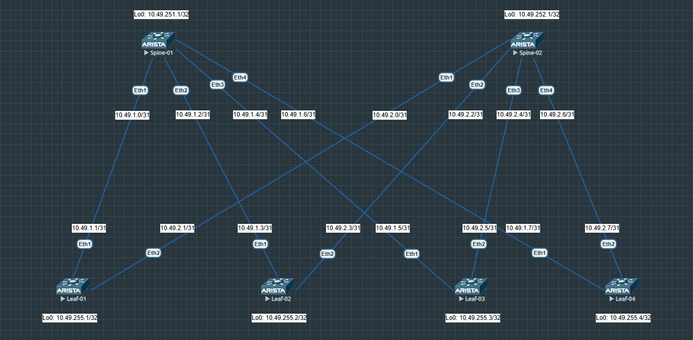

# Домашнее задание №1
## Проектирование адресного пространства

### Задачи:

- Собрать схему CLOS;
- Распределить адресное пространство.

## Выполнение:

### Собранная схема сети



### Таблица адресов

| hostname | interface |   IP/MASK   | Description |
| :------: | :-------: | :----------: | :---------: |
| leaf-01  | Loopback0 | 10.49.255.1/32 |            |
| leaf-01  |  Et1 | 10.49.1.1/31 | --- to spine-01 10.49.1.0 --- |
| leaf-01  |  Et2 | 10.49.2.1/31 | --- to spine-02 10.49.2.0 --- |
|          |          |              |            |
| leaf-02  | Loopback0 | 10.49.255.2/32 |            |
| leaf-02  |  Et1  | 10.49.1.3/31 | --- to spine-01 10.49.1.2 --- |
| leaf-02  |  Et2  | 10.49.2.3/31 | --- to spine-02 10.49.2.2 --- |
|          |          |              |            |
| leaf-03  | Loopback0 | 10.49.255.3/32 |            |
| leaf-03  |  Et1 | 10.49.1.5/31 | --- to spine-01 10.49.1.4 --- |
| leaf-03  |  Et2 | 10.49.2.5/31 | --- to spine-02 10.49.2.4 --- |
|          |          |              |            |
| leaf-04  | Loopback0 | 10.49.255.4/32 |            |
| leaf-04  |  Et1  | 10.49.1.7/31 | --- to spine-01 10.49.1.6 --- |
| leaf-04  |  Et2  | 10.49.2.7/31 | --- to spine-02 10.49.2.6 --- |
|          |          |              |            |
| spine-01 | Loopback0 | 10.49.251.1/32 |            |
| spine-01 |  Et1  | 10.49.1.0/31 |  --- to leaf-01 10.49.1.1 ---  |
| spine-01 |  Et2  | 10.49.1.2/31 |  --- to leaf-02 10.49.1.3 ---  |
| spine-01 |  Et3  | 10.49.1.4/31 |  --- to leaf-03 10.49.1.5 ---  |
| spine-01 |  Et4  | 10.49.1.6/31 |  --- to leaf-04 10.49.1.7 ---  |
|          |          |              |            |
| spine-02 | Loopback0 | 10.49.252.1/32 |            |
| spine-02 |  Et1  | 10.49.2.0/31 |  --- to leaf-01 10.49.2.1 ---  |
| spine-02 |  Et2  | 10.49.2.2/31 |  --- to leaf-02 10.49.2.3 ---  |
| spine-02 |  Et3  | 10.49.2.4/31 |  --- to leaf-03 10.49.2.5 ---  |
| spine-02 |  Et4  | 10.49.2.6/31 |  --- to leaf-04 10.49.2.7 ---  |
### Конфигурация оборудования

- #### [leaf-01](config/leaf-01.ios)
```
hostname leaf-01
!
interface Ethernet1
   description --- to spine-01 10.49.1.0 ---
   no switchport
   ip address 10.49.1.1/31
!
interface Ethernet2
   description --- to spine-02 10.49.2.0 ---
   no switchport
   ip address 10.49.2.1/31
!
interface Loopback0
   ip address 10.49.255.1/32
!
end
```
- #### [leaf-02](config/leaf-02.ios)
```
hostname leaf-02
!
interface Ethernet1
   description --- to spine-01 10.49.1.2 ---
   no switchport
   ip address 10.49.1.3/31
!
interface Ethernet2
   description --- to spine-02 10.49.2.2 ---
   no switchport
   ip address 10.49.2.3/31
!
interface Loopback0
   ip address 10.49.255.2/32
!
end

```
- #### [leaf-03](config/leaf-03.ios)
```
hostname leaf-03
!
interface Ethernet1
   description --- to spine-01 10.49.1.4 ---
   no switchport
   ip address 10.49.1.5/31
!
interface Ethernet2
   description --- to spine-02 10.49.2.4 ---
   no switchport
   ip address 10.49.2.5/31
!
interface Loopback0
   ip address 10.49.255.3/32
!
end
```
- #### [leaf-04](config/leaf-04.ios)
```
hostname leaf-04
!
interface Ethernet1
   description --- to spine-01 10.49.1.6 ---
   no switchport
   ip address 10.49.1.7/31
!
interface Ethernet2
   description --- to spine-02 10.49.2.6 ---
   no switchport
   ip address 10.49.2.7/31
!
interface Loopback0
   ip address 10.49.255.4/32
!
end
```
- #### [spine-01](config/spine-01.ios)
```
hostname spine-01
!
interface Ethernet1
   description --- to leaf-01 10.49.1.1 ---
   no switchport
   ip address 10.49.1.0/31
!
interface Ethernet2
   description --- to leaf-02 10.49.1.3 ---
   no switchport
   ip address 10.49.1.2/31
!
interface Ethernet3
   description --- to leaf-03 10.49.1.5 ---
   no switchport
   ip address 10.49.1.4/31
!
interface Ethernet4
   description --- to leaf-04 10.49.1.7 ---
   no switchport
   ip address 10.49.1.6/31
!
interface Loopback0
   ip address 10.49.251.1/32
!
end
```
- #### [spine-02](config/spine-02.ios)
```
hostname spine-02
!
interface Ethernet1
   description --- to leaf-01 10.49.2.1 ---
   no switchport
   ip address 10.49.2.0/31
!
interface Ethernet2
   description --- to leaf-02 10.49.2.3 ---
   no switchport
   ip address 10.49.2.2/31
!
interface Ethernet3
   description --- to leaf-03 10.49.2.5 ---
   no switchport
   ip address 10.49.2.4/31
!
interface Ethernet4
   description --- to leaf-04 10.49.2.7 ---
   no switchport
   ip address 10.49.2.6/31
!
interface Loopback0
   ip address 10.49.252.1/32
!
end
```
### Проверка доступности

- #### spine-01
```
spine-01#ping 10.49.1.1

--- 10.49.1.1 ping statistics ---
5 packets transmitted, 5 received, 0% packet loss, time 18ms
rtt min/avg/max/mdev = 2.117/2.757/4.847/1.052 ms, ipg/ewma 4.628/3.771 ms


spine-01#ping 10.49.1.3

--- 10.49.1.3 ping statistics ---
5 packets transmitted, 5 received, 0% packet loss, time 23ms
rtt min/avg/max/mdev = 2.657/3.512/6.295/1.394 ms, ipg/ewma 5.767/4.859 ms


spine-01#ping 10.49.1.5

--- 10.49.1.5 ping statistics ---
5 packets transmitted, 5 received, 0% packet loss, time 28ms
rtt min/avg/max/mdev = 1.994/3.311/7.644/2.173 ms, ipg/ewma 7.125/5.394 ms


spine-01#ping 10.49.1.7

--- 10.49.1.7 ping statistics ---
5 packets transmitted, 5 received, 0% packet loss, time 23ms
rtt min/avg/max/mdev = 2.837/3.798/6.224/1.249 ms, ipg/ewma 5.764/4.968 ms
```

- #### spine-02
```
spine-02#ping 10.49.2.1

--- 10.49.2.1 ping statistics ---
5 packets transmitted, 5 received, 0% packet loss, time 23ms
rtt min/avg/max/mdev = 2.050/3.533/6.187/1.484 ms, ipg/ewma 5.774/4.796 ms


spine-02#ping 10.49.2.3

5 packets transmitted, 5 received, 0% packet loss, time 21ms
rtt min/avg/max/mdev = 2.040/3.718/7.244/1.937 ms, ipg/ewma 5.285/3.893 ms


spine-02#ping 10.49.2.5
PING 10.49.2.5 (10.49.2.5) 72(100) bytes of data.

5 packets transmitted, 5 received, 0% packet loss, time 33ms
rtt min/avg/max/mdev = 2.420/4.124/9.306/2.618 ms, ipg/ewma 8.320/6.612 ms


spine-02#ping 10.49.2.7

5 packets transmitted, 5 received, 0% packet loss, time 12ms
rtt min/avg/max/mdev = 1.946/2.319/3.256/0.477 ms, ipg/ewma 3.228/2.767 ms
```