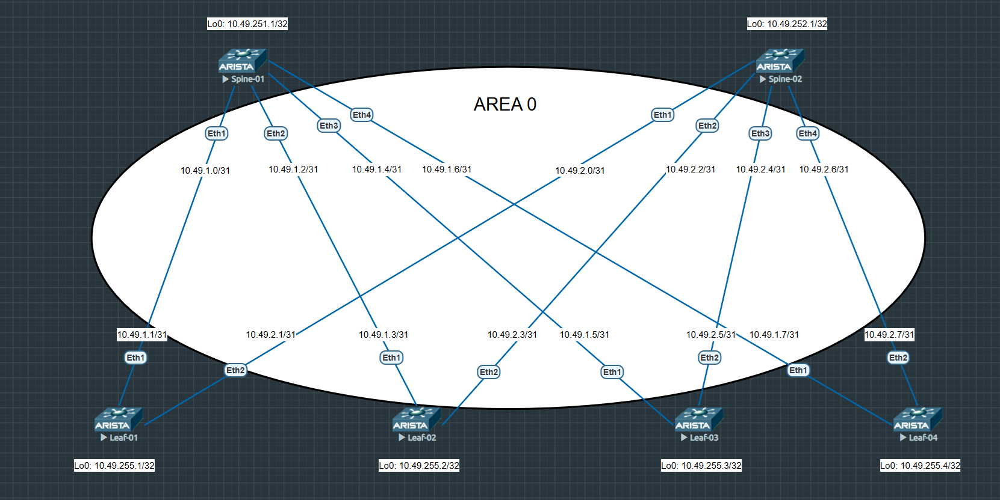

# Домашнее задание №2
## Underlay. OSPF

### Задача:

- Настроить протокол OSPF для Underlay сети
- Проверить связанность между устройствами

## Выполнение:

### Схема сети




### Конфигурация оборудования

- #### [leaf-01](config/leaf-01.ios)

```
interface Ethernet1
   description --- to spine-01 10.49.1.0 ---
   no switchport
   ip address 10.49.1.1/31
   ip ospf network point-to-point
   ip ospf area 0.0.0.0
!
interface Ethernet2
   description --- to spine-02 10.49.2.0 ---
   no switchport
   ip address 10.49.2.1/31
   ip ospf network point-to-point
   ip ospf area 0.0.0.0
!
interface Loopback0
   ip address 10.49.255.1/32
   ip ospf area 0.0.0.0
!
router ospf 1
   router-id 10.49.255.1
   max-lsa 12000
end
```

- #### [leaf-02](config/leaf-02.ios)

```
interface Ethernet1
   description --- to spine-01 10.49.1.2 ---
   no switchport
   ip address 10.49.1.3/31
   ip ospf network point-to-point
   ip ospf area 0.0.0.0
!
interface Ethernet2
   description --- to spine-02 10.49.2.2 ---
   no switchport
   ip address 10.49.2.3/31
   ip ospf network point-to-point
   ip ospf area 0.0.0.0
!
interface Loopback0
   ip address 10.49.255.2/32
   ip ospf area 0.0.0.0
!
router ospf 1
   router-id 10.49.255.2
   max-lsa 12000
end
```

- #### [leaf-03](config/leaf-03.ios)

```
interface Ethernet1
   description --- to spine-01 10.49.1.4 ---
   no switchport
   ip address 10.49.1.5/31
   ip ospf network point-to-point
   ip ospf area 0.0.0.0
!
interface Ethernet2
   description --- to spine-02 10.49.2.4 ---
   no switchport
   ip address 10.49.2.5/31
   ip ospf network point-to-point
   ip ospf area 0.0.0.0
!
interface Loopback0
   ip address 10.49.255.3/32
   ip ospf area 0.0.0.0
!
router ospf 1
   router-id 10.49.255.3
   max-lsa 12000
!
end
```
- #### [leaf-04](config/leaf-04.ios)

```
interface Ethernet1
   description --- to spine-01 10.49.1.6 ---
   no switchport
   ip address 10.49.1.7/31
   ip ospf network point-to-point
   ip ospf area 0.0.0.0
!
interface Ethernet2
   description --- to spine-02 10.49.2.6 ---
   no switchport
   ip address 10.49.2.7/31
   ip ospf network point-to-point
   ip ospf area 0.0.0.0
!
interface Loopback0
   ip address 10.49.255.4/32
   ip ospf area 0.0.0.0
!
router ospf 1
   router-id 10.49.255.4
   max-lsa 12000
!
end
```

- #### [spine-01](config/spine-01.ios)

```
interface Ethernet1
   description --- to leaf-01 10.49.1.1 ---
   no switchport
   ip address 10.49.1.0/31
   ip ospf network point-to-point
   ip ospf area 0.0.0.0
!
interface Ethernet2
   description --- to leaf-02 10.49.1.3 ---
   no switchport
   ip address 10.49.1.2/31
   ip ospf network point-to-point
   ip ospf area 0.0.0.0
!
interface Ethernet3
   description --- to leaf-03 10.49.1.5 ---
   no switchport
   ip address 10.49.1.4/31
   ip ospf network point-to-point
   ip ospf area 0.0.0.0
!
interface Ethernet4
   description --- to leaf-04 10.49.1.7 ---
   no switchport
   ip address 10.49.1.6/31
   ip ospf network point-to-point
   ip ospf area 0.0.0.0
!
interface Loopback0
   ip address 10.49.251.1/32
   ip ospf area 0.0.0.0
!
router ospf 1
   router-id 10.49.251.1
   max-lsa 12000
!
end
```

- #### [spine-2](config/spine-02.ios)

```
interface Ethernet1
   description --- to leaf-01 10.49.2.1 ---
   no switchport
   ip address 10.49.2.0/31
   ip ospf network point-to-point
   ip ospf area 0.0.0.0
!
interface Ethernet2
   description --- to leaf-02 10.49.2.3 ---
   no switchport
   ip address 10.49.2.2/31
   ip ospf network point-to-point
   ip ospf area 0.0.0.0
!
interface Ethernet3
   description --- to leaf-03 10.49.2.5 ---
   no switchport
   ip address 10.49.2.4/31
   ip ospf network point-to-point
   ip ospf area 0.0.0.0
!
interface Ethernet4
   description --- to leaf-04 10.49.2.7 ---
   no switchport
   ip address 10.49.2.6/31
   ip ospf network point-to-point
   ip ospf area 0.0.0.0
!
interface Loopback0
   ip address 10.49.252.1/32
   ip ospf area 0.0.0.0
!
router ospf 1
   router-id 10.49.252.1
   max-lsa 12000
!
end
```
---
### Проверка связанности устройств по протоколу OSPF

- #### spine-01

```
spine-01#sh ip ospf neighbor
Neighbor ID     Instance VRF      Pri State                  Dead Time   Address         Interface
10.49.255.1     1        default  0   FULL                   00:00:38    10.49.1.1       Ethernet1
10.49.255.2     1        default  0   FULL                   00:00:38    10.49.1.3       Ethernet2
10.49.255.3     1        default  0   FULL                   00:00:35    10.49.1.5       Ethernet3
10.49.255.4     1        default  0   FULL                   00:00:32    10.49.1.7       Ethernet4

spine-01#sh ip ro ospf

 O        10.49.255.1/32 [110/20] via 10.49.1.1, Ethernet1
 O        10.49.255.2/32 [110/20] via 10.49.1.3, Ethernet2
 O        10.49.255.3/32 [110/20] via 10.49.1.5, Ethernet3
 O        10.49.255.4/32 [110/20] via 10.49.1.7, Ethernet4

spine-01#ping 10.49.255.1 source 10.49.251.1
PING 10.49.255.1 (10.49.255.1) from 10.49.251.1 : 72(100) bytes of data.

--- 10.49.255.1 ping statistics ---
5 packets transmitted, 5 received, 0% packet loss, time 21ms


spine-01#ping 10.49.255.2 source 10.49.251.1
PING 10.49.255.2 (10.49.255.2) from 10.49.251.1 : 72(100) bytes of data.

--- 10.49.255.2 ping statistics ---
5 packets transmitted, 5 received, 0% packet loss, time 19ms


spine-01#ping 10.49.255.3 source 10.49.251.1
PING 10.49.255.3 (10.49.255.3) from 10.49.251.1 : 72(100) bytes of data.

--- 10.49.255.3 ping statistics ---
5 packets transmitted, 5 received, 0% packet loss, time 20ms


spine-01#ping 10.49.255.4 source 10.49.251.1
PING 10.49.255.4 (10.49.255.4) from 10.49.251.1 : 72(100) bytes of data.

--- 10.49.255.4 ping statistics ---
5 packets transmitted, 5 received, 0% packet loss, time 19ms

```

- #### spine-02

```
spine-02#sh ip ospf neighbor
Neighbor ID     Instance VRF      Pri State                  Dead Time   Address         Interface
10.49.255.1     1        default  0   FULL                   00:00:37    10.49.2.1       Ethernet1
10.49.255.2     1        default  0   FULL                   00:00:31    10.49.2.3       Ethernet2
10.49.255.3     1        default  0   FULL                   00:00:36    10.49.2.5       Ethernet3
10.49.255.4     1        default  0   FULL                   00:00:37    10.49.2.7       Ethernet4

spine-02#sh ip ro ospf

 O        10.49.255.1/32 [110/20] via 10.49.2.1, Ethernet1
 O        10.49.255.2/32 [110/20] via 10.49.2.3, Ethernet2
 O        10.49.255.3/32 [110/20] via 10.49.2.5, Ethernet3
 O        10.49.255.4/32 [110/20] via 10.49.2.7, Ethernet4


spine-02#ping 10.49.255.1 source 10.49.252.1
PING 10.49.255.1 (10.49.255.1) from 10.49.252.1 : 72(100) bytes of data.

--- 10.49.255.1 ping statistics ---
5 packets transmitted, 5 received, 0% packet loss, time 22ms


spine-02#ping 10.49.255.2 source 10.49.252.1
PING 10.49.255.2 (10.49.255.2) from 10.49.252.1 : 72(100) bytes of data.

--- 10.49.255.2 ping statistics ---
5 packets transmitted, 5 received, 0% packet loss, time 20ms


spine-02#ping 10.49.255.3 source 10.49.252.1
PING 10.49.255.3 (10.49.255.3) from 10.49.252.1 : 72(100) bytes of data.

--- 10.49.255.3 ping statistics ---
5 packets transmitted, 5 received, 0% packet loss, time 19ms


spine-02#ping 10.49.255.4 source 10.49.252.1
PING 10.49.255.4 (10.49.255.4) from 10.49.252.1 : 72(100) bytes of data.

--- 10.49.255.4 ping statistics ---
5 packets transmitted, 5 received, 0% packet loss, time 13ms


```