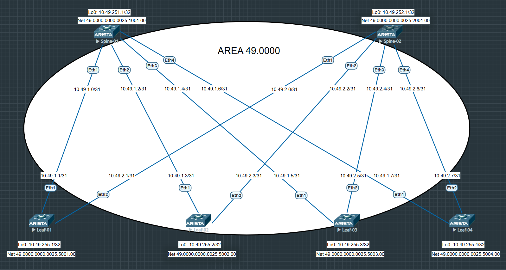

# Домашнее задание №3

## Underlay. IS-IS

### Задача:

- Настроить протокол IS-IS для Underlay сети
- Проверить связанность между устройствами

## Выполнение:

### Схема сети



### Конфигурация оборудования

- #### [leaf-01](config/leaf-01.ios)

```
interface Ethernet1
   description --- to spine-01 10.49.1.0 ---
   no switchport
   ip address 10.49.1.1/31
   isis enable 1
   isis network point-to-point
!
interface Ethernet2
   description --- to spine-02 10.49.2.0 ---
   no switchport
   ip address 10.49.2.1/31
   isis enable 1
   isis network point-to-point
!
interface Loopback0
   ip address 10.49.255.1/32
   isis enable 1
!
router isis 1
   net 49.0000.0000.0025.5001.00
   router-id ipv4 10.49.255.1
   !
   address-family ipv4 unicast
!
end
```

- #### [leaf-02](config/leaf-02.ios)

```
interface Ethernet1
   description --- to spine-01 10.49.1.2 ---
   no switchport
   ip address 10.49.1.3/31
   isis enable 1
   isis network point-to-point
!
interface Ethernet2
   description --- to spine-02 10.49.2.2 ---
   no switchport
   ip address 10.49.2.3/31
   isis enable 1
   isis network point-to-point
!
interface Loopback0
   ip address 10.49.255.2/32
   isis enable 1
!
router isis 1
   net 49.0000.0000.0025.5002.00
   router-id ipv4 10.49.255.2
   !
   address-family ipv4 unicast
!
end
```

- #### [leaf-03](config/leaf-03.ios)

```
interface Ethernet1
   description --- to spine-01 10.49.1.4 ---
   no switchport
   ip address 10.49.1.5/31
   isis enable 1
   isis network point-to-point
!
interface Ethernet2
   description --- to spine-02 10.49.2.4 ---
   no switchport
   ip address 10.49.2.5/31
   isis enable 1
   isis network point-to-point
!
interface Loopback0
   ip address 10.49.255.3/32
   isis enable 1
!
router isis 1
   net 49.0000.0000.0025.5003.00
   router-id ipv4 10.49.255.3
   !
   address-family ipv4 unicast
!
end
```
- #### [leaf-04](config/leaf-04.ios)

```
interface Ethernet1
   description --- to spine-01 10.49.1.6 ---
   no switchport
   ip address 10.49.1.7/31
   isis enable 1
   isis network point-to-point
!
interface Ethernet2
   description --- to spine-02 10.49.2.6 ---
   no switchport
   ip address 10.49.2.7/31
   isis enable 1
   isis network point-to-point
!
interface Loopback0
   ip address 10.49.255.4/32
   isis enable 1
!
router isis 1
   net 49.0000.0000.0025.5004.00
   router-id ipv4 10.49.255.4
   !
   address-family ipv4 unicast
!
end
```

- #### [spine-01](config/spine-01.ios)

```
interface Ethernet1
   description --- to leaf-01 10.49.1.1 ---
   no switchport
   ip address 10.49.1.0/31
   isis enable 1
   isis network point-to-point
!
interface Ethernet2
   description --- to leaf-02 10.49.1.3 ---
   no switchport
   ip address 10.49.1.2/31
   isis enable 1
   isis network point-to-point
!
interface Ethernet3
   description --- to leaf-03 10.49.1.5 ---
   no switchport
   ip address 10.49.1.4/31
   isis enable 1
   isis network point-to-point
!
interface Ethernet4
   description --- to leaf-04 10.49.1.7 ---
   no switchport
   ip address 10.49.1.6/31
   isis enable 1
   isis network point-to-point
!
interface Loopback0
   ip address 10.49.251.1/32
   isis enable 1
!
router isis 1
   net 49.0000.0000.0025.1001.00
   router-id ipv4 10.49.251.1
   !
   address-family ipv4 unicast
!
end
```

- #### [spine-02](config/spine-02.ios)

```
interface Ethernet1
   description --- to leaf-01 10.49.2.1 ---
   no switchport
   ip address 10.49.2.0/31
   isis enable 1
   isis network point-to-point
!
interface Ethernet2
   description --- to leaf-02 10.49.2.3 ---
   no switchport
   ip address 10.49.2.2/31
   isis enable 1
   isis network point-to-point
!
interface Ethernet3
   description --- to leaf-03 10.49.2.5 ---
   no switchport
   ip address 10.49.2.4/31
   isis enable 1
   isis network point-to-point
!
interface Ethernet4
   description --- to leaf-04 10.49.2.7 ---
   no switchport
   ip address 10.49.2.6/31
   isis enable 1
   isis network point-to-point
!
interface Loopback0
   ip address 10.49.252.1/32
   isis enable 1
!
router isis 1
   net 49.0000.0000.0025.2001.00
   router-id ipv4 10.49.252.1
   !
   address-family ipv4 unicast
!
end
```

---

### Проверка связанности устройств по протоколу IS-IS

- #### spine-01

```
spine-01#sh isis neighbors

Instance  VRF      System Id        Type Interface          SNPA              State Hold time   Circuit Id
1         default  leaf-01          L1L2 Ethernet1          P2P               UP    25          0E
1         default  leaf-02          L1L2 Ethernet2          P2P               UP    29          0E
1         default  leaf-03          L1L2 Ethernet3          P2P               UP    21          0E
1         default  leaf-04          L1L2 Ethernet4          P2P               UP    21          0E

spine-01#sh ip ro isis

 I L1     10.49.255.1/32 [115/20] via 10.49.1.1, Ethernet1
 I L1     10.49.255.2/32 [115/20] via 10.49.1.3, Ethernet2
 I L1     10.49.255.3/32 [115/20] via 10.49.1.5, Ethernet3
 I L1     10.49.255.4/32 [115/20] via 10.49.1.7, Ethernet4

spine-01#ping 10.49.255.1 source 10.49.251.1
PING 10.49.255.1 (10.49.255.1) from 10.49.251.1 : 72(100) bytes of data.

5 packets transmitted, 5 received, 0% packet loss, time 12ms


spine-01#ping 10.49.255.2 source 10.49.251.1
PING 10.49.255.2 (10.49.255.2) from 10.49.251.1 : 72(100) bytes of data.

5 packets transmitted, 5 received, 0% packet loss, time 20ms


spine-01#ping 10.49.255.3 source 10.49.251.1
PING 10.49.255.3 (10.49.255.3) from 10.49.251.1 : 72(100) bytes of data.

5 packets transmitted, 5 received, 0% packet loss, time 20ms


spine-01#ping 10.49.255.4 source 10.49.251.1
PING 10.49.255.4 (10.49.255.4) from 10.49.251.1 : 72(100) bytes of data.

5 packets transmitted, 5 received, 0% packet loss, time 20ms

```

- #### spine-02

```
spine-02#sh isis neighbors

Instance  VRF      System Id        Type Interface          SNPA              State Hold time   Circuit Id
1         default  leaf-01          L1L2 Ethernet1          P2P               UP    28          0F
1         default  leaf-02          L1L2 Ethernet2          P2P               UP    24          0F
1         default  leaf-03          L1L2 Ethernet3          P2P               UP    28          0F
1         default  leaf-04          L1L2 Ethernet4          P2P               UP    25          0F


spine-02#sh ip ro isis

 I L1     10.49.255.1/32 [115/20] via 10.49.2.1, Ethernet1
 I L1     10.49.255.2/32 [115/20] via 10.49.2.3, Ethernet2
 I L1     10.49.255.3/32 [115/20] via 10.49.2.5, Ethernet3
 I L1     10.49.255.4/32 [115/20] via 10.49.2.7, Ethernet4

spine-02#ping 10.49.255.1 source 10.49.252.1
PING 10.49.255.1 (10.49.255.1) from 10.49.252.1 : 72(100) bytes of data.

5 packets transmitted, 5 received, 0% packet loss, time 21ms


spine-02#ping 10.49.255.2 source 10.49.252.1
PING 10.49.255.2 (10.49.255.2) from 10.49.252.1 : 72(100) bytes of data.

5 packets transmitted, 5 received, 0% packet loss, time 20ms


spine-02#ping 10.49.255.3 source 10.49.252.1
PING 10.49.255.3 (10.49.255.3) from 10.49.252.1 : 72(100) bytes of data.

5 packets transmitted, 5 received, 0% packet loss, time 18ms


spine-02#ping 10.49.255.4 source 10.49.252.1
PING 10.49.255.4 (10.49.255.4) from 10.49.252.1 : 72(100) bytes of data.

5 packets transmitted, 5 received, 0% packet loss, time 19ms

```