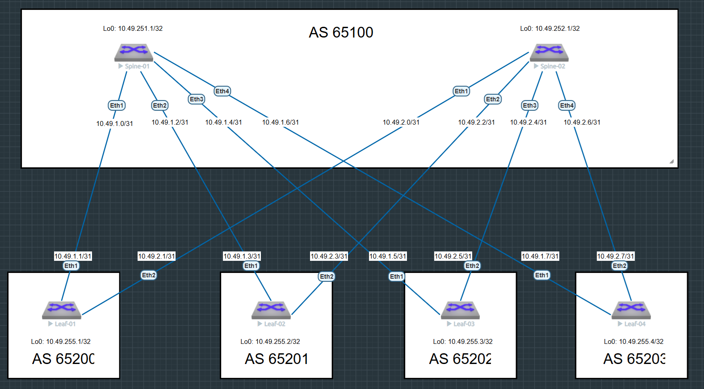

# Домашнее задание №4

## Underlay. eBGP

### Задача:

- Настроить протокол eBGP для Underlay сети
- Проверить связанность между устройствами

## Выполнение:

### Схема сети



### Конфигурация оборудования

- #### [leaf-01](config/leaf-01.ios)

```
ip routing
!
ip prefix-list PL_LOOPBACK
   seq 10 permit 10.49.255.1/32
!
route-map RM_CONNECTED permit 10
   match ip address prefix-list PL_LOOPBACK
!
router bgp 65200
   maximum-paths 4 ecmp 4
   neighbor SPINE peer group
   neighbor SPINE remote-as 65100
   neighbor SPINE bfd
   neighbor SPINE send-community
   neighbor SPINE maximum-routes 1000
   neighbor 10.49.1.0 peer group SPINE
   neighbor 10.49.2.0 peer group SPINE
   redistribute connected route-map RM_CONNECTED
!
end

```

- #### [leaf-02](config/leaf-02.ios)

```
ip routing
!
ip prefix-list PL_LOOPBACK
   seq 10 permit 10.49.255.2/32
!
route-map RM_CONNECTED permit 10
   match ip address prefix-list PL_LOOPBACK
!
router bgp 65201
   maximum-paths 4 ecmp 4
   neighbor SPINE peer group
   neighbor SPINE remote-as 65100
   neighbor SPINE bfd
   neighbor SPINE send-community
   neighbor SPINE maximum-routes 1000
   neighbor 10.49.1.2 peer group SPINE
   neighbor 10.49.2.2 peer group SPINE
   redistribute connected route-map RM_CONNECTED
!
end

```

- #### [leaf-03](config/leaf-03.ios)

```
ip routing
!
ip prefix-list PL_LOOPBACK
   seq 10 permit 10.49.255.3/32
!
route-map RM_CONNECTED permit 10
   match ip address prefix-list PL_LOOPBACK
!
router bgp 65202
   maximum-paths 4 ecmp 4
   neighbor SPINE peer group
   neighbor SPINE remote-as 65100
   neighbor SPINE bfd
   neighbor SPINE send-community
   neighbor SPINE maximum-routes 1000
   neighbor 10.49.1.4 peer group SPINE
   neighbor 10.49.2.4 peer group SPINE
   redistribute connected route-map RM_CONNECTED
!
end

```
- #### [leaf-04](config/leaf-04.ios)

```
ip routing
!
ip prefix-list PL_LOOPBACK
   seq 10 permit 10.49.255.4/32
!
route-map RM_CONNECTED permit 10
   match ip address prefix-list PL_LOOPBACK
!
router bgp 65203
   maximum-paths 4 ecmp 4
   neighbor SPINE peer group
   neighbor SPINE remote-as 65100
   neighbor SPINE bfd
   neighbor SPINE send-community
   neighbor SPINE maximum-routes 1000
   neighbor 10.49.1.6 peer group SPINE
   neighbor 10.49.2.6 peer group SPINE
   redistribute connected route-map RM_CONNECTED
!
end

```


- #### [spine-01](config/spine-01.ios)

```
ip routing
!
ip prefix-list PL_LOOPBACK
   seq 10 permit 10.49.251.1/32
!
route-map RM_CONNECTED permit 10
   match ip address prefix-list PL_LOOPBACK
!
peer-filter LEAF
   10 match as-range 65200-65203 result accept
!
router bgp 65100
   maximum-paths 4 ecmp 4
   bgp listen range 10.49.1.0/24 peer-group LEAF peer-filter LEAF
   neighbor LEAF peer group
   neighbor LEAF bfd
   neighbor LEAF send-community
   neighbor LEAF maximum-routes 1000
   redistribute connected route-map RM_CONNECTED
!
end

```

- #### [spine-02](config/spine-02.ios)

```
ip routing
!
ip prefix-list PL_LOOPBACK
   seq 10 permit 10.49.252.1/32
!
route-map RM_CONNECTED permit 10
   match ip address prefix-list PL_LOOPBACK
!
peer-filter LEAF
   10 match as-range 65200-65203 result accept
!
router bgp 65100
   maximum-paths 4 ecmp 4
   bgp listen range 10.49.2.0/24 peer-group LEAF peer-filter LEAF
   neighbor LEAF peer group
   neighbor LEAF bfd
   neighbor LEAF send-community
   neighbor LEAF maximum-routes 1000
   redistribute connected route-map RM_CONNECTED
!
end

```

---

### Проверка связанности устройств по протоколу BGP

- #### spine-01

```
spine-01#sh ip bgp summary
BGP summary information for VRF default
Router identifier 10.49.251.1, local AS number 65100
Neighbor Status Codes: m - Under maintenance
  Neighbor         V  AS           MsgRcvd   MsgSent  InQ OutQ  Up/Down State   PfxRcd PfxAcc
  10.49.1.1        4  65200           1377      1379    0    0 22:51:19 Estab   1      1
  10.49.1.3        4  65201           1362      1364    0    0 22:36:14 Estab   1      1
  10.49.1.5        4  65202           1356      1358    0    0 22:30:43 Estab   1      1
  10.49.1.7        4  65203           1354      1356    0    0 22:28:17 Estab   1      1


spine-01#sh ip ro bgp

VRF: default

 B E      10.49.255.1/32 [200/0] via 10.49.1.1, Ethernet1
 B E      10.49.255.2/32 [200/0] via 10.49.1.3, Ethernet2
 B E      10.49.255.3/32 [200/0] via 10.49.1.5, Ethernet3
 B E      10.49.255.4/32 [200/0] via 10.49.1.7, Ethernet4


spine-01#sh ip bgp

         Network                Next Hop            Metric  LocPref Weight  Path
 * >     10.49.251.1/32         -                     0       0       -       i
 * >     10.49.255.1/32         10.49.1.1             0       100     0       65200 i
 * >     10.49.255.2/32         10.49.1.3             0       100     0       65201 i
 * >     10.49.255.3/32         10.49.1.5             0       100     0       65202 i
 * >     10.49.255.4/32         10.49.1.7             0       100     0       65203 i

spine-01#ping 10.49.255.1 source 10.49.251.1
PING 10.49.255.1 (10.49.255.1) from 10.49.251.1 : 72(100) bytes of data.

5 packets transmitted, 5 received, 0% packet loss, time 1ms


spine-01#ping 10.49.255.2 source 10.49.251.1
PING 10.49.255.2 (10.49.255.2) from 10.49.251.1 : 72(100) bytes of data.

5 packets transmitted, 5 received, 0% packet loss, time 20ms


spine-01#ping 10.49.255.3 source 10.49.251.1
PING 10.49.255.3 (10.49.255.3) from 10.49.251.1 : 72(100) bytes of data.

5 packets transmitted, 5 received, 0% packet loss, time 20ms


spine-01#ping 10.49.255.4 source 10.49.251.1
PING 10.49.255.4 (10.49.255.4) from 10.49.251.1 : 72(100) bytes of data.

5 packets transmitted, 5 received, 0% packet loss, time 19ms

```

- #### spine-02

```
spine-02#sh ip bgp summary
BGP summary information for VRF default
Router identifier 10.49.252.1, local AS number 65100
Neighbor Status Codes: m - Under maintenance
  Neighbor         V  AS           MsgRcvd   MsgSent  InQ OutQ  Up/Down State   PfxRcd PfxAcc
  10.49.2.1        4  65200           1384      1383    0    0 22:55:30 Estab   1      1
  10.49.2.3        4  65201           1375      1374    0    0 22:46:12 Estab   1      1
  10.49.2.5        4  65202           1369      1368    0    0 22:40:43 Estab   1      1
  10.49.2.7        4  65203           1367      1366    0    0 22:38:18 Estab   1      1

spine-02#sh ip ro bgp

VRF: default

 B E      10.49.255.1/32 [200/0] via 10.49.2.1, Ethernet1
 B E      10.49.255.2/32 [200/0] via 10.49.2.3, Ethernet2
 B E      10.49.255.3/32 [200/0] via 10.49.2.5, Ethernet3
 B E      10.49.255.4/32 [200/0] via 10.49.2.7, Ethernet4

spine-02#sh ip bgp

         Network                Next Hop            Metric  LocPref Weight  Path
 * >     10.49.252.1/32         -                     0       0       -       i
 * >     10.49.255.1/32         10.49.2.1             0       100     0       65200 i
 * >     10.49.255.2/32         10.49.2.3             0       100     0       65201 i
 * >     10.49.255.3/32         10.49.2.5             0       100     0       65202 i
 * >     10.49.255.4/32         10.49.2.7             0       100     0       65203 i

spine-02#ping 10.49.255.1 source 10.49.252.1
PING 10.49.255.1 (10.49.255.1) from 10.49.252.1 : 72(100) bytes of data.

5 packets transmitted, 5 received, 0% packet loss, time 12ms


spine-02#ping 10.49.255.2 source 10.49.252.1
PING 10.49.255.2 (10.49.255.2) from 10.49.252.1 : 72(100) bytes of data.

5 packets transmitted, 5 received, 0% packet loss, time 19ms


spine-02#ping 10.49.255.3 source 10.49.252.1
PING 10.49.255.3 (10.49.255.3) from 10.49.252.1 : 72(100) bytes of data.

5 packets transmitted, 5 received, 0% packet loss, time 12ms


spine-02#ping 10.49.255.4 source 10.49.252.1
PING 10.49.255.4 (10.49.255.4) from 10.49.252.1 : 72(100) bytes of data.

5 packets transmitted, 5 received, 0% packet loss, time 21ms

```

- #### leaf-01

```
leaf-01#sh ip bgp summary
BGP summary information for VRF default
Router identifier 10.49.255.1, local AS number 65200
Neighbor Status Codes: m - Under maintenance
  Neighbor         V  AS           MsgRcvd   MsgSent  InQ OutQ  Up/Down State   PfxRcd PfxAcc
  10.49.1.0        4  65100           1393      1391    0    0 23:05:43 Estab   4      4
  10.49.2.0        4  65100           1387      1388    0    0 22:59:47 Estab   4      4

leaf-01#sh ip ro bgp

VRF: default

 B E      10.49.251.1/32 [200/0] via 10.49.1.0, Ethernet1
 B E      10.49.252.1/32 [200/0] via 10.49.2.0, Ethernet2
 B E      10.49.255.2/32 [200/0] via 10.49.1.0, Ethernet1
                                 via 10.49.2.0, Ethernet2
 B E      10.49.255.3/32 [200/0] via 10.49.1.0, Ethernet1
                                 via 10.49.2.0, Ethernet2
 B E      10.49.255.4/32 [200/0] via 10.49.1.0, Ethernet1
                                 via 10.49.2.0, Ethernet2

leaf-01#sh ip bgp

         Network                Next Hop            Metric  LocPref Weight  Path
 * >     10.49.251.1/32         10.49.1.0             0       100     0       65100 i
 * >     10.49.252.1/32         10.49.2.0             0       100     0       65100 i
 * >     10.49.255.1/32         -                     0       0       -       i
 * >Ec   10.49.255.2/32         10.49.1.0             0       100     0       65100 65201 i
 *  ec   10.49.255.2/32         10.49.2.0             0       100     0       65100 65201 i
 * >Ec   10.49.255.3/32         10.49.1.0             0       100     0       65100 65202 i
 *  ec   10.49.255.3/32         10.49.2.0             0       100     0       65100 65202 i
 * >Ec   10.49.255.4/32         10.49.1.0             0       100     0       65100 65203 i
 *  ec   10.49.255.4/32         10.49.2.0             0       100     0       65100 65203 i

```

- #### leaf-02

```
leaf-02#sh ip bgp summary
BGP summary information for VRF default
Router identifier 10.49.255.2, local AS number 65201
Neighbor Status Codes: m - Under maintenance
  Neighbor         V  AS           MsgRcvd   MsgSent  InQ OutQ  Up/Down State   PfxRcd PfxAcc
  10.49.1.2        4  65100           1380      1378    0    0 22:52:39 Estab   4      4
  10.49.2.2        4  65100           1380      1381    0    0 22:52:30 Estab   4      4

leaf-02#sh ip ro bgp

 B E      10.49.251.1/32 [200/0] via 10.49.1.2, Ethernet1
 B E      10.49.252.1/32 [200/0] via 10.49.2.2, Ethernet2
 B E      10.49.255.1/32 [200/0] via 10.49.1.2, Ethernet1
                                 via 10.49.2.2, Ethernet2
 B E      10.49.255.3/32 [200/0] via 10.49.1.2, Ethernet1
                                 via 10.49.2.2, Ethernet2
 B E      10.49.255.4/32 [200/0] via 10.49.1.2, Ethernet1
                                 via 10.49.2.2, Ethernet2

leaf-02#sh ip bgp

         Network                Next Hop            Metric  LocPref Weight  Path
 * >     10.49.251.1/32         10.49.1.2             0       100     0       65100 i
 * >     10.49.252.1/32         10.49.2.2             0       100     0       65100 i
 * >Ec   10.49.255.1/32         10.49.1.2             0       100     0       65100 65200 i
 *  ec   10.49.255.1/32         10.49.2.2             0       100     0       65100 65200 i
 * >     10.49.255.2/32         -                     0       0       -       i
 * >Ec   10.49.255.3/32         10.49.1.2             0       100     0       65100 65202 i
 *  ec   10.49.255.3/32         10.49.2.2             0       100     0       65100 65202 i
 * >Ec   10.49.255.4/32         10.49.1.2             0       100     0       65100 65203 i
 *  ec   10.49.255.4/32         10.49.2.2             0       100     0       65100 65203 i

```

- #### leaf-03

```
leaf-03#sh ip bgp summary
BGP summary information for VRF default
Router identifier 10.49.255.3, local AS number 65202
Neighbor Status Codes: m - Under maintenance
  Neighbor         V  AS           MsgRcvd   MsgSent  InQ OutQ  Up/Down State   PfxRcd PfxAcc
  10.49.1.4        4  65100           1376      1374    0    0 22:48:22 Estab   4      4
  10.49.2.4        4  65100           1376      1377    0    0 22:48:14 Estab   4      4

leaf-03#sh ip ro bgp

 B E      10.49.251.1/32 [200/0] via 10.49.1.4, Ethernet1
 B E      10.49.252.1/32 [200/0] via 10.49.2.4, Ethernet2
 B E      10.49.255.1/32 [200/0] via 10.49.1.4, Ethernet1
                                 via 10.49.2.4, Ethernet2
 B E      10.49.255.2/32 [200/0] via 10.49.1.4, Ethernet1
                                 via 10.49.2.4, Ethernet2
 B E      10.49.255.4/32 [200/0] via 10.49.1.4, Ethernet1
                                 via 10.49.2.4, Ethernet2

leaf-03#sh ip bgp

         Network                Next Hop            Metric  LocPref Weight  Path
 * >     10.49.251.1/32         10.49.1.4             0       100     0       65100 i
 * >     10.49.252.1/32         10.49.2.4             0       100     0       65100 i
 * >Ec   10.49.255.1/32         10.49.1.4             0       100     0       65100 65200 i
 *  ec   10.49.255.1/32         10.49.2.4             0       100     0       65100 65200 i
 * >Ec   10.49.255.2/32         10.49.1.4             0       100     0       65100 65201 i
 *  ec   10.49.255.2/32         10.49.2.4             0       100     0       65100 65201 i
 * >     10.49.255.3/32         -                     0       0       -       i
 * >Ec   10.49.255.4/32         10.49.1.4             0       100     0       65100 65203 i
 *  ec   10.49.255.4/32         10.49.2.4             0       100     0       65100 65203 i

```

- #### leaf-04

```
leaf-04#sh ip bgp summary
BGP summary information for VRF default
Router identifier 10.49.255.4, local AS number 65203
Neighbor Status Codes: m - Under maintenance
  Neighbor         V  AS           MsgRcvd   MsgSent  InQ OutQ  Up/Down State   PfxRcd PfxAcc
  10.49.1.6        4  65100           1375      1373    0    0 22:47:37 Estab   4      4
  10.49.2.6        4  65100           1375      1376    0    0 22:47:31 Estab   4      4

leaf-04#sh ip ro bgp

 B E      10.49.251.1/32 [200/0] via 10.49.1.6, Ethernet1
 B E      10.49.252.1/32 [200/0] via 10.49.2.6, Ethernet2
 B E      10.49.255.1/32 [200/0] via 10.49.1.6, Ethernet1
                                 via 10.49.2.6, Ethernet2
 B E      10.49.255.2/32 [200/0] via 10.49.1.6, Ethernet1
                                 via 10.49.2.6, Ethernet2
 B E      10.49.255.3/32 [200/0] via 10.49.1.6, Ethernet1
                                 via 10.49.2.6, Ethernet2

leaf-04#sh ip bgp

         Network                Next Hop            Metric  LocPref Weight  Path
 * >     10.49.251.1/32         10.49.1.6             0       100     0       65100 i
 * >     10.49.252.1/32         10.49.2.6             0       100     0       65100 i
 * >Ec   10.49.255.1/32         10.49.1.6             0       100     0       65100 65200 i
 *  ec   10.49.255.1/32         10.49.2.6             0       100     0       65100 65200 i
 * >Ec   10.49.255.2/32         10.49.1.6             0       100     0       65100 65201 i
 *  ec   10.49.255.2/32         10.49.2.6             0       100     0       65100 65201 i
 * >Ec   10.49.255.3/32         10.49.1.6             0       100     0       65100 65202 i
 *  ec   10.49.255.3/32         10.49.2.6             0       100     0       65100 65202 i
 * >     10.49.255.4/32         -                     0       0       -       i

```