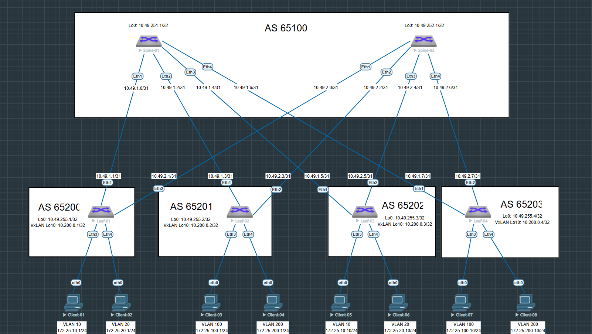

# Домашнее задание №5

## Overlay. VxLAN EVPN L2

### Задача:

- Настроить BGP peering между Leaf и Spine в AF l2vpn evpn
- Проверить связанность между клиентами

## Выполнение:

### Схема сети



### Конфигурация оборудования

Для того чтобы заработал MP-BGP EVPN для ARISTA нужно выполнить следующую команду:
```
service routing protocols model multi-agent
```

- #### [leaf-01](config/leaf-01.ios)

```
interface Loopback0
   ip address 10.49.255.1/32
!
interface Loopback10
   ip address 10.200.0.1/32
!
interface Management1
!
interface Vlan10
   ip address 172.25.10.20/24
!
interface Vlan20
   ip address 172.25.20.20/24
!
interface Vxlan1
   vxlan source-interface Loopback10
   vxlan udp-port 4789
   vxlan vlan 10 vni 10010
   vxlan vlan 20 vni 10020
   vxlan learn-restrict any
!
ip routing
!
ip prefix-list PL_LOOPBACK
   seq 10 permit 10.49.255.1/32
   seq 20 permit 10.200.0.1/32
!
route-map RM_CONNECTED permit 10
   match ip address prefix-list PL_LOOPBACK
!
router bgp 65200
   maximum-paths 4 ecmp 4
   neighbor EVPN peer group
   neighbor EVPN remote-as 65100
   neighbor EVPN update-source Loopback0
   neighbor EVPN ebgp-multihop 3
   neighbor EVPN send-community extended
   neighbor SPINE peer group
   neighbor SPINE remote-as 65100
   neighbor SPINE bfd
   neighbor SPINE send-community extended
   neighbor SPINE maximum-routes 1000
   neighbor 10.49.1.0 peer group SPINE
   neighbor 10.49.2.0 peer group SPINE
   neighbor 10.49.251.1 peer group EVPN
   neighbor 10.49.252.1 peer group EVPN
   redistribute connected route-map RM_CONNECTED
   !
   vlan 10
      rd 65200:10010
      route-target both 10:10010
      redistribute learned
   !
   vlan 20
      rd 65200:10020
      route-target both 20:10020
      redistribute learned
   !
   address-family evpn
      neighbor EVPN activate
   !
   address-family ipv4
      neighbor SPINE activate
!
end

```

- #### [leaf-02](config/leaf-02.ios)

```
interface Loopback0
   ip address 10.49.255.2/32
!
interface Loopback10
   ip address 10.200.0.2/32
!
interface Management1
!
interface Vlan100
   ip address 172.25.100.20/24
!
interface Vlan200
   ip address 172.25.200.20/24
!
interface Vxlan1
   vxlan source-interface Loopback10
   vxlan udp-port 4789
   vxlan vlan 100 vni 10100
   vxlan vlan 200 vni 10200
   vxlan learn-restrict any
!
ip routing
!
ip prefix-list PL_LOOPBACK
   seq 10 permit 10.49.255.2/32
   seq 20 permit 10.200.0.2/32
!
route-map RM_CONNECTED permit 10
   match ip address prefix-list PL_LOOPBACK
!
router bgp 65201
   maximum-paths 4 ecmp 4
   neighbor EVPN peer group
   neighbor EVPN remote-as 65100
   neighbor EVPN update-source Loopback0
   neighbor EVPN ebgp-multihop 3
   neighbor EVPN send-community extended
   neighbor SPINE peer group
   neighbor SPINE remote-as 65100
   neighbor SPINE bfd
   neighbor SPINE send-community extended
   neighbor SPINE maximum-routes 1000
   neighbor 10.49.1.2 peer group SPINE
   neighbor 10.49.2.2 peer group SPINE
   neighbor 10.49.251.1 peer group EVPN
   neighbor 10.49.252.1 peer group EVPN
   redistribute connected route-map RM_CONNECTED
   !
   vlan 100
      rd 65201:10100
      route-target both 10:10100
      redistribute learned
   !
   vlan 200
      rd 65201:10200
      route-target both 20:10200
      redistribute learned
   !
   address-family evpn
      neighbor EVPN activate
   !
   address-family ipv4
      neighbor SPINE activate
!
end

```

- #### [leaf-03](config/leaf-03.ios)

```
interface Loopback0
   ip address 10.49.255.3/32
!
interface Loopback10
   ip address 10.200.0.3/32
!
interface Management1
!
interface Vlan10
   ip address 172.25.10.40/24
!
interface Vlan20
   ip address 172.25.20.40/24
!
interface Vxlan1
   vxlan source-interface Loopback10
   vxlan udp-port 4789
   vxlan vlan 10 vni 10010
   vxlan vlan 20 vni 10020
   vxlan learn-restrict any
!
ip routing
!
ip prefix-list PL_LOOPBACK
   seq 10 permit 10.49.255.3/32
   seq 20 permit 10.200.0.3/32
!
route-map RM_CONNECTED permit 10
   match ip address prefix-list PL_LOOPBACK
!
router bgp 65202
   maximum-paths 4 ecmp 4
   neighbor EVPN peer group
   neighbor EVPN remote-as 65100
   neighbor EVPN update-source Loopback0
   neighbor EVPN ebgp-multihop 3
   neighbor EVPN send-community extended
   neighbor SPINE peer group
   neighbor SPINE remote-as 65100
   neighbor SPINE bfd
   neighbor SPINE send-community extended
   neighbor SPINE maximum-routes 1000
   neighbor 10.49.1.4 peer group SPINE
   neighbor 10.49.2.4 peer group SPINE
   neighbor 10.49.251.1 peer group EVPN
   neighbor 10.49.252.1 peer group EVPN
   redistribute connected route-map RM_CONNECTED
   !
   vlan 10
      rd 65202:10010
      route-target both 10:10010
      redistribute learned
   !
   vlan 20
      rd 65202:10020
      route-target both 20:10020
      redistribute learned
   !
   address-family evpn
      neighbor EVPN activate
   !
   address-family ipv4
      neighbor SPINE activate
!
end
```

- #### [leaf-04](config/leaf-04.ios)

```
interface Loopback0
   ip address 10.49.255.4/32
!
interface Loopback10
   ip address 10.200.0.4/32
!
interface Management1
!
interface Vlan100
   ip address 172.25.100.40/24
!
interface Vlan200
   ip address 172.25.200.40/24
!
interface Vxlan1
   vxlan source-interface Loopback10
   vxlan udp-port 4789
   vxlan vlan 100 vni 10100
   vxlan vlan 200 vni 10200
   vxlan learn-restrict any
!
ip routing
!
ip prefix-list PL_LOOPBACK
   seq 10 permit 10.49.255.4/32
   seq 20 permit 10.200.0.4/32
!
route-map RM_CONNECTED permit 10
   match ip address prefix-list PL_LOOPBACK
!
router bgp 65203
   maximum-paths 4 ecmp 4
   neighbor EVPN peer group
   neighbor EVPN remote-as 65100
   neighbor EVPN update-source Loopback0
   neighbor EVPN ebgp-multihop 3
   neighbor EVPN send-community extended
   neighbor SPINE peer group
   neighbor SPINE remote-as 65100
   neighbor SPINE bfd
   neighbor SPINE send-community
   neighbor SPINE maximum-routes 1000
   neighbor 10.49.1.6 peer group SPINE
   neighbor 10.49.2.6 peer group SPINE
   neighbor 10.49.251.1 peer group EVPN
   neighbor 10.49.252.1 peer group EVPN
   redistribute connected route-map RM_CONNECTED
   !
   vlan 100
      rd 65203:10100
      route-target both 10:10100
      redistribute learned
   !
   vlan 200
      rd 65203:10200
      route-target both 20:10200
      redistribute learned
   !
   address-family evpn
      neighbor EVPN activate
   !
   address-family ipv4
      neighbor SPINE activate
!
end
```

- #### [spine-01](config/spine-01.ios)

```
ip routing
!
ip prefix-list PL_LOOPBACK
   seq 10 permit 10.49.251.1/32
!
route-map RM_CONNECTED permit 10
   match ip address prefix-list PL_LOOPBACK
!
peer-filter EVPN
   10 match as-range 65200-65203 result accept
!
peer-filter LEAF
   10 match as-range 65200-65203 result accept
!
router bgp 65100
   maximum-paths 4 ecmp 4
   bgp listen range 10.49.255.0/24 peer-group EVPN peer-filter EVPN
   bgp listen range 10.49.1.0/24 peer-group LEAF peer-filter LEAF
   neighbor EVPN peer group
   neighbor EVPN next-hop-unchanged
   neighbor EVPN update-source Loopback0
   neighbor EVPN ebgp-multihop 3
   neighbor EVPN send-community extended
   neighbor LEAF peer group
   neighbor LEAF bfd
   neighbor LEAF send-community
   neighbor LEAF maximum-routes 1000
   redistribute connected route-map RM_CONNECTED
   !
   address-family evpn
      neighbor EVPN activate
   !
   address-family ipv4
      neighbor LEAF activate
!
end
```

- #### [spine-02](config/spine-02.ios)

```
ip routing
!
ip prefix-list PL_LOOPBACK
   seq 10 permit 10.49.252.1/32
!
route-map RM_CONNECTED permit 10
   match ip address prefix-list PL_LOOPBACK
!
peer-filter EVPN
   10 match as-range 65200-65203 result accept
!
peer-filter LEAF
   10 match as-range 65200-65203 result accept
!
router bgp 65100
   maximum-paths 4 ecmp 4
   bgp listen range 10.49.255.0/24 peer-group EVPN peer-filter EVPN
   bgp listen range 10.49.2.0/24 peer-group LEAF peer-filter LEAF
   neighbor EVPN peer group
   neighbor EVPN next-hop-unchanged
   neighbor EVPN update-source Loopback0
   neighbor EVPN ebgp-multihop 3
   neighbor EVPN send-community extended
   neighbor LEAF peer group
   neighbor LEAF bfd
   neighbor LEAF send-community extended
   neighbor LEAF maximum-routes 1000
   redistribute connected route-map RM_CONNECTED
   !
   address-family evpn
      neighbor EVPN activate
   !
   address-family ipv4
      neighbor EVPN activate
!
end
```
---

### Проверка связанности клиентов по L2

- #### spine-01

```
spine-01#sh bgp evpn summary
BGP summary information for VRF default
Router identifier 10.49.251.1, local AS number 65100
Neighbor Status Codes: m - Under maintenance
  Neighbor    V AS           MsgRcvd   MsgSent  InQ OutQ  Up/Down State   PfxRcd PfxAcc
  10.49.255.1 4 65200           1622      1622    0    0 22:31:50 Estab   2      2
  10.49.255.2 4 65201            212       219    0    0 02:44:45 Estab   2      2
  10.49.255.3 4 65202           1618      1629    0    0 22:31:24 Estab   2      2
  10.49.255.4 4 65203            127       122    0    0 01:26:15 Estab   2      2

```

- #### spine-02

```
spine-02#sh bgp evpn summary
BGP summary information for VRF default
Router identifier 10.49.252.1, local AS number 65100
Neighbor Status Codes: m - Under maintenance
  Neighbor    V AS           MsgRcvd   MsgSent  InQ OutQ  Up/Down State   PfxRcd PfxAcc
  10.49.255.1 4 65200           1633      1621    0    0 22:34:43 Estab   2      2
  10.49.255.2 4 65201            223       224    0    0 02:48:42 Estab   2      2
  10.49.255.3 4 65202           1637      1630    0    0 22:34:21 Estab   2      2
  10.49.255.4 4 65203            122       127    0    0 01:30:14 Estab   2      2


```

- #### leaf-01

```
leaf-01#sh ip ro bgp

VRF: default

 B E      10.49.251.1/32 [200/0] via 10.49.1.0, Ethernet1
 B E      10.49.252.1/32 [200/0] via 10.49.2.0, Ethernet2
 B E      10.49.255.2/32 [200/0] via 10.49.1.0, Ethernet1
                                 via 10.49.2.0, Ethernet2
 B E      10.49.255.3/32 [200/0] via 10.49.1.0, Ethernet1
                                 via 10.49.2.0, Ethernet2
 B E      10.49.255.4/32 [200/0] via 10.49.1.0, Ethernet1
                                 via 10.49.2.0, Ethernet2
 B E      10.200.0.2/32 [200/0] via 10.49.1.0, Ethernet1
                                via 10.49.2.0, Ethernet2
 B E      10.200.0.3/32 [200/0] via 10.49.1.0, Ethernet1
                                via 10.49.2.0, Ethernet2
 B E      10.200.0.4/32 [200/0] via 10.49.1.0, Ethernet1
                                via 10.49.2.0, Ethernet2


leaf-01#sh ip bgp summary
BGP summary information for VRF default
Router identifier 10.200.0.1, local AS number 65200
Neighbor Status Codes: m - Under maintenance
  Neighbor    V AS           MsgRcvd   MsgSent  InQ OutQ  Up/Down State   PfxRcd PfxAcc
  10.49.1.0   4 65100           1612      1613    0    0 22:42:39 Estab   7      7
  10.49.2.0   4 65100           1616      1612    0    0 22:41:34 Estab   7      7
  10.49.251.1 4 65100           1636      1636    0    0 22:42:38 Estab   7      7
  10.49.252.1 4 65100           1631      1645    0    0 22:41:33 Estab   7      7


leaf-01#sh vxlan address-table
          Vxlan Mac Address Table
----------------------------------------------------------------------

VLAN  Mac Address     Type      Prt  VTEP             Moves   Last Move
----  -----------     ----      ---  ----             -----   ---------
  10  0050.7966.680b  EVPN      Vx1  10.200.0.3       1       0:00:33 ago
  20  0050.7966.680c  EVPN      Vx1  10.200.0.3       1       0:00:25 ago
Total Remote Mac Addresses for this criterion: 2


leaf-01#sh vxlan vtep
Remote VTEPS for Vxlan1:

VTEP             Tunnel Type(s)
---------------- --------------
10.200.0.3       flood, unicast

Total number of remote VTEPS:  1


leaf-01#sh bgp evpn route-type mac-ip
BGP routing table information for VRF default
Router identifier 10.200.0.1, local AS number 65200
Route status codes: * - valid, > - active, S - Stale, E - ECMP head, e - ECMP
                    c - Contributing to ECMP, % - Pending BGP convergence
Origin codes: i - IGP, e - EGP, ? - incomplete
AS Path Attributes: Or-ID - Originator ID, C-LST - Cluster List, LL Nexthop - Link Local Nexthop

          Network                Next Hop              Metric  LocPref Weight  Path
 * >      RD: 65200:10010 mac-ip 0050.7966.6807
                                 -                     -       -       0       i
 * >      RD: 65200:10010 mac-ip 0050.7966.6807 172.25.10.1
                                 -                     -       -       0       i
 * >      RD: 65200:10020 mac-ip 0050.7966.6808
                                 -                     -       -       0       i
 * >Ec    RD: 65201:10100 mac-ip 0050.7966.6809
                                 10.200.0.2            -       100     0       65100 65201 i
 *  ec    RD: 65201:10100 mac-ip 0050.7966.6809
                                 10.200.0.2            -       100     0       65100 65201 i
 * >Ec    RD: 65201:10100 mac-ip 0050.7966.6809 172.25.100.1
                                 10.200.0.2            -       100     0       65100 65201 i
 *  ec    RD: 65201:10100 mac-ip 0050.7966.6809 172.25.100.1
                                 10.200.0.2            -       100     0       65100 65201 i
 * >Ec    RD: 65201:10200 mac-ip 0050.7966.680a
                                 10.200.0.2            -       100     0       65100 65201 i
 *  ec    RD: 65201:10200 mac-ip 0050.7966.680a
                                 10.200.0.2            -       100     0       65100 65201 i
 * >Ec    RD: 65201:10200 mac-ip 0050.7966.680a 172.25.200.1
                                 10.200.0.2            -       100     0       65100 65201 i
 *  ec    RD: 65201:10200 mac-ip 0050.7966.680a 172.25.200.1
                                 10.200.0.2            -       100     0       65100 65201 i
 * >Ec    RD: 65202:10010 mac-ip 0050.7966.680b
                                 10.200.0.3            -       100     0       65100 65202 i
 *  ec    RD: 65202:10010 mac-ip 0050.7966.680b
                                 10.200.0.3            -       100     0       65100 65202 i
 * >Ec    RD: 65202:10020 mac-ip 0050.7966.680c
                                 10.200.0.3            -       100     0       65100 65202 i
 *  ec    RD: 65202:10020 mac-ip 0050.7966.680c
                                 10.200.0.3            -       100     0       65100 65202 i
 * >Ec    RD: 65203:10100 mac-ip 0050.7966.680d
                                 10.200.0.4            -       100     0       65100 65203 i
 *  ec    RD: 65203:10100 mac-ip 0050.7966.680d
                                 10.200.0.4            -       100     0       65100 65203 i
 * >Ec    RD: 65203:10100 mac-ip 0050.7966.680d 172.25.100.10
                                 10.200.0.4            -       100     0       65100 65203 i
 *  ec    RD: 65203:10100 mac-ip 0050.7966.680d 172.25.100.10
                                 10.200.0.4            -       100     0       65100 65203 i
 * >Ec    RD: 65203:10200 mac-ip 0050.7966.680e
                                 10.200.0.4            -       100     0       65100 65203 i
 *  ec    RD: 65203:10200 mac-ip 0050.7966.680e
                                 10.200.0.4            -       100     0       65100 65203 i
 * >Ec    RD: 65203:10200 mac-ip 0050.7966.680e 172.25.200.10
                                 10.200.0.4            -       100     0       65100 65203 i
 *  ec    RD: 65203:10200 mac-ip 0050.7966.680e 172.25.200.10
                                 10.200.0.4            -       100     0       65100 65203 i


leaf-01#sh interfaces vxlan 1
Vxlan1 is up, line protocol is up (connected)
  Hardware is Vxlan
  Source interface is Loopback10 and is active with 10.200.0.1
  Listening on UDP port 4789
  Replication/Flood Mode is headend with Flood List Source: EVPN
  Remote MAC learning via EVPN
  VNI mapping to VLANs
  Static VLAN to VNI mapping is
    [10, 10010]       [20, 10020]
  Note: All Dynamic VLANs used by VCS are internal VLANs.
        Use 'show vxlan vni' for details.
  Static VRF to VNI mapping is not configured
  Headend replication flood vtep list is:
    10 10.200.0.3
    20 10.200.0.3
  Shared Router MAC is 0000.0000.0000

  
leaf-01#show vxlan vni
VNI to VLAN Mapping for Vxlan1
VNI         VLAN       Source       Interface       802.1Q Tag
----------- ---------- ------------ --------------- ----------
10010       10         static       Ethernet3       untagged
                                    Vxlan1          10
10020       20         static       Ethernet4       untagged
                                    Vxlan1          20

VNI to dynamic VLAN Mapping for Vxlan1
VNI       VLAN       VRF       Source
--------- ---------- --------- ------------


```

- #### leaf-02

```
leaf-02#sh ip ro bgp

VRF: default

 B E      10.49.251.1/32 [200/0] via 10.49.1.2, Ethernet1
 B E      10.49.252.1/32 [200/0] via 10.49.2.2, Ethernet2
 B E      10.49.255.1/32 [200/0] via 10.49.1.2, Ethernet1
                                 via 10.49.2.2, Ethernet2
 B E      10.49.255.3/32 [200/0] via 10.49.1.2, Ethernet1
                                 via 10.49.2.2, Ethernet2
 B E      10.49.255.4/32 [200/0] via 10.49.1.2, Ethernet1
                                 via 10.49.2.2, Ethernet2
 B E      10.200.0.1/32 [200/0] via 10.49.1.2, Ethernet1
                                via 10.49.2.2, Ethernet2
 B E      10.200.0.3/32 [200/0] via 10.49.1.2, Ethernet1
                                via 10.49.2.2, Ethernet2
 B E      10.200.0.4/32 [200/0] via 10.49.1.2, Ethernet1
                                via 10.49.2.2, Ethernet2

leaf-02#sh ip bgp summary
BGP summary information for VRF default
Router identifier 10.200.0.2, local AS number 65201
Neighbor Status Codes: m - Under maintenance
  Neighbor    V AS           MsgRcvd   MsgSent  InQ OutQ  Up/Down State   PfxRcd PfxAcc
  10.49.1.2   4 65100           1631      1642    0    0 03:18:46 Estab   7      7
  10.49.2.2   4 65100           1640      1639    0    0 03:18:46 Estab   7      7
  10.49.251.1 4 65100            274       265    0    0 03:18:45 Estab   7      7
  10.49.252.1 4 65100            273       276    0    0 03:18:44 Estab   7      7

leaf-02#sh vxlan address-table
          Vxlan Mac Address Table
----------------------------------------------------------------------

VLAN  Mac Address     Type      Prt  VTEP             Moves   Last Move
----  -----------     ----      ---  ----             -----   ---------
 100  0050.7966.680d  EVPN      Vx1  10.200.0.4       1       0:15:45 ago
 200  0050.7966.680e  EVPN      Vx1  10.200.0.4       1       0:07:48 ago
Total Remote Mac Addresses for this criterion: 2

leaf-02#sh vxlan vtep
Remote VTEPS for Vxlan1:

VTEP             Tunnel Type(s)
---------------- --------------
10.200.0.4       unicast, flood

Total number of remote VTEPS:  1

leaf-02#sh bgp evpn route-type mac-ip
BGP routing table information for VRF default
Router identifier 10.200.0.2, local AS number 65201
Route status codes: * - valid, > - active, S - Stale, E - ECMP head, e - ECMP
                    c - Contributing to ECMP, % - Pending BGP convergence
Origin codes: i - IGP, e - EGP, ? - incomplete
AS Path Attributes: Or-ID - Originator ID, C-LST - Cluster List, LL Nexthop - Link Local Nexthop

          Network                Next Hop              Metric  LocPref Weight  Path
 * >Ec    RD: 65200:10010 mac-ip 0050.7966.6807
                                 10.200.0.1            -       100     0       65100 65200 i
 *  ec    RD: 65200:10010 mac-ip 0050.7966.6807
                                 10.200.0.1            -       100     0       65100 65200 i
 * >Ec    RD: 65200:10010 mac-ip 0050.7966.6807 172.25.10.1
                                 10.200.0.1            -       100     0       65100 65200 i
 *  ec    RD: 65200:10010 mac-ip 0050.7966.6807 172.25.10.1
                                 10.200.0.1            -       100     0       65100 65200 i
 * >Ec    RD: 65200:10020 mac-ip 0050.7966.6808
                                 10.200.0.1            -       100     0       65100 65200 i
 *  ec    RD: 65200:10020 mac-ip 0050.7966.6808
                                 10.200.0.1            -       100     0       65100 65200 i
 * >      RD: 65201:10100 mac-ip 0050.7966.6809
                                 -                     -       -       0       i
 * >      RD: 65201:10100 mac-ip 0050.7966.6809 172.25.100.1
                                 -                     -       -       0       i
 * >      RD: 65201:10200 mac-ip 0050.7966.680a
                                 -                     -       -       0       i
 * >      RD: 65201:10200 mac-ip 0050.7966.680a 172.25.200.1
                                 -                     -       -       0       i
 * >Ec    RD: 65202:10010 mac-ip 0050.7966.680b
                                 10.200.0.3            -       100     0       65100 65202 i
 *  ec    RD: 65202:10010 mac-ip 0050.7966.680b
                                 10.200.0.3            -       100     0       65100 65202 i
 * >Ec    RD: 65202:10020 mac-ip 0050.7966.680c
                                 10.200.0.3            -       100     0       65100 65202 i
 *  ec    RD: 65202:10020 mac-ip 0050.7966.680c
                                 10.200.0.3            -       100     0       65100 65202 i
 * >Ec    RD: 65203:10100 mac-ip 0050.7966.680d
                                 10.200.0.4            -       100     0       65100 65203 i
 *  ec    RD: 65203:10100 mac-ip 0050.7966.680d
                                 10.200.0.4            -       100     0       65100 65203 i
 * >Ec    RD: 65203:10100 mac-ip 0050.7966.680d 172.25.100.10
                                 10.200.0.4            -       100     0       65100 65203 i
 *  ec    RD: 65203:10100 mac-ip 0050.7966.680d 172.25.100.10
                                 10.200.0.4            -       100     0       65100 65203 i
 * >Ec    RD: 65203:10200 mac-ip 0050.7966.680e
                                 10.200.0.4            -       100     0       65100 65203 i
 *  ec    RD: 65203:10200 mac-ip 0050.7966.680e
                                 10.200.0.4            -       100     0       65100 65203 i
 * >Ec    RD: 65203:10200 mac-ip 0050.7966.680e 172.25.200.10
                                 10.200.0.4            -       100     0       65100 65203 i
 *  ec    RD: 65203:10200 mac-ip 0050.7966.680e 172.25.200.10
                                 10.200.0.4            -       100     0       65100 65203 i

leaf-02#sh interfaces vxlan 1
Vxlan1 is up, line protocol is up (connected)
  Hardware is Vxlan
  Source interface is Loopback10 and is active with 10.200.0.2
  Listening on UDP port 4789
  Replication/Flood Mode is headend with Flood List Source: EVPN
  Remote MAC learning via EVPN
  VNI mapping to VLANs
  Static VLAN to VNI mapping is
    [100, 10100]      [200, 10200]
  Note: All Dynamic VLANs used by VCS are internal VLANs.
        Use 'show vxlan vni' for details.
  Static VRF to VNI mapping is not configured
  Headend replication flood vtep list is:
   100 10.200.0.4
   200 10.200.0.4
  Shared Router MAC is 0000.0000.0000

leaf-02#sh vxlan vni
VNI to VLAN Mapping for Vxlan1
VNI         VLAN       Source       Interface       802.1Q Tag
----------- ---------- ------------ --------------- ----------
10100       100        static       Ethernet3       untagged
                                    Vxlan1          100
10200       200        static       Ethernet4       untagged
                                    Vxlan1          200

VNI to dynamic VLAN Mapping for Vxlan1
VNI       VLAN       VRF       Source
--------- ---------- --------- ------------

```

- #### leaf-03

```
leaf-03#sh ip ro bgp

VRF: default

 B E      10.49.251.1/32 [200/0] via 10.49.1.4, Ethernet1
 B E      10.49.252.1/32 [200/0] via 10.49.2.4, Ethernet2
 B E      10.49.255.1/32 [200/0] via 10.49.1.4, Ethernet1
                                 via 10.49.2.4, Ethernet2
 B E      10.49.255.2/32 [200/0] via 10.49.1.4, Ethernet1
                                 via 10.49.2.4, Ethernet2
 B E      10.49.255.4/32 [200/0] via 10.49.1.4, Ethernet1
                                 via 10.49.2.4, Ethernet2
 B E      10.200.0.1/32 [200/0] via 10.49.1.4, Ethernet1
                                via 10.49.2.4, Ethernet2
 B E      10.200.0.2/32 [200/0] via 10.49.1.4, Ethernet1
                                via 10.49.2.4, Ethernet2
 B E      10.200.0.4/32 [200/0] via 10.49.1.4, Ethernet1
                                via 10.49.2.4, Ethernet2

leaf-03#sh ip bgp summary
BGP summary information for VRF default
Router identifier 10.200.0.3, local AS number 65202
Neighbor Status Codes: m - Under maintenance
  Neighbor    V AS           MsgRcvd   MsgSent  InQ OutQ  Up/Down State   PfxRcd PfxAcc
  10.49.1.4   4 65100           1705      1698    0    0 23:43:25 Estab   7      7
  10.49.2.4   4 65100           1695      1688    0    0 23:42:18 Estab   7      7
  10.49.251.1 4 65100           1738      1740    0    0 23:42:58 Estab   7      7
  10.49.252.1 4 65100           1733      1748    0    0 23:41:57 Estab   7      7

leaf-03#sh vxlan address-table
          Vxlan Mac Address Table
----------------------------------------------------------------------

VLAN  Mac Address     Type      Prt  VTEP             Moves   Last Move
----  -----------     ----      ---  ----             -----   ---------
  10  0050.7966.6807  EVPN      Vx1  10.200.0.1       1       0:00:20 ago
  20  0050.7966.6808  EVPN      Vx1  10.200.0.1       1       0:02:51 ago
Total Remote Mac Addresses for this criterion: 2

leaf-03#sh vxlan vtep
Remote VTEPS for Vxlan1:

VTEP             Tunnel Type(s)
---------------- --------------
10.200.0.1       unicast, flood

Total number of remote VTEPS:  1

leaf-03#sh bgp evpn route-type mac-ip
BGP routing table information for VRF default
Router identifier 10.200.0.3, local AS number 65202
Route status codes: * - valid, > - active, S - Stale, E - ECMP head, e - ECMP
                    c - Contributing to ECMP, % - Pending BGP convergence
Origin codes: i - IGP, e - EGP, ? - incomplete
AS Path Attributes: Or-ID - Originator ID, C-LST - Cluster List, LL Nexthop - Link Local Nexthop

          Network                Next Hop              Metric  LocPref Weight  Path
 * >Ec    RD: 65200:10010 mac-ip 0050.7966.6807
                                 10.200.0.1            -       100     0       65100 65200 i
 *  ec    RD: 65200:10010 mac-ip 0050.7966.6807
                                 10.200.0.1            -       100     0       65100 65200 i
 * >Ec    RD: 65200:10010 mac-ip 0050.7966.6807 172.25.10.1
                                 10.200.0.1            -       100     0       65100 65200 i
 *  ec    RD: 65200:10010 mac-ip 0050.7966.6807 172.25.10.1
                                 10.200.0.1            -       100     0       65100 65200 i
 * >Ec    RD: 65200:10020 mac-ip 0050.7966.6808
                                 10.200.0.1            -       100     0       65100 65200 i
 *  ec    RD: 65200:10020 mac-ip 0050.7966.6808
                                 10.200.0.1            -       100     0       65100 65200 i
 * >      RD: 65202:10010 mac-ip 0050.7966.680b
                                 -                     -       -       0       i
 * >      RD: 65202:10010 mac-ip 0050.7966.680b 172.25.10.10
                                 -                     -       -       0       i
 * >      RD: 65202:10020 mac-ip 0050.7966.680c
                                 -                     -       -       0       i

leaf-03#sh interfaces vxlan 1
Vxlan1 is up, line protocol is up (connected)
  Hardware is Vxlan
  Source interface is Loopback10 and is active with 10.200.0.3
  Listening on UDP port 4789
  Replication/Flood Mode is headend with Flood List Source: EVPN
  Remote MAC learning via EVPN
  VNI mapping to VLANs
  Static VLAN to VNI mapping is
    [10, 10010]       [20, 10020]
  Note: All Dynamic VLANs used by VCS are internal VLANs.
        Use 'show vxlan vni' for details.
  Static VRF to VNI mapping is not configured
  Headend replication flood vtep list is:
    10 10.200.0.1
    20 10.200.0.1
  Shared Router MAC is 0000.0000.0000

leaf-03#sh vxlan vni
VNI to VLAN Mapping for Vxlan1
VNI         VLAN       Source       Interface       802.1Q Tag
----------- ---------- ------------ --------------- ----------
10010       10         static       Ethernet3       untagged
                                    Vxlan1          10
10020       20         static       Ethernet4       untagged
                                    Vxlan1          20

VNI to dynamic VLAN Mapping for Vxlan1
VNI       VLAN       VRF       Source
--------- ---------- --------- ------------

```

- #### leaf-04

```
leaf-04#sh ip ro bgp

VRF: default

 B E      10.49.251.1/32 [200/0] via 10.49.1.6, Ethernet1
 B E      10.49.252.1/32 [200/0] via 10.49.2.6, Ethernet2
 B E      10.49.255.1/32 [200/0] via 10.49.1.6, Ethernet1
                                 via 10.49.2.6, Ethernet2
 B E      10.49.255.2/32 [200/0] via 10.49.1.6, Ethernet1
                                 via 10.49.2.6, Ethernet2
 B E      10.49.255.3/32 [200/0] via 10.49.1.6, Ethernet1
                                 via 10.49.2.6, Ethernet2
 B E      10.200.0.1/32 [200/0] via 10.49.1.6, Ethernet1
                                via 10.49.2.6, Ethernet2
 B E      10.200.0.2/32 [200/0] via 10.49.1.6, Ethernet1
                                via 10.49.2.6, Ethernet2
 B E      10.200.0.3/32 [200/0] via 10.49.1.6, Ethernet1
                                via 10.49.2.6, Ethernet2

leaf-04#sh ip bgp summary
BGP summary information for VRF default
Router identifier 10.200.0.4, local AS number 65203
Neighbor Status Codes: m - Under maintenance
  Neighbor    V AS           MsgRcvd   MsgSent  InQ OutQ  Up/Down State   PfxRcd PfxAcc
  10.49.1.6   4 65100           1732      1735    0    0 03:15:03 Estab   7      7
  10.49.2.6   4 65100           1727      1720    0    0 03:15:03 Estab   7      7
  10.49.251.1 4 65100            276       283    0    0 03:15:01 Estab   7      7
  10.49.252.1 4 65100            274       273    0    0 03:15:02 Estab   7      7


leaf-04#sh vxlan address-table
          Vxlan Mac Address Table
----------------------------------------------------------------------

VLAN  Mac Address     Type      Prt  VTEP             Moves   Last Move
----  -----------     ----      ---  ----             -----   ---------
 100  0050.7966.6809  EVPN      Vx1  10.200.0.2       1       0:15:10 ago
 200  0050.7966.680a  EVPN      Vx1  10.200.0.2       1       0:14:43 ago


leaf-04#sh vxlan vtep
Remote VTEPS for Vxlan1:

VTEP             Tunnel Type(s)
---------------- --------------
10.200.0.2       unicast, flood

leaf-04#sh bgp evpn route-type mac-ip
BGP routing table information for VRF default
Router identifier 10.200.0.4, local AS number 65203
Route status codes: * - valid, > - active, S - Stale, E - ECMP head, e - ECMP
                    c - Contributing to ECMP, % - Pending BGP convergence
Origin codes: i - IGP, e - EGP, ? - incomplete
AS Path Attributes: Or-ID - Originator ID, C-LST - Cluster List, LL Nexthop - Link Local Nexthop

          Network                Next Hop              Metric  LocPref Weight  Path
 * >Ec    RD: 65200:10010 mac-ip 0050.7966.6807
                                 10.200.0.1            -       100     0       65100 65200 i
 *  ec    RD: 65200:10010 mac-ip 0050.7966.6807
                                 10.200.0.1            -       100     0       65100 65200 i
 * >Ec    RD: 65200:10010 mac-ip 0050.7966.6807 172.25.10.1
                                 10.200.0.1            -       100     0       65100 65200 i
 *  ec    RD: 65200:10010 mac-ip 0050.7966.6807 172.25.10.1
                                 10.200.0.1            -       100     0       65100 65200 i
 * >Ec    RD: 65200:10020 mac-ip 0050.7966.6808
                                 10.200.0.1            -       100     0       65100 65200 i
 *  ec    RD: 65200:10020 mac-ip 0050.7966.6808
                                 10.200.0.1            -       100     0       65100 65200 i
 * >Ec    RD: 65201:10100 mac-ip 0050.7966.6809
                                 10.200.0.2            -       100     0       65100 65201 i
 *  ec    RD: 65201:10100 mac-ip 0050.7966.6809
                                 10.200.0.2            -       100     0       65100 65201 i
 * >Ec    RD: 65201:10100 mac-ip 0050.7966.6809 172.25.100.1
                                 10.200.0.2            -       100     0       65100 65201 i
 *  ec    RD: 65201:10100 mac-ip 0050.7966.6809 172.25.100.1
                                 10.200.0.2            -       100     0       65100 65201 i
 * >Ec    RD: 65201:10200 mac-ip 0050.7966.680a
                                 10.200.0.2            -       100     0       65100 65201 i
 *  ec    RD: 65201:10200 mac-ip 0050.7966.680a
                                 10.200.0.2            -       100     0       65100 65201 i
 * >Ec    RD: 65201:10200 mac-ip 0050.7966.680a 172.25.200.1
                                 10.200.0.2            -       100     0       65100 65201 i
 *  ec    RD: 65201:10200 mac-ip 0050.7966.680a 172.25.200.1
                                 10.200.0.2            -       100     0       65100 65201 i
 * >Ec    RD: 65202:10010 mac-ip 0050.7966.680b
                                 10.200.0.3            -       100     0       65100 65202 i
 *  ec    RD: 65202:10010 mac-ip 0050.7966.680b
                                 10.200.0.3            -       100     0       65100 65202 i
 * >Ec    RD: 65202:10010 mac-ip 0050.7966.680b 172.25.10.10
                                 10.200.0.3            -       100     0       65100 65202 i
 *  ec    RD: 65202:10010 mac-ip 0050.7966.680b 172.25.10.10
                                 10.200.0.3            -       100     0       65100 65202 i
 * >Ec    RD: 65202:10020 mac-ip 0050.7966.680c
                                 10.200.0.3            -       100     0       65100 65202 i
 *  ec    RD: 65202:10020 mac-ip 0050.7966.680c
                                 10.200.0.3            -       100     0       65100 65202 i
 * >      RD: 65203:10100 mac-ip 0050.7966.680d
                                 -                     -       -       0       i
 * >      RD: 65203:10100 mac-ip 0050.7966.680d 172.25.100.10
                                 -                     -       -       0       i
 * >      RD: 65203:10200 mac-ip 0050.7966.680e
                                 -                     -       -       0       i
 * >      RD: 65203:10200 mac-ip 0050.7966.680e 172.25.200.10
                                 -                     -       -       0       i

leaf-04#sh interfaces vxlan 1
Vxlan1 is up, line protocol is up (connected)
  Hardware is Vxlan
  Source interface is Loopback10 and is active with 10.200.0.4
  Listening on UDP port 4789
  Replication/Flood Mode is headend with Flood List Source: EVPN
  Remote MAC learning via EVPN
  VNI mapping to VLANs
  Static VLAN to VNI mapping is
    [100, 10100]      [200, 10200]
  Note: All Dynamic VLANs used by VCS are internal VLANs.
        Use 'show vxlan vni' for details.
  Static VRF to VNI mapping is not configured
  Headend replication flood vtep list is:
   100 10.200.0.2
   200 10.200.0.2
  Shared Router MAC is 0000.0000.0000

leaf-04#sh vxlan vni
VNI to VLAN Mapping for Vxlan1
VNI         VLAN       Source       Interface       802.1Q Tag
----------- ---------- ------------ --------------- ----------
10100       100        static       Ethernet3       untagged
                                    Vxlan1          100
10200       200        static       Ethernet4       untagged
                                    Vxlan1          200

VNI to dynamic VLAN Mapping for Vxlan1
VNI       VLAN       VRF       Source
--------- ---------- --------- ------------

```


- #### client-01

```
VPCS> sh ip

NAME        : VPCS[1]
IP/MASK     : 172.25.10.1/24
GATEWAY     : 0.0.0.0
DNS         :
MAC         : 00:50:79:66:68:07
LPORT       : 20000
RHOST:PORT  : 127.0.0.1:30000
MTU         : 1500

VPCS> ping 172.25.10.10

84 bytes from 172.25.10.10 icmp_seq=1 ttl=64 time=69.116 ms
84 bytes from 172.25.10.10 icmp_seq=2 ttl=64 time=67.222 ms
84 bytes from 172.25.10.10 icmp_seq=3 ttl=64 time=61.881 ms
84 bytes from 172.25.10.10 icmp_seq=4 ttl=64 time=55.938 ms
84 bytes from 172.25.10.10 icmp_seq=5 ttl=64 time=57.465 ms

```

- #### client-02

```
VPCS> sh ip

NAME        : VPCS[1]
IP/MASK     : 172.25.20.1/24
GATEWAY     : 0.0.0.0
DNS         :
MAC         : 00:50:79:66:68:08
LPORT       : 20000
RHOST:PORT  : 127.0.0.1:30000
MTU         : 1500

VPCS> ping 172.25.20.10

84 bytes from 172.25.20.10 icmp_seq=1 ttl=64 time=54.625 ms
84 bytes from 172.25.20.10 icmp_seq=2 ttl=64 time=63.800 ms
84 bytes from 172.25.20.10 icmp_seq=3 ttl=64 time=78.840 ms
84 bytes from 172.25.20.10 icmp_seq=4 ttl=64 time=50.742 ms
84 bytes from 172.25.20.10 icmp_seq=5 ttl=64 time=60.661 ms

```

- #### client-03
```
VPCS> sh ip

NAME        : VPCS[1]
IP/MASK     : 172.25.100.1/24
GATEWAY     : 0.0.0.0
DNS         :
MAC         : 00:50:79:66:68:09
LPORT       : 20000
RHOST:PORT  : 127.0.0.1:30000
MTU         : 1500

VPCS> ping 172.25.100.10

84 bytes from 172.25.100.10 icmp_seq=1 ttl=64 time=25.495 ms
84 bytes from 172.25.100.10 icmp_seq=2 ttl=64 time=25.211 ms
84 bytes from 172.25.100.10 icmp_seq=3 ttl=64 time=28.330 ms
84 bytes from 172.25.100.10 icmp_seq=4 ttl=64 time=23.516 ms
84 bytes from 172.25.100.10 icmp_seq=5 ttl=64 time=22.712 ms

```

- #### client-04
```
VPCS> sh ip

NAME        : VPCS[1]
IP/MASK     : 172.25.200.1/24
GATEWAY     : 0.0.0.0
DNS         :
MAC         : 00:50:79:66:68:0a
LPORT       : 20000
RHOST:PORT  : 127.0.0.1:30000
MTU         : 1500

VPCS> ping 172.25.200.10

84 bytes from 172.25.200.10 icmp_seq=1 ttl=64 time=21.989 ms
84 bytes from 172.25.200.10 icmp_seq=2 ttl=64 time=24.942 ms
84 bytes from 172.25.200.10 icmp_seq=3 ttl=64 time=25.417 ms
84 bytes from 172.25.200.10 icmp_seq=4 ttl=64 time=21.293 ms
84 bytes from 172.25.200.10 icmp_seq=5 ttl=64 time=20.678 ms

```