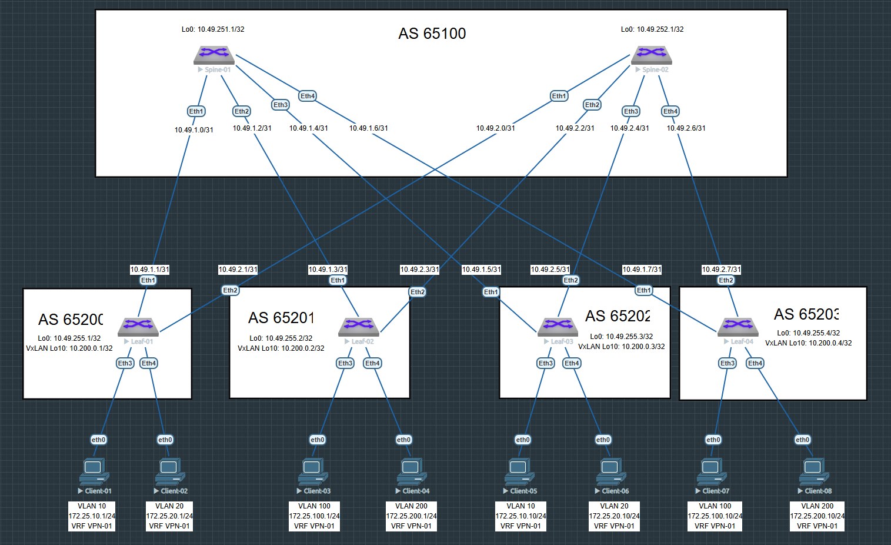

# Домашнее задание №6

## Overlay. VxLAN EVPN L3

### Задача:

- Настроить клиентов в разных VNI
- Настроить маршрутизацию между клиентами 
- Проверить связанность между клиентами

## Выполнение:

### Схема сети



### Конфигурация оборудования

- #### [leaf-01](config/leaf-01.ios)

```
vlan 10
   name VLAN-10
!
vlan 20
   name VLAN-20
!
vrf instance VPN-01
!
interface Vlan10
   vrf VPN-01
   ip address virtual 172.25.10.254/24
!
interface Vlan20
   vrf VPN-01
   ip address virtual 172.25.20.254/24
!
interface Vxlan1
   vxlan source-interface Loopback10
   vxlan udp-port 4789
   vxlan vlan 10 vni 10010
   vxlan vlan 20 vni 10020
   vxlan vrf VPN-01 vni 155
   vxlan learn-restrict any
!
ip virtual-router mac-address 00:00:00:00:00:01
!
ip routing
ip routing vrf VPN-01
!
router bgp 65200
   maximum-paths 4 ecmp 4
   neighbor EVPN peer group
   neighbor EVPN remote-as 65100
   neighbor EVPN update-source Loopback0
   neighbor EVPN ebgp-multihop 3
   neighbor EVPN send-community extended
   neighbor SPINE peer group
   neighbor SPINE remote-as 65100
   neighbor SPINE bfd
   neighbor SPINE send-community extended
   neighbor SPINE maximum-routes 1000
   neighbor 10.49.1.0 peer group SPINE
   neighbor 10.49.2.0 peer group SPINE
   neighbor 10.49.251.1 peer group EVPN
   neighbor 10.49.252.1 peer group EVPN
   redistribute connected route-map RM_CONNECTED
   !
   vlan 10
      rd 65200:10010
      route-target both 10:10010
      redistribute learned
   !
   vlan 20
      rd 65200:10020
      route-target both 20:10020
      redistribute learned
   !
   address-family evpn
      neighbor EVPN activate
   !
   address-family ipv4
      neighbor SPINE activate
   !
   vrf VPN-01
      rd 65200:155
      route-target import evpn 155:155
      route-target export evpn 155:155
!
end

```

- #### [leaf-02](config/leaf-02.ios)

```
vlan 100
   name VLAN-100
!
vlan 200
   name VLAN-200
!
vrf instance VPN-01
!
interface Vlan100
   vrf VPN-01
   ip address virtual 172.25.100.254/24
!
interface Vlan200
   vrf VPN-01
   ip address virtual 172.25.200.254/24
!
interface Vxlan1
   vxlan source-interface Loopback10
   vxlan udp-port 4789
   vxlan vlan 100 vni 10100
   vxlan vlan 200 vni 10200
   vxlan vrf VPN-01 vni 155
   vxlan learn-restrict any
!
ip virtual-router mac-address 00:00:00:00:00:02
!
ip routing
ip routing vrf VPN-01
!
router bgp 65201
   maximum-paths 4 ecmp 4
   neighbor EVPN peer group
   neighbor EVPN remote-as 65100
   neighbor EVPN update-source Loopback0
   neighbor EVPN ebgp-multihop 3
   neighbor EVPN send-community extended
   neighbor SPINE peer group
   neighbor SPINE remote-as 65100
   neighbor SPINE bfd
   neighbor SPINE send-community extended
   neighbor SPINE maximum-routes 1000
   neighbor 10.49.1.2 peer group SPINE
   neighbor 10.49.2.2 peer group SPINE
   neighbor 10.49.251.1 peer group EVPN
   neighbor 10.49.252.1 peer group EVPN
   redistribute connected route-map RM_CONNECTED
   !
   vlan 100
      rd 65201:10100
      route-target both 10:10100
      redistribute learned
   !
   vlan 200
      rd 65201:10200
      route-target both 20:10200
      redistribute learned
   !
   address-family evpn
      neighbor EVPN activate
   !
   address-family ipv4
      neighbor SPINE activate
   !
   vrf VPN-01
      rd 65201:155
      route-target import evpn 155:155
      route-target export evpn 155:155
!
end
```

- #### [leaf-03](config/leaf-03.ios)

```
vlan 10
   name VLAN-10
!
vlan 20
   name VLAN-20
!
vrf instance VPN-01
!
interface Vlan10
   vrf VPN-01
   ip address virtual 172.25.10.254/24
!
interface Vlan20
   vrf VPN-01
   ip address virtual 172.25.20.254/24
!
interface Vxlan1
   vxlan source-interface Loopback10
   vxlan udp-port 4789
   vxlan vlan 10 vni 10010
   vxlan vlan 20 vni 10020
   vxlan vrf VPN-01 vni 155
   vxlan learn-restrict any
!
ip virtual-router mac-address 00:00:00:00:00:03
!
ip routing
ip routing vrf VPN-01
!
router bgp 65202
   maximum-paths 4 ecmp 4
   neighbor EVPN peer group
   neighbor EVPN remote-as 65100
   neighbor EVPN update-source Loopback0
   neighbor EVPN ebgp-multihop 3
   neighbor EVPN send-community extended
   neighbor SPINE peer group
   neighbor SPINE remote-as 65100
   neighbor SPINE bfd
   neighbor SPINE send-community extended
   neighbor SPINE maximum-routes 1000
   neighbor 10.49.1.4 peer group SPINE
   neighbor 10.49.2.4 peer group SPINE
   neighbor 10.49.251.1 peer group EVPN
   neighbor 10.49.252.1 peer group EVPN
   redistribute connected route-map RM_CONNECTED
   !
   vlan 10
      rd 65202:10010
      route-target both 10:10010
      redistribute learned
   !
   vlan 20
      rd 65202:10020
      route-target both 20:10020
      redistribute learned
   !
   address-family evpn
      neighbor EVPN activate
   !
   address-family ipv4
      neighbor SPINE activate
   !
   vrf VPN-01
      rd 65202:155
      route-target import evpn 155:155
      route-target export evpn 155:155
!
end
```
- #### [leaf-04](config/leaf-04.ios)

```
vlan 100
   name VLAN-100
!
vlan 200
   name VLAN-200
!
vrf instance VPN-01
!
interface Vlan100
   vrf VPN-01
   ip address virtual 172.25.100.254/24
!
interface Vlan200
   vrf VPN-01
   ip address virtual 172.25.200.254/24
!
interface Vxlan1
   vxlan source-interface Loopback10
   vxlan udp-port 4789
   vxlan vlan 100 vni 10100
   vxlan vlan 200 vni 10200
   vxlan vrf VPN-01 vni 155
   vxlan learn-restrict any
!
ip virtual-router mac-address 00:00:00:00:00:04
!
ip routing
ip routing vrf VPN-01
!
router bgp 65203
   maximum-paths 4 ecmp 4
   neighbor EVPN peer group
   neighbor EVPN remote-as 65100
   neighbor EVPN update-source Loopback0
   neighbor EVPN ebgp-multihop 3
   neighbor EVPN send-community extended
   neighbor SPINE peer group
   neighbor SPINE remote-as 65100
   neighbor SPINE bfd
   neighbor SPINE send-community
   neighbor SPINE maximum-routes 1000
   neighbor 10.49.1.6 peer group SPINE
   neighbor 10.49.2.6 peer group SPINE
   neighbor 10.49.251.1 peer group EVPN
   neighbor 10.49.252.1 peer group EVPN
   redistribute connected route-map RM_CONNECTED
   !
   vlan 100
      rd 65203:10100
      route-target both 10:10100
      redistribute learned
   !
   vlan 200
      rd 65203:10200
      route-target both 20:10200
      redistribute learned
   !
   address-family evpn
      neighbor EVPN activate
   !
   address-family ipv4
      neighbor SPINE activate
   !
   vrf VPN-01
      rd 65203:155
      route-target import evpn 155:155
      route-target export evpn 155:155
!
end
```
---

### Проверка связанности клиентов по L3

- #### leaf-01

```
leaf-01#sh ip route vrf VPN-01

VRF: VPN-01

Gateway of last resort is not set

 C        172.25.10.0/24 is directly connected, Vlan10
 B E      172.25.20.10/32 [200/0] via VTEP 10.200.0.3 VNI 155 router-mac 50:01:00:be:ab:97 local-interface Vxlan1
 C        172.25.20.0/24 is directly connected, Vlan20
 B E      172.25.100.1/32 [200/0] via VTEP 10.200.0.2 VNI 155 router-mac 50:01:00:ca:7a:8d local-interface Vxlan1
 B E      172.25.100.10/32 [200/0] via VTEP 10.200.0.4 VNI 155 router-mac 50:01:00:27:03:91 local-interface Vxlan1
 B E      172.25.200.1/32 [200/0] via VTEP 10.200.0.2 VNI 155 router-mac 50:01:00:ca:7a:8d local-interface Vxlan1
 B E      172.25.200.10/32 [200/0] via VTEP 10.200.0.4 VNI 155 router-mac 50:01:00:27:03:91 local-interface Vxlan1


```
```
leaf-01#sh bgp evpn route-type ip-prefix ipv4
BGP routing table information for VRF default
Router identifier 10.200.0.1, local AS number 65200
Route status codes: * - valid, > - active, S - Stale, E - ECMP head, e - ECMP
                    c - Contributing to ECMP, % - Pending BGP convergence
Origin codes: i - IGP, e - EGP, ? - incomplete
AS Path Attributes: Or-ID - Originator ID, C-LST - Cluster List, LL Nexthop - Link Local Nexthop

          Network                Next Hop              Metric  LocPref Weight  Path


```
```
leaf-01#sh bgp evpn route-type mac-ip
BGP routing table information for VRF default
Router identifier 10.200.0.1, local AS number 65200
Route status codes: * - valid, > - active, S - Stale, E - ECMP head, e - ECMP
                    c - Contributing to ECMP, % - Pending BGP convergence
Origin codes: i - IGP, e - EGP, ? - incomplete
AS Path Attributes: Or-ID - Originator ID, C-LST - Cluster List, LL Nexthop - Link Local Nexthop

          Network                Next Hop              Metric  LocPref Weight  Path
 * >      RD: 65200:10010 mac-ip 0050.7966.6807
                                 -                     -       -       0       i
 * >      RD: 65200:10010 mac-ip 0050.7966.6807 172.25.10.1
                                 -                     -       -       0       i
 * >Ec    RD: 65201:10100 mac-ip 0050.7966.6809
                                 10.200.0.2            -       100     0       65100 65201 i
 *  ec    RD: 65201:10100 mac-ip 0050.7966.6809
                                 10.200.0.2            -       100     0       65100 65201 i
 * >Ec    RD: 65201:10100 mac-ip 0050.7966.6809 172.25.100.1
                                 10.200.0.2            -       100     0       65100 65201 i
 *  ec    RD: 65201:10100 mac-ip 0050.7966.6809 172.25.100.1
                                 10.200.0.2            -       100     0       65100 65201 i
 * >Ec    RD: 65201:10200 mac-ip 0050.7966.680a
                                 10.200.0.2            -       100     0       65100 65201 i
 *  ec    RD: 65201:10200 mac-ip 0050.7966.680a
                                 10.200.0.2            -       100     0       65100 65201 i
 * >Ec    RD: 65201:10200 mac-ip 0050.7966.680a 172.25.200.1
                                 10.200.0.2            -       100     0       65100 65201 i
 *  ec    RD: 65201:10200 mac-ip 0050.7966.680a 172.25.200.1
                                 10.200.0.2            -       100     0       65100 65201 i
 * >Ec    RD: 65202:10020 mac-ip 0050.7966.680c
                                 10.200.0.3            -       100     0       65100 65202 i
 *  ec    RD: 65202:10020 mac-ip 0050.7966.680c
                                 10.200.0.3            -       100     0       65100 65202 i
 * >Ec    RD: 65202:10020 mac-ip 0050.7966.680c 172.25.20.10
                                 10.200.0.3            -       100     0       65100 65202 i
 *  ec    RD: 65202:10020 mac-ip 0050.7966.680c 172.25.20.10
                                 10.200.0.3            -       100     0       65100 65202 i
 * >Ec    RD: 65203:10100 mac-ip 0050.7966.680d
                                 10.200.0.4            -       100     0       65100 65203 i
 *  ec    RD: 65203:10100 mac-ip 0050.7966.680d
                                 10.200.0.4            -       100     0       65100 65203 i
 * >Ec    RD: 65203:10100 mac-ip 0050.7966.680d 172.25.100.10
                                 10.200.0.4            -       100     0       65100 65203 i
 *  ec    RD: 65203:10100 mac-ip 0050.7966.680d 172.25.100.10
                                 10.200.0.4            -       100     0       65100 65203 i
 * >Ec    RD: 65203:10200 mac-ip 0050.7966.680e
                                 10.200.0.4            -       100     0       65100 65203 i
 *  ec    RD: 65203:10200 mac-ip 0050.7966.680e
                                 10.200.0.4            -       100     0       65100 65203 i
 * >Ec    RD: 65203:10200 mac-ip 0050.7966.680e 172.25.200.10
                                 10.200.0.4            -       100     0       65100 65203 i
 *  ec    RD: 65203:10200 mac-ip 0050.7966.680e 172.25.200.10
                                 10.200.0.4            -       100     0       65100 65203 i

```
```
leaf-01#sh arp vrf VPN-01
Address         Age (sec)  Hardware Addr   Interface
172.25.10.1       0:00:07  0050.7966.6807  Vlan10, Ethernet3
172.25.20.1       0:00:07  0050.7966.6808  Vlan20, Ethernet4
172.25.20.10            -  0050.7966.680c  Vlan20, Vxlan1

```

```
leaf-01#sh int vxlan 1
Vxlan1 is up, line protocol is up (connected)
  Hardware is Vxlan
  Source interface is Loopback10 and is active with 10.200.0.1
  Listening on UDP port 4789
  Replication/Flood Mode is headend with Flood List Source: EVPN
  Remote MAC learning via EVPN
  VNI mapping to VLANs
  Static VLAN to VNI mapping is
    [10, 10010]       [20, 10020]
  Dynamic VLAN to VNI mapping for 'evpn' is
    [4093, 155]
  Note: All Dynamic VLANs used by VCS are internal VLANs.
        Use 'show vxlan vni' for details.
  Static VRF to VNI mapping is
   [VPN-01, 155]
  Headend replication flood vtep list is:
    10 10.200.0.3
    20 10.200.0.3
  Shared Router MAC is 0000.0000.0000

```
```  
leaf-01#sh vxlan vni
VNI to VLAN Mapping for Vxlan1
VNI         VLAN       Source       Interface       802.1Q Tag
----------- ---------- ------------ --------------- ----------
10010       10         static       Ethernet3       untagged
                                    Vxlan1          10
10020       20         static       Ethernet4       untagged
                                    Vxlan1          20

VNI to dynamic VLAN Mapping for Vxlan1
VNI       VLAN       VRF          Source
--------- ---------- ------------ ------------
155       4093       VPN-01       evpn

```

- #### leaf-02

```
leaf-02#sh ip route vrf VPN-01

VRF: VPN-01

Gateway of last resort is not set

 B E      172.25.10.1/32 [200/0] via VTEP 10.200.0.1 VNI 155 router-mac 50:01:00:c7:fa:a0 local-interface Vxlan1
 B E      172.25.20.10/32 [200/0] via VTEP 10.200.0.3 VNI 155 router-mac 50:01:00:be:ab:97 local-interface Vxlan1
 B E      172.25.100.10/32 [200/0] via VTEP 10.200.0.4 VNI 155 router-mac 50:01:00:27:03:91 local-interface Vxlan1
 C        172.25.100.0/24 is directly connected, Vlan100
 B E      172.25.200.10/32 [200/0] via VTEP 10.200.0.4 VNI 155 router-mac 50:01:00:27:03:91 local-interface Vxlan1
 C        172.25.200.0/24 is directly connected, Vlan200

```
```
leaf-02#sh bgp evpn route-type ip-prefix ipv4
BGP routing table information for VRF default
Router identifier 10.200.0.2, local AS number 65201
Route status codes: * - valid, > - active, S - Stale, E - ECMP head, e - ECMP
                    c - Contributing to ECMP, % - Pending BGP convergence
Origin codes: i - IGP, e - EGP, ? - incomplete
AS Path Attributes: Or-ID - Originator ID, C-LST - Cluster List, LL Nexthop - Link Local Nexthop

          Network                Next Hop              Metric  LocPref Weight  Path

```
```
leaf-02#sh bgp evpn route-type mac-ip
BGP routing table information for VRF default
Router identifier 10.200.0.2, local AS number 65201
Route status codes: * - valid, > - active, S - Stale, E - ECMP head, e - ECMP
                    c - Contributing to ECMP, % - Pending BGP convergence
Origin codes: i - IGP, e - EGP, ? - incomplete
AS Path Attributes: Or-ID - Originator ID, C-LST - Cluster List, LL Nexthop - Link Local Nexthop

          Network                Next Hop              Metric  LocPref Weight  Path
 * >Ec    RD: 65200:10010 mac-ip 0050.7966.6807
                                 10.200.0.1            -       100     0       65100 65200 i
 *  ec    RD: 65200:10010 mac-ip 0050.7966.6807
                                 10.200.0.1            -       100     0       65100 65200 i
 * >Ec    RD: 65200:10010 mac-ip 0050.7966.6807 172.25.10.1
                                 10.200.0.1            -       100     0       65100 65200 i
 *  ec    RD: 65200:10010 mac-ip 0050.7966.6807 172.25.10.1
                                 10.200.0.1            -       100     0       65100 65200 i
 * >      RD: 65201:10100 mac-ip 0050.7966.6809
                                 -                     -       -       0       i
 * >      RD: 65201:10100 mac-ip 0050.7966.6809 172.25.100.1
                                 -                     -       -       0       i
 * >      RD: 65201:10200 mac-ip 0050.7966.680a
                                 -                     -       -       0       i
 * >      RD: 65201:10200 mac-ip 0050.7966.680a 172.25.200.1
                                 -                     -       -       0       i
 * >Ec    RD: 65202:10020 mac-ip 0050.7966.680c
                                 10.200.0.3            -       100     0       65100 65202 i
 *  ec    RD: 65202:10020 mac-ip 0050.7966.680c
                                 10.200.0.3            -       100     0       65100 65202 i
 * >Ec    RD: 65202:10020 mac-ip 0050.7966.680c 172.25.20.10
                                 10.200.0.3            -       100     0       65100 65202 i
 *  ec    RD: 65202:10020 mac-ip 0050.7966.680c 172.25.20.10
                                 10.200.0.3            -       100     0       65100 65202 i
 * >Ec    RD: 65203:10100 mac-ip 0050.7966.680d
                                 10.200.0.4            -       100     0       65100 65203 i
 *  ec    RD: 65203:10100 mac-ip 0050.7966.680d
                                 10.200.0.4            -       100     0       65100 65203 i
 * >Ec    RD: 65203:10100 mac-ip 0050.7966.680d 172.25.100.10
                                 10.200.0.4            -       100     0       65100 65203 i
 *  ec    RD: 65203:10100 mac-ip 0050.7966.680d 172.25.100.10
                                 10.200.0.4            -       100     0       65100 65203 i
 * >Ec    RD: 65203:10200 mac-ip 0050.7966.680e
                                 10.200.0.4            -       100     0       65100 65203 i
 *  ec    RD: 65203:10200 mac-ip 0050.7966.680e
                                 10.200.0.4            -       100     0       65100 65203 i
 * >Ec    RD: 65203:10200 mac-ip 0050.7966.680e 172.25.200.10
                                 10.200.0.4            -       100     0       65100 65203 i
 *  ec    RD: 65203:10200 mac-ip 0050.7966.680e 172.25.200.10
                                 10.200.0.4            -       100     0       65100 65203 i

```
```
leaf-02#sh arp vrf VPN-01
Address         Age (sec)  Hardware Addr   Interface
172.25.100.1      0:09:26  0050.7966.6809  Vlan100, Ethernet3
172.25.100.10           -  0050.7966.680d  Vlan100, Vxlan1
172.25.200.1      0:08:59  0050.7966.680a  Vlan200, Ethernet4
172.25.200.10           -  0050.7966.680e  Vlan200, Vxlan1

```
```
leaf-02#sh int vxlan 1
Vxlan1 is up, line protocol is up (connected)
  Hardware is Vxlan
  Source interface is Loopback10 and is active with 10.200.0.2
  Listening on UDP port 4789
  Replication/Flood Mode is headend with Flood List Source: EVPN
  Remote MAC learning via EVPN
  VNI mapping to VLANs
  Static VLAN to VNI mapping is
    [100, 10100]      [200, 10200]
  Dynamic VLAN to VNI mapping for 'evpn' is
    [4093, 155]
  Note: All Dynamic VLANs used by VCS are internal VLANs.
        Use 'show vxlan vni' for details.
  Static VRF to VNI mapping is
   [VPN-01, 155]
  Headend replication flood vtep list is:
   100 10.200.0.4
   200 10.200.0.4
  Shared Router MAC is 0000.0000.0000

```
```  
leaf-02#sh vxlan vni
VNI to VLAN Mapping for Vxlan1
VNI         VLAN       Source       Interface       802.1Q Tag
----------- ---------- ------------ --------------- ----------
10100       100        static       Ethernet3       untagged
                                    Vxlan1          100
10200       200        static       Ethernet4       untagged
                                    Vxlan1          200

VNI to dynamic VLAN Mapping for Vxlan1
VNI       VLAN       VRF          Source
--------- ---------- ------------ ------------
155       4093       VPN-01       evpn

```

- #### leaf-03

```
leaf-03#sh ip route vrf VPN-01

VRF: VPN-01

Gateway of last resort is not set

 B E      172.25.10.1/32 [200/0] via VTEP 10.200.0.1 VNI 155 router-mac 50:01:00:c7:fa:a0 local-interface Vxlan1
 C        172.25.10.0/24 is directly connected, Vlan10
 B E      172.25.20.1/32 [200/0] via VTEP 10.200.0.1 VNI 155 router-mac 50:01:00:c7:fa:a0 local-interface Vxlan1
 C        172.25.20.0/24 is directly connected, Vlan20
 B E      172.25.100.1/32 [200/0] via VTEP 10.200.0.2 VNI 155 router-mac 50:01:00:ca:7a:8d local-interface Vxlan1
 B E      172.25.100.10/32 [200/0] via VTEP 10.200.0.4 VNI 155 router-mac 50:01:00:27:03:91 local-interface Vxlan1
 B E      172.25.200.1/32 [200/0] via VTEP 10.200.0.2 VNI 155 router-mac 50:01:00:ca:7a:8d local-interface Vxlan1
 B E      172.25.200.10/32 [200/0] via VTEP 10.200.0.4 VNI 155 router-mac 50:01:00:27:03:91 local-interface Vxlan1

```
```
leaf-03#sh bgp evpn route-type ip-prefix ipv4
BGP routing table information for VRF default
Router identifier 10.200.0.3, local AS number 65202
Route status codes: * - valid, > - active, S - Stale, E - ECMP head, e - ECMP
                    c - Contributing to ECMP, % - Pending BGP convergence
Origin codes: i - IGP, e - EGP, ? - incomplete
AS Path Attributes: Or-ID - Originator ID, C-LST - Cluster List, LL Nexthop - Link Local Nexthop

          Network                Next Hop              Metric  LocPref Weight  Path

```
```
leaf-03#sh bgp evpn route-type mac-ip
BGP routing table information for VRF default
Router identifier 10.200.0.3, local AS number 65202
Route status codes: * - valid, > - active, S - Stale, E - ECMP head, e - ECMP
                    c - Contributing to ECMP, % - Pending BGP convergence
Origin codes: i - IGP, e - EGP, ? - incomplete
AS Path Attributes: Or-ID - Originator ID, C-LST - Cluster List, LL Nexthop - Link Local Nexthop

          Network                Next Hop              Metric  LocPref Weight  Path
 * >Ec    RD: 65200:10010 mac-ip 0050.7966.6807
                                 10.200.0.1            -       100     0       65100 65200 i
 *  ec    RD: 65200:10010 mac-ip 0050.7966.6807
                                 10.200.0.1            -       100     0       65100 65200 i
 * >Ec    RD: 65200:10010 mac-ip 0050.7966.6807 172.25.10.1
                                 10.200.0.1            -       100     0       65100 65200 i
 *  ec    RD: 65200:10010 mac-ip 0050.7966.6807 172.25.10.1
                                 10.200.0.1            -       100     0       65100 65200 i
 * >Ec    RD: 65200:10020 mac-ip 0050.7966.6808
                                 10.200.0.1            -       100     0       65100 65200 i
 *  ec    RD: 65200:10020 mac-ip 0050.7966.6808
                                 10.200.0.1            -       100     0       65100 65200 i
 * >Ec    RD: 65200:10020 mac-ip 0050.7966.6808 172.25.20.1
                                 10.200.0.1            -       100     0       65100 65200 i
 *  ec    RD: 65200:10020 mac-ip 0050.7966.6808 172.25.20.1
                                 10.200.0.1            -       100     0       65100 65200 i
 * >Ec    RD: 65201:10100 mac-ip 0050.7966.6809
                                 10.200.0.2            -       100     0       65100 65201 i
 *  ec    RD: 65201:10100 mac-ip 0050.7966.6809
                                 10.200.0.2            -       100     0       65100 65201 i
 * >Ec    RD: 65201:10100 mac-ip 0050.7966.6809 172.25.100.1
                                 10.200.0.2            -       100     0       65100 65201 i
 *  ec    RD: 65201:10100 mac-ip 0050.7966.6809 172.25.100.1
                                 10.200.0.2            -       100     0       65100 65201 i
 * >Ec    RD: 65201:10200 mac-ip 0050.7966.680a
                                 10.200.0.2            -       100     0       65100 65201 i
 *  ec    RD: 65201:10200 mac-ip 0050.7966.680a
                                 10.200.0.2            -       100     0       65100 65201 i
 * >Ec    RD: 65201:10200 mac-ip 0050.7966.680a 172.25.200.1
                                 10.200.0.2            -       100     0       65100 65201 i
 *  ec    RD: 65201:10200 mac-ip 0050.7966.680a 172.25.200.1
                                 10.200.0.2            -       100     0       65100 65201 i
 * >      RD: 65202:10010 mac-ip 0050.7966.680b
                                 -                     -       -       0       i
 * >      RD: 65202:10010 mac-ip 0050.7966.680b 172.25.10.10
                                 -                     -       -       0       i
 * >      RD: 65202:10020 mac-ip 0050.7966.680c
                                 -                     -       -       0       i
 * >      RD: 65202:10020 mac-ip 0050.7966.680c 172.25.20.10
                                 -                     -       -       0       i
 * >Ec    RD: 65203:10100 mac-ip 0050.7966.680d
                                 10.200.0.4            -       100     0       65100 65203 i
 *  ec    RD: 65203:10100 mac-ip 0050.7966.680d
                                 10.200.0.4            -       100     0       65100 65203 i
 * >Ec    RD: 65203:10100 mac-ip 0050.7966.680d 172.25.100.10
                                 10.200.0.4            -       100     0       65100 65203 i
 *  ec    RD: 65203:10100 mac-ip 0050.7966.680d 172.25.100.10
                                 10.200.0.4            -       100     0       65100 65203 i
 * >Ec    RD: 65203:10200 mac-ip 0050.7966.680e
                                 10.200.0.4            -       100     0       65100 65203 i
 *  ec    RD: 65203:10200 mac-ip 0050.7966.680e
                                 10.200.0.4            -       100     0       65100 65203 i
 * >Ec    RD: 65203:10200 mac-ip 0050.7966.680e 172.25.200.10
                                 10.200.0.4            -       100     0       65100 65203 i
 *  ec    RD: 65203:10200 mac-ip 0050.7966.680e 172.25.200.10
                                 10.200.0.4            -       100     0       65100 65203 i

```
```
leaf-03#sh arp vrf VPN-01
Address         Age (sec)  Hardware Addr   Interface
172.25.10.1             -  0050.7966.6807  Vlan10, Vxlan1
172.25.10.10      0:06:58  0050.7966.680b  Vlan10, Ethernet3
172.25.20.1             -  0050.7966.6808  Vlan20, Vxlan1
172.25.20.10      0:06:41  0050.7966.680c  Vlan20, Ethernet4

```
```
leaf-03#sh int vxlan 1
Vxlan1 is up, line protocol is up (connected)
  Hardware is Vxlan
  Source interface is Loopback10 and is active with 10.200.0.3
  Listening on UDP port 4789
  Replication/Flood Mode is headend with Flood List Source: EVPN
  Remote MAC learning via EVPN
  VNI mapping to VLANs
  Static VLAN to VNI mapping is
    [10, 10010]       [20, 10020]
  Dynamic VLAN to VNI mapping for 'evpn' is
    [4092, 155]
  Note: All Dynamic VLANs used by VCS are internal VLANs.
        Use 'show vxlan vni' for details.
  Static VRF to VNI mapping is
   [VPN-01, 155]
  Headend replication flood vtep list is:
    10 10.200.0.1
    20 10.200.0.1
  Shared Router MAC is 0000.0000.0000

```
```
leaf-03#sh vxlan vni
VNI to VLAN Mapping for Vxlan1
VNI         VLAN       Source       Interface       802.1Q Tag
----------- ---------- ------------ --------------- ----------
10010       10         static       Ethernet3       untagged
                                    Vxlan1          10
10020       20         static       Ethernet4       untagged
                                    Vxlan1          20

VNI to dynamic VLAN Mapping for Vxlan1
VNI       VLAN       VRF          Source
--------- ---------- ------------ ------------
155       4092       VPN-01       evpn

```

- #### leaf-04

```
leaf-04#sh ip route vrf VPN-01

VRF: VPN-01

Gateway of last resort is not set

 B E      172.25.10.1/32 [200/0] via VTEP 10.200.0.1 VNI 155 router-mac 50:01:00:c7:fa:a0 local-interface Vxlan1
 B E      172.25.10.10/32 [200/0] via VTEP 10.200.0.3 VNI 155 router-mac 50:01:00:be:ab:97 local-interface Vxlan1
 B E      172.25.20.1/32 [200/0] via VTEP 10.200.0.1 VNI 155 router-mac 50:01:00:c7:fa:a0 local-interface Vxlan1
 B E      172.25.20.10/32 [200/0] via VTEP 10.200.0.3 VNI 155 router-mac 50:01:00:be:ab:97 local-interface Vxlan1
 B E      172.25.100.1/32 [200/0] via VTEP 10.200.0.2 VNI 155 router-mac 50:01:00:ca:7a:8d local-interface Vxlan1
 C        172.25.100.0/24 is directly connected, Vlan100
 B E      172.25.200.1/32 [200/0] via VTEP 10.200.0.2 VNI 155 router-mac 50:01:00:ca:7a:8d local-interface Vxlan1
 C        172.25.200.0/24 is directly connected, Vlan200


```
```
leaf-04#sh bgp evpn route-type ip-prefix ipv4
BGP routing table information for VRF default
Router identifier 10.200.0.4, local AS number 65203
Route status codes: * - valid, > - active, S - Stale, E - ECMP head, e - ECMP
                    c - Contributing to ECMP, % - Pending BGP convergence
Origin codes: i - IGP, e - EGP, ? - incomplete
AS Path Attributes: Or-ID - Originator ID, C-LST - Cluster List, LL Nexthop - Link Local Nexthop

          Network                Next Hop              Metric  LocPref Weight  Path

```
```
leaf-04#sh bgp evpn route-type mac-ip
BGP routing table information for VRF default
Router identifier 10.200.0.4, local AS number 65203
Route status codes: * - valid, > - active, S - Stale, E - ECMP head, e - ECMP
                    c - Contributing to ECMP, % - Pending BGP convergence
Origin codes: i - IGP, e - EGP, ? - incomplete
AS Path Attributes: Or-ID - Originator ID, C-LST - Cluster List, LL Nexthop - Link Local Nexthop

          Network                Next Hop              Metric  LocPref Weight  Path
 * >Ec    RD: 65200:10010 mac-ip 0050.7966.6807
                                 10.200.0.1            -       100     0       65100 65200 i
 *  ec    RD: 65200:10010 mac-ip 0050.7966.6807
                                 10.200.0.1            -       100     0       65100 65200 i
 * >Ec    RD: 65200:10010 mac-ip 0050.7966.6807 172.25.10.1
                                 10.200.0.1            -       100     0       65100 65200 i
 *  ec    RD: 65200:10010 mac-ip 0050.7966.6807 172.25.10.1
                                 10.200.0.1            -       100     0       65100 65200 i
 * >Ec    RD: 65200:10020 mac-ip 0050.7966.6808
                                 10.200.0.1            -       100     0       65100 65200 i
 *  ec    RD: 65200:10020 mac-ip 0050.7966.6808
                                 10.200.0.1            -       100     0       65100 65200 i
 * >Ec    RD: 65200:10020 mac-ip 0050.7966.6808 172.25.20.1
                                 10.200.0.1            -       100     0       65100 65200 i
 *  ec    RD: 65200:10020 mac-ip 0050.7966.6808 172.25.20.1
                                 10.200.0.1            -       100     0       65100 65200 i
 * >Ec    RD: 65201:10100 mac-ip 0050.7966.6809
                                 10.200.0.2            -       100     0       65100 65201 i
 *  ec    RD: 65201:10100 mac-ip 0050.7966.6809
                                 10.200.0.2            -       100     0       65100 65201 i
 * >Ec    RD: 65201:10100 mac-ip 0050.7966.6809 172.25.100.1
                                 10.200.0.2            -       100     0       65100 65201 i
 *  ec    RD: 65201:10100 mac-ip 0050.7966.6809 172.25.100.1
                                 10.200.0.2            -       100     0       65100 65201 i
 * >Ec    RD: 65201:10200 mac-ip 0050.7966.680a
                                 10.200.0.2            -       100     0       65100 65201 i
 *  ec    RD: 65201:10200 mac-ip 0050.7966.680a
                                 10.200.0.2            -       100     0       65100 65201 i
 * >Ec    RD: 65201:10200 mac-ip 0050.7966.680a 172.25.200.1
                                 10.200.0.2            -       100     0       65100 65201 i
 *  ec    RD: 65201:10200 mac-ip 0050.7966.680a 172.25.200.1
                                 10.200.0.2            -       100     0       65100 65201 i
 * >Ec    RD: 65202:10010 mac-ip 0050.7966.680b
                                 10.200.0.3            -       100     0       65100 65202 i
 *  ec    RD: 65202:10010 mac-ip 0050.7966.680b
                                 10.200.0.3            -       100     0       65100 65202 i
 * >Ec    RD: 65202:10010 mac-ip 0050.7966.680b 172.25.10.10
                                 10.200.0.3            -       100     0       65100 65202 i
 *  ec    RD: 65202:10010 mac-ip 0050.7966.680b 172.25.10.10
                                 10.200.0.3            -       100     0       65100 65202 i
 * >Ec    RD: 65202:10020 mac-ip 0050.7966.680c
                                 10.200.0.3            -       100     0       65100 65202 i
 *  ec    RD: 65202:10020 mac-ip 0050.7966.680c
                                 10.200.0.3            -       100     0       65100 65202 i
 * >Ec    RD: 65202:10020 mac-ip 0050.7966.680c 172.25.20.10
                                 10.200.0.3            -       100     0       65100 65202 i
 *  ec    RD: 65202:10020 mac-ip 0050.7966.680c 172.25.20.10
                                 10.200.0.3            -       100     0       65100 65202 i
 * >      RD: 65203:10100 mac-ip 0050.7966.680d
                                 -                     -       -       0       i
 * >      RD: 65203:10100 mac-ip 0050.7966.680d 172.25.100.10
                                 -                     -       -       0       i
 * >      RD: 65203:10200 mac-ip 0050.7966.680e
                                 -                     -       -       0       i
 * >      RD: 65203:10200 mac-ip 0050.7966.680e 172.25.200.10
                                 -                     -       -       0       i

```
```
leaf-04#sh arp vrf VPN-01
Address         Age (sec)  Hardware Addr   Interface
172.25.100.1            -  0050.7966.6809  Vlan100, Vxlan1
172.25.100.10     0:00:55  0050.7966.680d  Vlan100, Ethernet3
172.25.200.1            -  0050.7966.680a  Vlan200, Vxlan1
172.25.200.10     0:00:52  0050.7966.680e  Vlan200, Ethernet4

```
```
leaf-04#sh arp vrf VPN-01
Address         Age (sec)  Hardware Addr   Interface
172.25.100.1            -  0050.7966.6809  Vlan100, Vxlan1
172.25.100.10     0:00:55  0050.7966.680d  Vlan100, Ethernet3
172.25.200.1            -  0050.7966.680a  Vlan200, Vxlan1
172.25.200.10     0:00:52  0050.7966.680e  Vlan200, Ethernet4
leaf-04#sh int vxlan 1
Vxlan1 is up, line protocol is up (connected)
  Hardware is Vxlan
  Source interface is Loopback10 and is active with 10.200.0.4
  Listening on UDP port 4789
  Replication/Flood Mode is headend with Flood List Source: EVPN
  Remote MAC learning via EVPN
  VNI mapping to VLANs
  Static VLAN to VNI mapping is
    [100, 10100]      [200, 10200]
  Dynamic VLAN to VNI mapping for 'evpn' is
    [4092, 155]
  Note: All Dynamic VLANs used by VCS are internal VLANs.
        Use 'show vxlan vni' for details.
  Static VRF to VNI mapping is
   [VPN-01, 155]
  Headend replication flood vtep list is:
   100 10.200.0.2
   200 10.200.0.2
  Shared Router MAC is 0000.0000.0000

```
```
leaf-04#sh vxlan vni
VNI to VLAN Mapping for Vxlan1
VNI         VLAN       Source       Interface       802.1Q Tag
----------- ---------- ------------ --------------- ----------
10100       100        static       Ethernet3       untagged
                                    Vxlan1          100
10200       200        static       Ethernet4       untagged
                                    Vxlan1          200

VNI to dynamic VLAN Mapping for Vxlan1
VNI       VLAN       VRF          Source
--------- ---------- ------------ ------------
155       4092       VPN-01       evpn

```


- #### client-01

```
VPCS> sh ip

NAME        : VPCS[1]
IP/MASK     : 172.25.10.1/24
GATEWAY     : 172.25.10.254
DNS         :
MAC         : 00:50:79:66:68:07
LPORT       : 20000
RHOST:PORT  : 127.0.0.1:30000
MTU         : 1500

VPCS> ping 172.25.10.10 -c 2

84 bytes from 172.25.10.10 icmp_seq=1 ttl=64 time=44.327 ms
84 bytes from 172.25.10.10 icmp_seq=2 ttl=64 time=45.569 ms

VPCS> ping 172.25.20.1 -c 2

84 bytes from 172.25.20.1 icmp_seq=1 ttl=63 time=19.092 ms
84 bytes from 172.25.20.1 icmp_seq=2 ttl=63 time=14.088 ms

VPCS> ping 172.25.20.10 -c 2

84 bytes from 172.25.20.10 icmp_seq=1 ttl=62 time=21.165 ms
84 bytes from 172.25.20.10 icmp_seq=2 ttl=62 time=33.237 ms


VPCS> ping 172.25.100.1 -c 2

84 bytes from 172.25.100.1 icmp_seq=1 ttl=62 time=41.233 ms
84 bytes from 172.25.100.1 icmp_seq=2 ttl=62 time=31.633 ms


VPCS> ping 172.25.200.1 -c 2

84 bytes from 172.25.200.1 icmp_seq=1 ttl=62 time=50.795 ms
84 bytes from 172.25.200.1 icmp_seq=2 ttl=62 time=28.444 ms

VPCS> ping 172.25.200.10 -c 2

84 bytes from 172.25.200.10 icmp_seq=1 ttl=62 time=34.340 ms
84 bytes from 172.25.200.10 icmp_seq=2 ttl=62 time=35.360 ms

VPCS> ping 172.25.100.10 -c 2

84 bytes from 172.25.100.10 icmp_seq=1 ttl=62 time=27.208 ms
84 bytes from 172.25.100.10 icmp_seq=2 ttl=62 time=30.960 ms


```

- #### client-04

```
VPCS> sh ip

NAME        : VPCS[1]
IP/MASK     : 172.25.200.10/24
GATEWAY     : 172.25.200.254
DNS         :
MAC         : 00:50:79:66:68:0e
LPORT       : 20000
RHOST:PORT  : 127.0.0.1:30000
MTU         : 1500


VPCS> ping 172.25.10.1 -c 2

84 bytes from 172.25.10.1 icmp_seq=1 ttl=62 time=26.645 ms
84 bytes from 172.25.10.1 icmp_seq=2 ttl=62 time=31.507 ms

VPCS> ping 172.25.20.1 -c 2

84 bytes from 172.25.20.1 icmp_seq=1 ttl=62 time=34.387 ms
84 bytes from 172.25.20.1 icmp_seq=2 ttl=62 time=38.046 ms

VPCS> ping 172.25.100.1 -c 2

84 bytes from 172.25.100.1 icmp_seq=1 ttl=62 time=57.385 ms
84 bytes from 172.25.100.1 icmp_seq=2 ttl=62 time=30.352 ms

VPCS> ping 172.25.200.1 -c 2

84 bytes from 172.25.200.1 icmp_seq=1 ttl=64 time=25.013 ms
84 bytes from 172.25.200.1 icmp_seq=2 ttl=64 time=25.046 ms

VPCS> ping 172.25.10.10 -c 2

84 bytes from 172.25.10.10 icmp_seq=1 ttl=62 time=45.180 ms
84 bytes from 172.25.10.10 icmp_seq=2 ttl=62 time=37.979 ms

VPCS> ping 172.25.20.10 -c 2

84 bytes from 172.25.20.10 icmp_seq=1 ttl=62 time=51.958 ms
84 bytes from 172.25.20.10 icmp_seq=2 ttl=62 time=29.893 ms

VPCS> ping 172.25.100.10 -c 2

84 bytes from 172.25.100.10 icmp_seq=1 ttl=63 time=11.712 ms
84 bytes from 172.25.100.10 icmp_seq=2 ttl=63 time=5.891 ms

```

