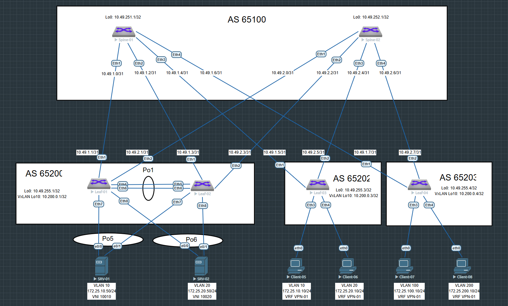

# Домашнее задание №7

## Overlay. VxLAN VPC

### Задача:

- Подключить клиентов 2-я линками к разным Leaf
- Настроить агрегированный канал со стороны клиента 
- Настроить VPC для работы в Overlay сети
- Проверить связанность между клиентами

## Выполнение:

### Схема сети



### Конфигурация оборудования

- #### [leaf-01](config/leaf-01.ios)

```
spanning-tree mode mstp
no spanning-tree vlan-id 4094
!
vlan 10
   name VLAN-10
!
vlan 20
   name VLAN-20
!
vlan 4094
   trunk group MLAGPEER
!
vrf instance VPN-01
!
interface Port-Channel1
   description Peer-Link
   switchport mode trunk
   switchport trunk group MLAGPEER
!
interface Port-Channel5
   description --- to SRV-01 ---
   switchport mode trunk
   mlag 5
!
interface Port-Channel6
   description --- to SRV-02 ---
   switchport mode trunk
   mlag 6
!
interface Ethernet5
   channel-group 1 mode active
!
interface Ethernet6
   channel-group 1 mode active
!
interface Ethernet7
   channel-group 5 mode active
!
interface Ethernet8
   channel-group 6 mode active
!
interface Loopback0
   ip address 10.49.255.1/32
!
interface Loopback10
   ip address 10.200.0.1/32
!
interface Vlan10
   vrf VPN-01
   ip address virtual 172.25.10.254/24
!
interface Vlan20
   vrf VPN-01
   ip address virtual 172.25.20.254/24
!
interface Vlan4094
   ip address 10.10.10.0/31
!
interface Vxlan1
   vxlan source-interface Loopback10
   vxlan udp-port 4789
   vxlan vlan 10 vni 10010
   vxlan vlan 20 vni 10020
   vxlan vrf VPN-01 vni 155
   vxlan virtual-vtep local-interface Loopback10
   vxlan learn-restrict any
!
ip virtual-router mac-address 00:00:00:00:00:01
!
ip routing
ip routing vrf VPN-01
!
mlag configuration
   domain-id mlag1
   local-interface Vlan4094
   peer-address 10.10.10.1
   peer-link Port-Channel1
!
router bgp 65200
   maximum-paths 4 ecmp 4
   neighbor EVPN peer group
   neighbor EVPN remote-as 65100
   neighbor EVPN update-source Loopback0
   neighbor EVPN ebgp-multihop 3
   neighbor EVPN send-community extended
   neighbor SPINE peer group
   neighbor SPINE remote-as 65100
   neighbor SPINE bfd
   neighbor SPINE send-community extended
   neighbor SPINE maximum-routes 1000
   neighbor 10.49.1.0 peer group SPINE
   neighbor 10.49.2.0 peer group SPINE
   neighbor 10.49.251.1 peer group EVPN
   neighbor 10.49.252.1 peer group EVPN
   redistribute connected route-map RM_CONNECTED
   !
   vlan 10
      rd 65200:10010
      route-target both 10:10010
      redistribute learned
   !
   vlan 20
      rd 65200:10020
      route-target both 20:10020
      redistribute learned
   !
   address-family evpn
      neighbor EVPN activate
   !
   address-family ipv4
      neighbor SPINE activate
   !
   vrf VPN-01
      rd 65200:155
      route-target import evpn 155:155
      route-target export evpn 155:155
      redistribute connected
!
end

```

- #### [leaf-02](config/leaf-02.ios)

```
spanning-tree mode mstp
no spanning-tree vlan-id 4094
!
vlan 10
   name VLAN-10
!
vlan 20
   name VLAN-20
!
vlan 4094
   trunk group MLAGPEER
!
vrf instance VPN-01
!
interface Port-Channel1
   description Peer-Link
   switchport mode trunk
   switchport trunk group MLAGPEER
!
interface Port-Channel5
   description --- to SRV-01 ---
   switchport mode trunk
   mlag 5
!
interface Port-Channel6
   description --- to SRV-02 ---
   switchport mode trunk
   mlag 6
!
interface Ethernet5
   channel-group 1 mode active
!
interface Ethernet6
   channel-group 1 mode active
!
interface Ethernet7
   channel-group 5 mode active
!
interface Ethernet8
   channel-group 6 mode active
!
interface Loopback0
   ip address 10.49.255.2/32
!
interface Loopback10
   ip address 10.200.0.1/32
!
interface Vlan10
   vrf VPN-01
   ip address virtual 172.25.10.254/24
!
interface Vlan20
   vrf VPN-01
   ip address virtual 172.25.20.254/24
!
interface Vlan4094
   ip address 10.10.10.1/31
!
interface Vxlan1
   vxlan source-interface Loopback10
   vxlan udp-port 4789
   vxlan vlan 10 vni 10010
   vxlan vlan 20 vni 10020
   vxlan vrf VPN-01 vni 155
   vxlan virtual-vtep local-interface Loopback10
   vxlan learn-restrict any
!
ip virtual-router mac-address 00:00:00:00:00:01
!
ip routing
ip routing vrf VPN-01
!
mlag configuration
   domain-id mlag1
   local-interface Vlan4094
   peer-address 10.10.10.0
   peer-link Port-Channel1
!
router bgp 65200
   maximum-paths 4 ecmp 4
   neighbor EVPN peer group
   neighbor EVPN remote-as 65100
   neighbor EVPN update-source Loopback0
   neighbor EVPN ebgp-multihop 3
   neighbor EVPN send-community extended
   neighbor SPINE peer group
   neighbor SPINE remote-as 65100
   neighbor SPINE bfd
   neighbor SPINE send-community extended
   neighbor SPINE maximum-routes 1000
   neighbor 10.49.1.2 peer group SPINE
   neighbor 10.49.2.2 peer group SPINE
   neighbor 10.49.251.1 peer group EVPN
   neighbor 10.49.252.1 peer group EVPN
   redistribute connected route-map RM_CONNECTED
   !
   vlan 10
      rd 65200:10010
      route-target both 10:10010
      redistribute learned
   !
   vlan 20
      rd 65200:10020
      route-target both 20:10020
      redistribute learned
   !
   address-family evpn
      neighbor EVPN activate
   !
   address-family ipv4
      neighbor SPINE activate
   !
   vrf VPN-01
      rd 65200:155
      route-target import evpn 155:155
      route-target export evpn 155:155
      redistribute connected
!
end

```

- #### [leaf-03](config/leaf-03.ios)

```
vlan 10
   name VLAN-10
!
vlan 20
   name VLAN-20
!
vrf instance VPN-01
!
interface Ethernet3
   switchport access vlan 10
!
interface Ethernet4
   switchport access vlan 20
!
interface Loopback0
   ip address 10.49.255.3/32
!
interface Loopback10
   ip address 10.200.0.3/32
!
interface Vlan10
   vrf VPN-01
   ip address virtual 172.25.10.254/24
!
interface Vlan20
   vrf VPN-01
   ip address virtual 172.25.20.254/24
!
interface Vxlan1
   vxlan source-interface Loopback10
   vxlan udp-port 4789
   vxlan vlan 10 vni 10010
   vxlan vlan 20 vni 10020
   vxlan vrf VPN-01 vni 155
   vxlan learn-restrict any
!
ip virtual-router mac-address 00:00:00:00:00:03
!
ip routing
ip routing vrf VPN-01
!
router bgp 65202
   maximum-paths 4 ecmp 4
   neighbor EVPN peer group
   neighbor EVPN remote-as 65100
   neighbor EVPN update-source Loopback0
   neighbor EVPN ebgp-multihop 3
   neighbor EVPN send-community extended
   neighbor SPINE peer group
   neighbor SPINE remote-as 65100
   neighbor SPINE bfd
   neighbor SPINE send-community extended
   neighbor SPINE maximum-routes 1000
   neighbor 10.49.1.4 peer group SPINE
   neighbor 10.49.2.4 peer group SPINE
   neighbor 10.49.251.1 peer group EVPN
   neighbor 10.49.252.1 peer group EVPN
   redistribute connected route-map RM_CONNECTED
   !
   vlan 10
      rd 65202:10010
      route-target both 10:10010
      redistribute learned
   !
   vlan 20
      rd 65202:10020
      route-target both 20:10020
      redistribute learned
   !
   address-family evpn
      neighbor EVPN activate
   !
   address-family ipv4
      neighbor SPINE activate
   !
   vrf VPN-01
      rd 65202:155
      route-target import evpn 155:155
      route-target export evpn 155:155
      redistribute connected
!
end


```

- #### [leaf-04](config/leaf-04.ios)

```
vlan 100
   name VLAN-100
!
vlan 200
   name VLAN-200
!
vrf instance VPN-01
!
interface Ethernet3
   switchport access vlan 100
!
interface Ethernet4
   switchport access vlan 200
!
interface Loopback0
   ip address 10.49.255.4/32
!
interface Loopback10
   ip address 10.200.0.4/32
!
interface Vlan100
   vrf VPN-01
   ip address virtual 172.25.100.254/24
!
interface Vlan200
   vrf VPN-01
   ip address virtual 172.25.200.254/24
!
interface Vxlan1
   vxlan source-interface Loopback10
   vxlan udp-port 4789
   vxlan vlan 100 vni 10100
   vxlan vlan 200 vni 10200
   vxlan vrf VPN-01 vni 155
   vxlan learn-restrict any
!
ip virtual-router mac-address 00:00:00:00:00:04
!
ip routing
ip routing vrf VPN-01
!
router bgp 65203
   maximum-paths 4 ecmp 4
   neighbor EVPN peer group
   neighbor EVPN remote-as 65100
   neighbor EVPN update-source Loopback0
   neighbor EVPN ebgp-multihop 3
   neighbor EVPN send-community extended
   neighbor SPINE peer group
   neighbor SPINE remote-as 65100
   neighbor SPINE bfd
   neighbor SPINE send-community
   neighbor SPINE maximum-routes 1000
   neighbor 10.49.1.6 peer group SPINE
   neighbor 10.49.2.6 peer group SPINE
   neighbor 10.49.251.1 peer group EVPN
   neighbor 10.49.252.1 peer group EVPN
   redistribute connected route-map RM_CONNECTED
   !
   vlan 100
      rd 65203:10100
      route-target both 10:10100
      redistribute learned
   !
   vlan 200
      rd 65203:10200
      route-target both 20:10200
      redistribute learned
   !
   address-family evpn
      neighbor EVPN activate
   !
   address-family ipv4
      neighbor SPINE activate
   !
   vrf VPN-01
      rd 65203:155
      route-target import evpn 155:155
      route-target export evpn 155:155
      redistribute connected
!
end

```

- #### [server-01](config/srv-01.ios)

```
vlan 10,20
!
interface Port-channel5
 switchport trunk allowed vlan 10
 switchport trunk encapsulation dot1q
 switchport mode trunk
!
interface Ethernet0/0
 switchport trunk allowed vlan 10
 switchport trunk encapsulation dot1q
 switchport mode trunk
 channel-group 5 mode active
!
interface Ethernet0/1
 switchport trunk allowed vlan 10
 switchport trunk encapsulation dot1q
 switchport mode trunk
 channel-group 5 mode active
!
interface Vlan10
 ip address 172.25.10.50 255.255.255.0
!
ip forward-protocol nd
!
ip http server
ip http secure-server
!
ip route 0.0.0.0 0.0.0.0 172.25.10.254


```

- #### [server-02](config/srv-02.ios)

```
vlan 20
!
interface Port-channel6
 switchport trunk allowed vlan 20
 switchport trunk encapsulation dot1q
 switchport mode trunk
!
interface Ethernet0/0
 switchport trunk allowed vlan 20
 switchport trunk encapsulation dot1q
 switchport mode trunk
 channel-group 6 mode active
!
interface Ethernet0/1
 switchport trunk allowed vlan 20
 switchport trunk encapsulation dot1q
 switchport mode trunk
 channel-group 6 mode active
!
interface Vlan20
 ip address 172.25.20.50 255.255.255.0
!
ip route 0.0.0.0 0.0.0.0 172.25.20.254
```

---

### Проверка связанности клиентов по L3

- #### leaf-01

```
leaf-01#sh mlag
MLAG Configuration:
domain-id                          :               mlag1
local-interface                    :            Vlan4094
peer-address                       :          10.10.10.1
peer-link                          :       Port-Channel1
peer-config                        :          consistent

MLAG Status:
state                              :              Active
negotiation status                 :           Connected
peer-link status                   :                  Up
local-int status                   :                  Up
system-id                          :   52:01:00:c7:fa:a0
dual-primary detection             :            Disabled
dual-primary interface errdisabled :               False

MLAG Ports:
Disabled                           :                   0
Configured                         :                   0
Inactive                           :                   0
Active-partial                     :                   0
Active-full                        :                   2

```
```
leaf-01#sh mlag interfaces detail
                                        local/remote
 mlag         state   local   remote    oper    config    last change   changes
------ ------------- ------- -------- ------- --------- --------------- -------
    5   active-full     Po5      Po5   up/up   ena/ena   13:46:24 ago         4
    6   active-full     Po6      Po6   up/up   ena/ena   13:24:41 ago        12
```
```
leaf-01#sh port-channel 5 detailed
Port Channel Port-Channel5 (Fallback State: Unconfigured):
Minimum links: unconfigured
Minimum speed: unconfigured
Current weight/Max weight: 1/16
  Active Ports:
      Port               Time Became Active      Protocol      Mode      Weight
    ------------------ ----------------------- ------------- ----------- ------
      Ethernet7          Thu 18:14:01            LACP          Active      1
      PeerEthernet7      Thu 18:12:37            LACP          Active      0

leaf-01#sh port-channel 6 detailed
Port Channel Port-Channel6 (Fallback State: Unconfigured):
Minimum links: unconfigured
Minimum speed: unconfigured
Current weight/Max weight: 1/16
  Active Ports:
      Port               Time Became Active      Protocol      Mode      Weight
    ------------------ ----------------------- ------------- ----------- ------
      Ethernet8          Thu 18:35:44            LACP          Active      1
      PeerEthernet8      Thu 18:35:45            LACP          Active      0


```
```

leaf-01#sh bgp evpn
BGP routing table information for VRF default
Router identifier 10.200.0.1, local AS number 65200
Route status codes: * - valid, > - active, S - Stale, E - ECMP head, e - ECMP
                    c - Contributing to ECMP, % - Pending BGP convergence
Origin codes: i - IGP, e - EGP, ? - incomplete
AS Path Attributes: Or-ID - Originator ID, C-LST - Cluster List, LL Nexthop - Link Local Nexthop

          Network                Next Hop              Metric  LocPref Weight  Path
 * >Ec    RD: 65202:10010 mac-ip 0050.7966.680b
                                 10.200.0.3            -       100     0       65100 65202 i
 *  ec    RD: 65202:10010 mac-ip 0050.7966.680b
                                 10.200.0.3            -       100     0       65100 65202 i
 * >Ec    RD: 65202:10010 mac-ip 0050.7966.680b 172.25.10.10
                                 10.200.0.3            -       100     0       65100 65202 i
 *  ec    RD: 65202:10010 mac-ip 0050.7966.680b 172.25.10.10
                                 10.200.0.3            -       100     0       65100 65202 i
 * >Ec    RD: 65202:10020 mac-ip 0050.7966.680c
                                 10.200.0.3            -       100     0       65100 65202 i
 *  ec    RD: 65202:10020 mac-ip 0050.7966.680c
                                 10.200.0.3            -       100     0       65100 65202 i
 * >Ec    RD: 65202:10020 mac-ip 0050.7966.680c 172.25.20.10
                                 10.200.0.3            -       100     0       65100 65202 i
 *  ec    RD: 65202:10020 mac-ip 0050.7966.680c 172.25.20.10
                                 10.200.0.3            -       100     0       65100 65202 i
 * >      RD: 65200:10010 mac-ip aabb.cc80.7100
                                 -                     -       -       0       i
 * >      RD: 65200:10010 mac-ip aabb.cc80.7100 172.25.10.50
                                 -                     -       -       0       i
 * >      RD: 65200:10020 mac-ip aabb.cc80.8100
                                 -                     -       -       0       i
 * >      RD: 65200:10020 mac-ip aabb.cc80.8100 172.25.20.50
                                 -                     -       -       0       i
 * >      RD: 65200:10010 imet 10.200.0.1
                                 -                     -       -       0       i
 * >      RD: 65200:10020 imet 10.200.0.1
                                 -                     -       -       0       i
 * >Ec    RD: 65202:10010 imet 10.200.0.3
                                 10.200.0.3            -       100     0       65100 65202 i
 *  ec    RD: 65202:10010 imet 10.200.0.3
                                 10.200.0.3            -       100     0       65100 65202 i
 * >Ec    RD: 65202:10020 imet 10.200.0.3
                                 10.200.0.3            -       100     0       65100 65202 i
 *  ec    RD: 65202:10020 imet 10.200.0.3
                                 10.200.0.3            -       100     0       65100 65202 i
 * >Ec    RD: 65203:10100 imet 10.200.0.4
                                 10.200.0.4            -       100     0       65100 65203 i
 *  ec    RD: 65203:10100 imet 10.200.0.4
                                 10.200.0.4            -       100     0       65100 65203 i
 * >Ec    RD: 65203:10200 imet 10.200.0.4
                                 10.200.0.4            -       100     0       65100 65203 i
 *  ec    RD: 65203:10200 imet 10.200.0.4
                                 10.200.0.4            -       100     0       65100 65203 i
 * >      RD: 65200:155 ip-prefix 172.25.10.0/24
                                 -                     -       -       0       i
 * >Ec    RD: 65202:155 ip-prefix 172.25.10.0/24
                                 10.200.0.3            -       100     0       65100 65202 i
 *  ec    RD: 65202:155 ip-prefix 172.25.10.0/24
                                 10.200.0.3            -       100     0       65100 65202 i
 * >      RD: 65200:155 ip-prefix 172.25.20.0/24
                                 -                     -       -       0       i
 * >Ec    RD: 65202:155 ip-prefix 172.25.20.0/24
                                 10.200.0.3            -       100     0       65100 65202 i
 *  ec    RD: 65202:155 ip-prefix 172.25.20.0/24
                                 10.200.0.3            -       100     0       65100 65202 i
 * >Ec    RD: 65203:155 ip-prefix 172.25.100.0/24
                                 10.200.0.4            -       100     0       65100 65203 i
 *  ec    RD: 65203:155 ip-prefix 172.25.100.0/24
                                 10.200.0.4            -       100     0       65100 65203 i
 * >Ec    RD: 65203:155 ip-prefix 172.25.200.0/24
                                 10.200.0.4            -       100     0       65100 65203 i
 *  ec    RD: 65203:155 ip-prefix 172.25.200.0/24
                                 10.200.0.4            -       100     0       65100 65203 i

```
```
leaf-01#sh ip ro vrf VPN-01

VRF: VPN-01

Gateway of last resort is not set

 B E      172.25.10.10/32 [200/0] via VTEP 10.200.0.3 VNI 155 router-mac 50:01:00:be:ab:97 local-interface Vxlan1
 C        172.25.10.0/24 is directly connected, Vlan10
 B E      172.25.20.10/32 [200/0] via VTEP 10.200.0.3 VNI 155 router-mac 50:01:00:be:ab:97 local-interface Vxlan1
 C        172.25.20.0/24 is directly connected, Vlan20
 B E      172.25.100.10/32 [200/0] via VTEP 10.200.0.4 VNI 155 router-mac 50:01:00:27:03:91 local-interface Vxlan1
 B E      172.25.100.0/24 [200/0] via VTEP 10.200.0.4 VNI 155 router-mac 50:01:00:27:03:91 local-interface Vxlan1
 B E      172.25.200.10/32 [200/0] via VTEP 10.200.0.4 VNI 155 router-mac 50:01:00:27:03:91 local-interface Vxlan1
 B E      172.25.200.0/24 [200/0] via VTEP 10.200.0.4 VNI 155 router-mac 50:01:00:27:03:91 local-interface Vxlan1

```
```
leaf-01#sh vxlan address-table
          Vxlan Mac Address Table
----------------------------------------------------------------------

VLAN  Mac Address     Type      Prt  VTEP             Moves   Last Move
----  -----------     ----      ---  ----             -----   ---------
  10  0050.7966.680b  EVPN      Vx1  10.200.0.3       1       0:08:11 ago
  20  0050.7966.680c  EVPN      Vx1  10.200.0.3       1       0:07:48 ago
4093  5001.0027.0391  EVPN      Vx1  10.200.0.4       1       1:34:40 ago
4093  5001.00be.ab97  EVPN      Vx1  10.200.0.3       1       1:36:04 ago
Total Remote Mac Addresses for this criterion: 4

```
```
leaf-01#sh int vxlan 1
Vxlan1 is up, line protocol is up (connected)
  Hardware is Vxlan
  Source interface is Loopback10 and is active with 10.200.0.1
  Listening on UDP port 4789
  Virtual VTEP source interface is 'Loopback10'
  Replication/Flood Mode is headend with Flood List Source: EVPN
  Remote MAC learning via EVPN
  VNI mapping to VLANs
  Static VLAN to VNI mapping is
    [10, 10010]       [20, 10020]
  Dynamic VLAN to VNI mapping for 'evpn' is
    [4093, 155]
  Note: All Dynamic VLANs used by VCS are internal VLANs.
        Use 'show vxlan vni' for details.
  Static VRF to VNI mapping is
   [VPN-01, 155]
  Headend replication flood vtep list is:
    10 10.200.0.3
    20 10.200.0.3
  MLAG Shared Router MAC is 0000.0000.0000

```
```  
leaf-01#sh vxlan vni
VNI to VLAN Mapping for Vxlan1
VNI         VLAN       Source       Interface           802.1Q Tag
----------- ---------- ------------ ------------------- ----------
10010       10         static       Ethernet3           untagged
                                    Port-Channel5       10
                                    Port-Channel6       10
                                    Vxlan1              10
10020       20         static       Ethernet4           untagged
                                    Port-Channel5       20
                                    Port-Channel6       20
                                    Vxlan1              20

VNI to dynamic VLAN Mapping for Vxlan1
VNI       VLAN       VRF          Source
--------- ---------- ------------ ------------
155       4093       VPN-01       evpn

```

- #### leaf-02

```
leaf-02#sh mlag
MLAG Configuration:
domain-id                          :               mlag1
local-interface                    :            Vlan4094
peer-address                       :          10.10.10.0
peer-link                          :       Port-Channel1
peer-config                        :          consistent

MLAG Status:
state                              :              Active
negotiation status                 :           Connected
peer-link status                   :                  Up
local-int status                   :                  Up
system-id                          :   52:01:00:c7:fa:a0
dual-primary detection             :            Disabled
dual-primary interface errdisabled :               False

MLAG Ports:
Disabled                           :                   0
Configured                         :                   0
Inactive                           :                   0
Active-partial                     :                   0
Active-full                        :                   2

```
```
leaf-02#sh mlag interfaces detail
                                        local/remote
 mlag         state   local   remote    oper    config    last change   changes
------ ------------- ------- -------- ------- --------- --------------- -------
    5   active-full     Po5      Po5   up/up   ena/ena   14:03:35 ago         4
    6   active-full     Po6      Po6   up/up   ena/ena   13:41:52 ago        11

```
```
leaf-02#sh port-channel 5 detailed
Port Channel Port-Channel5 (Fallback State: Unconfigured):
Minimum links: unconfigured
Minimum speed: unconfigured
Current weight/Max weight: 1/16
  Active Ports:
      Port               Time Became Active      Protocol      Mode      Weight
    ------------------ ----------------------- ------------- ----------- ------
      Ethernet7          Thu 18:12:37            LACP          Active      1
      PeerEthernet7      Thu 18:14:01            LACP          Active      0

leaf-02#sh port-channel 6 detailed
Port Channel Port-Channel6 (Fallback State: Unconfigured):
Minimum links: unconfigured
Minimum speed: unconfigured
Current weight/Max weight: 1/16
  Active Ports:
      Port               Time Became Active      Protocol      Mode      Weight
    ------------------ ----------------------- ------------- ----------- ------
      Ethernet8          Thu 18:35:45            LACP          Active      1
      PeerEthernet8      Thu 18:35:44            LACP          Active      0

```
```
leaf-02#sh bgp evpn
BGP routing table information for VRF default
Router identifier 10.200.0.1, local AS number 65200
Route status codes: * - valid, > - active, S - Stale, E - ECMP head, e - ECMP
                    c - Contributing to ECMP, % - Pending BGP convergence
Origin codes: i - IGP, e - EGP, ? - incomplete
AS Path Attributes: Or-ID - Originator ID, C-LST - Cluster List, LL Nexthop - Link Local Nexthop

          Network                Next Hop              Metric  LocPref Weight  Path
 * >Ec    RD: 65202:10010 mac-ip 0050.7966.680b
                                 10.200.0.3            -       100     0       65100 65202 i
 *  ec    RD: 65202:10010 mac-ip 0050.7966.680b
                                 10.200.0.3            -       100     0       65100 65202 i
 * >Ec    RD: 65202:10010 mac-ip 0050.7966.680b 172.25.10.10
                                 10.200.0.3            -       100     0       65100 65202 i
 *  ec    RD: 65202:10010 mac-ip 0050.7966.680b 172.25.10.10
                                 10.200.0.3            -       100     0       65100 65202 i
 * >Ec    RD: 65202:10020 mac-ip 0050.7966.680c
                                 10.200.0.3            -       100     0       65100 65202 i
 *  ec    RD: 65202:10020 mac-ip 0050.7966.680c
                                 10.200.0.3            -       100     0       65100 65202 i
 * >Ec    RD: 65202:10020 mac-ip 0050.7966.680c 172.25.20.10
                                 10.200.0.3            -       100     0       65100 65202 i
 *  ec    RD: 65202:10020 mac-ip 0050.7966.680c 172.25.20.10
                                 10.200.0.3            -       100     0       65100 65202 i
 * >Ec    RD: 65203:10100 mac-ip 0050.7966.680d
                                 10.200.0.4            -       100     0       65100 65203 i
 *  ec    RD: 65203:10100 mac-ip 0050.7966.680d
                                 10.200.0.4            -       100     0       65100 65203 i
 * >Ec    RD: 65203:10100 mac-ip 0050.7966.680d 172.25.100.10
                                 10.200.0.4            -       100     0       65100 65203 i
 *  ec    RD: 65203:10100 mac-ip 0050.7966.680d 172.25.100.10
                                 10.200.0.4            -       100     0       65100 65203 i
 * >Ec    RD: 65203:10200 mac-ip 0050.7966.680e
                                 10.200.0.4            -       100     0       65100 65203 i
 *  ec    RD: 65203:10200 mac-ip 0050.7966.680e
                                 10.200.0.4            -       100     0       65100 65203 i
 * >Ec    RD: 65203:10200 mac-ip 0050.7966.680e 172.25.200.10
                                 10.200.0.4            -       100     0       65100 65203 i
 *  ec    RD: 65203:10200 mac-ip 0050.7966.680e 172.25.200.10
                                 10.200.0.4            -       100     0       65100 65203 i
 * >      RD: 65200:10010 mac-ip aabb.cc80.7100
                                 -                     -       -       0       i
 * >      RD: 65200:10010 mac-ip aabb.cc80.7100 172.25.10.50
                                 -                     -       -       0       i
 * >      RD: 65200:10020 mac-ip aabb.cc80.8100
                                 -                     -       -       0       i
 * >      RD: 65200:10020 mac-ip aabb.cc80.8100 172.25.20.50
                                 -                     -       -       0       i
 * >      RD: 65200:10010 imet 10.200.0.1
                                 -                     -       -       0       i
 * >      RD: 65200:10020 imet 10.200.0.1
                                 -                     -       -       0       i
 * >Ec    RD: 65202:10010 imet 10.200.0.3
                                 10.200.0.3            -       100     0       65100 65202 i
 *  ec    RD: 65202:10010 imet 10.200.0.3
                                 10.200.0.3            -       100     0       65100 65202 i
 * >Ec    RD: 65202:10020 imet 10.200.0.3
                                 10.200.0.3            -       100     0       65100 65202 i
 *  ec    RD: 65202:10020 imet 10.200.0.3
                                 10.200.0.3            -       100     0       65100 65202 i
 * >Ec    RD: 65203:10100 imet 10.200.0.4
                                 10.200.0.4            -       100     0       65100 65203 i
 *  ec    RD: 65203:10100 imet 10.200.0.4
                                 10.200.0.4            -       100     0       65100 65203 i
 * >Ec    RD: 65203:10200 imet 10.200.0.4
                                 10.200.0.4            -       100     0       65100 65203 i
 *  ec    RD: 65203:10200 imet 10.200.0.4
                                 10.200.0.4            -       100     0       65100 65203 i
 * >      RD: 65200:155 ip-prefix 172.25.10.0/24
                                 -                     -       -       0       i
 * >Ec    RD: 65202:155 ip-prefix 172.25.10.0/24
                                 10.200.0.3            -       100     0       65100 65202 i
 *  ec    RD: 65202:155 ip-prefix 172.25.10.0/24
                                 10.200.0.3            -       100     0       65100 65202 i
 * >      RD: 65200:155 ip-prefix 172.25.20.0/24
                                 -                     -       -       0       i
 * >Ec    RD: 65202:155 ip-prefix 172.25.20.0/24
                                 10.200.0.3            -       100     0       65100 65202 i
 *  ec    RD: 65202:155 ip-prefix 172.25.20.0/24
                                 10.200.0.3            -       100     0       65100 65202 i
 * >Ec    RD: 65203:155 ip-prefix 172.25.100.0/24
                                 10.200.0.4            -       100     0       65100 65203 i
 *  ec    RD: 65203:155 ip-prefix 172.25.100.0/24
                                 10.200.0.4            -       100     0       65100 65203 i
 * >Ec    RD: 65203:155 ip-prefix 172.25.200.0/24
                                 10.200.0.4            -       100     0       65100 65203 i
 *  ec    RD: 65203:155 ip-prefix 172.25.200.0/24
                                 10.200.0.4            -       100     0       65100 65203 i

```
```
leaf-02#sh ip ro vrf VPN-01

VRF: VPN-01

Gateway of last resort is not set

 B E      172.25.10.10/32 [200/0] via VTEP 10.200.0.3 VNI 155 router-mac 50:01:00:be:ab:97 local-interface Vxlan1
 C        172.25.10.0/24 is directly connected, Vlan10
 B E      172.25.20.10/32 [200/0] via VTEP 10.200.0.3 VNI 155 router-mac 50:01:00:be:ab:97 local-interface Vxlan1
 C        172.25.20.0/24 is directly connected, Vlan20
 B E      172.25.100.10/32 [200/0] via VTEP 10.200.0.4 VNI 155 router-mac 50:01:00:27:03:91 local-interface Vxlan1
 B E      172.25.100.0/24 [200/0] via VTEP 10.200.0.4 VNI 155 router-mac 50:01:00:27:03:91 local-interface Vxlan1
 B E      172.25.200.10/32 [200/0] via VTEP 10.200.0.4 VNI 155 router-mac 50:01:00:27:03:91 local-interface Vxlan1
 B E      172.25.200.0/24 [200/0] via VTEP 10.200.0.4 VNI 155 router-mac 50:01:00:27:03:91 local-interface Vxlan1

```
```
leaf-02#sh vxlan address-table
          Vxlan Mac Address Table
----------------------------------------------------------------------

VLAN  Mac Address     Type      Prt  VTEP             Moves   Last Move
----  -----------     ----      ---  ----             -----   ---------
  10  0050.7966.680b  EVPN      Vx1  10.200.0.3       1       0:18:07 ago
  20  0050.7966.680c  EVPN      Vx1  10.200.0.3       1       0:17:44 ago
4093  5001.0027.0391  EVPN      Vx1  10.200.0.4       1       1:44:36 ago
4093  5001.00be.ab97  EVPN      Vx1  10.200.0.3       1       1:46:00 ago
Total Remote Mac Addresses for this criterion: 4

```
```
leaf-02#sh interfaces vxlan 1
Vxlan1 is up, line protocol is up (connected)
  Hardware is Vxlan
  Source interface is Loopback10 and is active with 10.200.0.1
  Listening on UDP port 4789
  Virtual VTEP source interface is 'Loopback10'
  Replication/Flood Mode is headend with Flood List Source: EVPN
  Remote MAC learning via EVPN
  VNI mapping to VLANs
  Static VLAN to VNI mapping is
    [10, 10010]       [20, 10020]
  Dynamic VLAN to VNI mapping for 'evpn' is
    [4093, 155]
  Note: All Dynamic VLANs used by VCS are internal VLANs.
        Use 'show vxlan vni' for details.
  Static VRF to VNI mapping is
   [VPN-01, 155]
  Headend replication flood vtep list is:
    10 10.200.0.3
    20 10.200.0.3
  MLAG Shared Router MAC is 0000.0000.0000

```
```  
leaf-02#sh vxlan vni
VNI to VLAN Mapping for Vxlan1
VNI         VLAN       Source       Interface           802.1Q Tag
----------- ---------- ------------ ------------------- ----------
10010       10         static       PeerEthernet3       untagged
                                    Port-Channel5       10
                                    Port-Channel6       10
                                    Vxlan1              10
10020       20         static       PeerEthernet4       untagged
                                    Port-Channel5       20
                                    Port-Channel6       20
                                    Vxlan1              20

VNI to dynamic VLAN Mapping for Vxlan1
VNI       VLAN       VRF          Source
--------- ---------- ------------ ------------
155       4093       VPN-01       evpn

```

- #### leaf-03

```
leaf-03#sh ip ro vrf VPN-01

VRF: VPN-01

Gateway of last resort is not set

 B E      172.25.10.50/32 [200/0] via VTEP 10.200.0.1 VNI 155 router-mac 50:01:00:c7:fa:a0 local-interface Vxlan1
 C        172.25.10.0/24 is directly connected, Vlan10
 B E      172.25.20.50/32 [200/0] via VTEP 10.200.0.1 VNI 155 router-mac 50:01:00:c7:fa:a0 local-interface Vxlan1
 C        172.25.20.0/24 is directly connected, Vlan20
 B E      172.25.100.10/32 [200/0] via VTEP 10.200.0.4 VNI 155 router-mac 50:01:00:27:03:91 local-interface Vxlan1
 B E      172.25.100.0/24 [200/0] via VTEP 10.200.0.4 VNI 155 router-mac 50:01:00:27:03:91 local-interface Vxlan1
 B E      172.25.200.10/32 [200/0] via VTEP 10.200.0.4 VNI 155 router-mac 50:01:00:27:03:91 local-interface Vxlan1
 B E      172.25.200.0/24 [200/0] via VTEP 10.200.0.4 VNI 155 router-mac 50:01:00:27:03:91 local-interface Vxlan1
```
```
leaf-03#sh bgp evpn route-type mac-ip
BGP routing table information for VRF default
Router identifier 10.200.0.3, local AS number 65202
Route status codes: * - valid, > - active, S - Stale, E - ECMP head, e - ECMP
                    c - Contributing to ECMP, % - Pending BGP convergence
Origin codes: i - IGP, e - EGP, ? - incomplete
AS Path Attributes: Or-ID - Originator ID, C-LST - Cluster List, LL Nexthop - Link Local Nexthop

          Network                Next Hop              Metric  LocPref Weight  Path
 * >      RD: 65202:10010 mac-ip 0050.7966.680b
                                 -                     -       -       0       i
 * >      RD: 65202:10010 mac-ip 0050.7966.680b 172.25.10.10
                                 -                     -       -       0       i
 * >      RD: 65202:10020 mac-ip 0050.7966.680c
                                 -                     -       -       0       i
 * >      RD: 65202:10020 mac-ip 0050.7966.680c 172.25.20.10
                                 -                     -       -       0       i
 * >Ec    RD: 65203:10100 mac-ip 0050.7966.680d
                                 10.200.0.4            -       100     0       65100 65203 i
 *  ec    RD: 65203:10100 mac-ip 0050.7966.680d
                                 10.200.0.4            -       100     0       65100 65203 i
 * >Ec    RD: 65203:10100 mac-ip 0050.7966.680d 172.25.100.10
                                 10.200.0.4            -       100     0       65100 65203 i
 *  ec    RD: 65203:10100 mac-ip 0050.7966.680d 172.25.100.10
                                 10.200.0.4            -       100     0       65100 65203 i
 * >Ec    RD: 65203:10200 mac-ip 0050.7966.680e
                                 10.200.0.4            -       100     0       65100 65203 i
 *  ec    RD: 65203:10200 mac-ip 0050.7966.680e
                                 10.200.0.4            -       100     0       65100 65203 i
 * >Ec    RD: 65203:10200 mac-ip 0050.7966.680e 172.25.200.10
                                 10.200.0.4            -       100     0       65100 65203 i
 *  ec    RD: 65203:10200 mac-ip 0050.7966.680e 172.25.200.10
                                 10.200.0.4            -       100     0       65100 65203 i
 * >Ec    RD: 65200:10010 mac-ip aabb.cc80.7100
                                 10.200.0.1            -       100     0       65100 65200 i
 *  ec    RD: 65200:10010 mac-ip aabb.cc80.7100
                                 10.200.0.1            -       100     0       65100 65200 i
 * >Ec    RD: 65200:10010 mac-ip aabb.cc80.7100 172.25.10.50
                                 10.200.0.1            -       100     0       65100 65200 i
 *  ec    RD: 65200:10010 mac-ip aabb.cc80.7100 172.25.10.50
                                 10.200.0.1            -       100     0       65100 65200 i
 * >Ec    RD: 65200:10020 mac-ip aabb.cc80.8100
                                 10.200.0.1            -       100     0       65100 65200 i
 *  ec    RD: 65200:10020 mac-ip aabb.cc80.8100
                                 10.200.0.1            -       100     0       65100 65200 i
 * >Ec    RD: 65200:10020 mac-ip aabb.cc80.8100 172.25.20.50
                                 10.200.0.1            -       100     0       65100 65200 i
 *  ec    RD: 65200:10020 mac-ip aabb.cc80.8100 172.25.20.50
                                 10.200.0.1            -       100     0       65100 65200 i
                                 -                     -       -       0       i
```
```
leaf-03#sh vxlan address-table
          Vxlan Mac Address Table
----------------------------------------------------------------------

VLAN  Mac Address     Type      Prt  VTEP             Moves   Last Move
----  -----------     ----      ---  ----             -----   ---------
  10  aabb.cc80.7100  EVPN      Vx1  10.200.0.1       1       0:24:18 ago
  20  aabb.cc80.8100  EVPN      Vx1  10.200.0.1       1       0:21:47 ago
4092  5001.0027.0391  EVPN      Vx1  10.200.0.4       1       1:51:01 ago
4092  5001.00c7.faa0  EVPN      Vx1  10.200.0.1       1       0:24:18 ago
4092  5001.00ca.7a8d  EVPN      Vx1  10.200.0.1       1       14:14:48 ago

```
```
leaf-03#sh interfaces vxlan 1
Vxlan1 is up, line protocol is up (connected)
  Hardware is Vxlan
  Source interface is Loopback10 and is active with 10.200.0.3
  Listening on UDP port 4789
  Replication/Flood Mode is headend with Flood List Source: EVPN
  Remote MAC learning via EVPN
  VNI mapping to VLANs
  Static VLAN to VNI mapping is
    [10, 10010]       [20, 10020]
  Dynamic VLAN to VNI mapping for 'evpn' is
    [4092, 155]
  Note: All Dynamic VLANs used by VCS are internal VLANs.
        Use 'show vxlan vni' for details.
  Static VRF to VNI mapping is
   [VPN-01, 155]
  Headend replication flood vtep list is:
    10 10.200.0.1
    20 10.200.0.1
  Shared Router MAC is 0000.0000.0000
```

```
leaf-03#sh vxlan vni
VNI to VLAN Mapping for Vxlan1
VNI         VLAN       Source       Interface       802.1Q Tag
----------- ---------- ------------ --------------- ----------
10010       10         static       Ethernet3       untagged
                                    Vxlan1          10
10020       20         static       Ethernet4       untagged
                                    Vxlan1          20

VNI to dynamic VLAN Mapping for Vxlan1
VNI       VLAN       VRF          Source
--------- ---------- ------------ ------------
155       4092       VPN-01       evpn

```
- #### leaf-04

```
leaf-04#sh ip ro vrf VPN-01

VRF: VPN-01

Gateway of last resort is not set

 B E      172.25.10.10/32 [200/0] via VTEP 10.200.0.3 VNI 155 router-mac 50:01:00:be:ab:97 local-interface Vxlan1
 B E      172.25.10.50/32 [200/0] via VTEP 10.200.0.1 VNI 155 router-mac 50:01:00:c7:fa:a0 local-interface Vxlan1
 B E      172.25.10.0/24 [200/0] via VTEP 10.200.0.1 VNI 155 router-mac 50:01:00:ca:7a:8d local-interface Vxlan1
                                 via VTEP 10.200.0.3 VNI 155 router-mac 50:01:00:be:ab:97 local-interface Vxlan1
 B E      172.25.20.10/32 [200/0] via VTEP 10.200.0.3 VNI 155 router-mac 50:01:00:be:ab:97 local-interface Vxlan1
 B E      172.25.20.50/32 [200/0] via VTEP 10.200.0.1 VNI 155 router-mac 50:01:00:c7:fa:a0 local-interface Vxlan1
 B E      172.25.20.0/24 [200/0] via VTEP 10.200.0.1 VNI 155 router-mac 50:01:00:ca:7a:8d local-interface Vxlan1
                                 via VTEP 10.200.0.3 VNI 155 router-mac 50:01:00:be:ab:97 local-interface Vxlan1
 C        172.25.100.0/24 is directly connected, Vlan100
 C        172.25.200.0/24 is directly connected, Vlan200

```

```
leaf-04#sh bgp evpn route-type mac-ip
BGP routing table information for VRF default
Router identifier 10.200.0.4, local AS number 65203
Route status codes: * - valid, > - active, S - Stale, E - ECMP head, e - ECMP
                    c - Contributing to ECMP, % - Pending BGP convergence
Origin codes: i - IGP, e - EGP, ? - incomplete
AS Path Attributes: Or-ID - Originator ID, C-LST - Cluster List, LL Nexthop - Link Local Nexthop

          Network                Next Hop              Metric  LocPref Weight  Path
 * >Ec    RD: 65202:10010 mac-ip 0050.7966.680b
                                 10.200.0.3            -       100     0       65100 65202 i
 *  ec    RD: 65202:10010 mac-ip 0050.7966.680b
                                 10.200.0.3            -       100     0       65100 65202 i
 * >Ec    RD: 65202:10010 mac-ip 0050.7966.680b 172.25.10.10
                                 10.200.0.3            -       100     0       65100 65202 i
 *  ec    RD: 65202:10010 mac-ip 0050.7966.680b 172.25.10.10
                                 10.200.0.3            -       100     0       65100 65202 i
 * >Ec    RD: 65202:10020 mac-ip 0050.7966.680c
                                 10.200.0.3            -       100     0       65100 65202 i
 *  ec    RD: 65202:10020 mac-ip 0050.7966.680c
                                 10.200.0.3            -       100     0       65100 65202 i
 * >Ec    RD: 65202:10020 mac-ip 0050.7966.680c 172.25.20.10
                                 10.200.0.3            -       100     0       65100 65202 i
 *  ec    RD: 65202:10020 mac-ip 0050.7966.680c 172.25.20.10
                                 10.200.0.3            -       100     0       65100 65202 i
 * >      RD: 65203:10100 mac-ip 0050.7966.680d
                                 -                     -       -       0       i
 * >      RD: 65203:10100 mac-ip 0050.7966.680d 172.25.100.10
                                 -                     -       -       0       i
 * >      RD: 65203:10200 mac-ip 0050.7966.680e
                                 -                     -       -       0       i
 * >      RD: 65203:10200 mac-ip 0050.7966.680e 172.25.200.10
                                 -                     -       -       0       i
 * >Ec    RD: 65200:10010 mac-ip aabb.cc80.7100
                                 10.200.0.1            -       100     0       65100 65200 i
 *  ec    RD: 65200:10010 mac-ip aabb.cc80.7100
                                 10.200.0.1            -       100     0       65100 65200 i
 * >Ec    RD: 65200:10010 mac-ip aabb.cc80.7100 172.25.10.50
                                 10.200.0.1            -       100     0       65100 65200 i
 *  ec    RD: 65200:10010 mac-ip aabb.cc80.7100 172.25.10.50
                                 10.200.0.1            -       100     0       65100 65200 i
 * >Ec    RD: 65200:10020 mac-ip aabb.cc80.8100
                                 10.200.0.1            -       100     0       65100 65200 i
 *  ec    RD: 65200:10020 mac-ip aabb.cc80.8100
                                 10.200.0.1            -       100     0       65100 65200 i
 * >Ec    RD: 65200:10020 mac-ip aabb.cc80.8100 172.25.20.50
                                 10.200.0.1            -       100     0       65100 65200 i
 *  ec    RD: 65200:10020 mac-ip aabb.cc80.8100 172.25.20.50
                                 10.200.0.1            -       100     0       65100 65200 i

```

```
leaf-04#sh vxlan address-table
          Vxlan Mac Address Table
----------------------------------------------------------------------

VLAN  Mac Address     Type      Prt  VTEP             Moves   Last Move
----  -----------     ----      ---  ----             -----   ---------
4092  5001.00be.ab97  EVPN      Vx1  10.200.0.3       1       2:02:21 ago
4092  5001.00c7.faa0  EVPN      Vx1  10.200.0.1       1       0:34:14 ago
4092  5001.00ca.7a8d  EVPN      Vx1  10.200.0.1       1       14:24:44 ago
Total Remote Mac Addresses for this criterion: 3

```

```
leaf-04#sh interfaces vxlan 1
Vxlan1 is up, line protocol is up (connected)
  Hardware is Vxlan
  Source interface is Loopback10 and is active with 10.200.0.4
  Listening on UDP port 4789
  Replication/Flood Mode is headend with Flood List Source: EVPN
  Remote MAC learning via EVPN
  VNI mapping to VLANs
  Static VLAN to VNI mapping is
    [100, 10100]      [200, 10200]
  Dynamic VLAN to VNI mapping for 'evpn' is
    [4092, 155]
  Note: All Dynamic VLANs used by VCS are internal VLANs.
        Use 'show vxlan vni' for details.
  Static VRF to VNI mapping is
   [VPN-01, 155]
  Shared Router MAC is 0000.0000.0000

```

```
leaf-04#sh vxlan vni
VNI to VLAN Mapping for Vxlan1
VNI         VLAN       Source       Interface       802.1Q Tag
----------- ---------- ------------ --------------- ----------
10100       100        static       Ethernet3       untagged
                                    Vxlan1          100
10200       200        static       Ethernet4       untagged
                                    Vxlan1          200

VNI to dynamic VLAN Mapping for Vxlan1
VNI       VLAN       VRF          Source
--------- ---------- ------------ ------------
155       4092       VPN-01       evpn

```
- #### server-01

```
SRV-01#sh etherchannel summary
Flags:  D - down        P - bundled in port-channel

Number of channel-groups in use: 1
Number of aggregators:           1

Group  Port-channel  Protocol    Ports
------+-------------+-----------+-----------------------------------------------
5      Po5(SU)         LACP      Et0/0(P)    Et0/1(P)

```

```
SRV-01#sh ip int b
Interface              IP-Address      OK? Method Status                Protocol
Ethernet0/0            unassigned      YES unset  up                    up
Ethernet0/1            unassigned      YES unset  up                    up
Ethernet0/2            unassigned      YES unset  up                    up
Ethernet0/3            unassigned      YES unset  up                    up
Port-channel5          unassigned      YES unset  up                    up
Vlan10                 172.25.10.50    YES NVRAM  up                    up

```
```
SRV-01#sh ip ro

Gateway of last resort is 172.25.10.254 to network 0.0.0.0

S*    0.0.0.0/0 [1/0] via 172.25.10.254
      172.25.0.0/16 is variably subnetted, 2 subnets, 2 masks
C        172.25.10.0/24 is directly connected, Vlan10
L        172.25.10.50/32 is directly connected, Vlan10

```

- #### server-02

```
SRV-02#sh etherchannel summary
Flags:  D - down        P - bundled in port-channel

Number of channel-groups in use: 1
Number of aggregators:           1

Group  Port-channel  Protocol    Ports
------+-------------+-----------+-----------------------------------------------
6      Po6(SU)         LACP      Et0/0(P)    Et0/1(P)


```

```
SRV-02#sh ip int b
Interface              IP-Address      OK? Method Status                Protocol
Ethernet0/0            unassigned      YES unset  up                    up
Ethernet0/1            unassigned      YES unset  up                    up
Ethernet0/2            unassigned      YES unset  up                    up
Ethernet0/3            unassigned      YES unset  up                    up
Port-channel6          unassigned      YES unset  up                    up
Vlan20                 172.25.20.50    YES manual up                    up

```
```
SRV-02#sh ip ro

Gateway of last resort is 172.25.20.254 to network 0.0.0.0

S*    0.0.0.0/0 [1/0] via 172.25.20.254
      172.25.0.0/16 is variably subnetted, 2 subnets, 2 masks
C        172.25.20.0/24 is directly connected, Vlan20
L        172.25.20.50/32 is directly connected, Vlan20

```

- #### client-05

```
VPCS> sh ip

NAME        : VPCS[1]
IP/MASK     : 172.25.10.10/24
GATEWAY     : 172.25.10.254
DNS         :
MAC         : 00:50:79:66:68:0b
LPORT       : 20000
RHOST:PORT  : 127.0.0.1:30000
MTU         : 1500


VPCS> ping 172.25.10.50 -c 2

84 bytes from 172.25.10.50 icmp_seq=1 ttl=255 time=49.572 ms
84 bytes from 172.25.10.50 icmp_seq=2 ttl=255 time=47.642 ms

VPCS> ping 172.25.20.50 -c 2

84 bytes from 172.25.20.50 icmp_seq=1 ttl=254 time=47.681 ms
84 bytes from 172.25.20.50 icmp_seq=2 ttl=254 time=42.333 ms

VPCS> ping 172.25.20.10 -c 2

84 bytes from 172.25.20.10 icmp_seq=1 ttl=63 time=21.310 ms
84 bytes from 172.25.20.10 icmp_seq=2 ttl=63 time=20.179 ms

VPCS> ping 172.25.100.10 -c 2

84 bytes from 172.25.100.10 icmp_seq=1 ttl=62 time=53.718 ms
84 bytes from 172.25.100.10 icmp_seq=2 ttl=62 time=36.209 ms

VPCS> ping 172.25.200.10 -c 2

84 bytes from 172.25.200.10 icmp_seq=1 ttl=62 time=42.344 ms
84 bytes from 172.25.200.10 icmp_seq=2 ttl=62 time=19.888 ms


```

- #### client-08

```
VPCS> sh ip

NAME        : VPCS[1]
IP/MASK     : 172.25.200.10/24
GATEWAY     : 172.25.200.254
DNS         :
MAC         : 00:50:79:66:68:0e
LPORT       : 20000
RHOST:PORT  : 127.0.0.1:30000
MTU         : 1500

VPCS> ping 172.25.10.50 -c 2

84 bytes from 172.25.10.50 icmp_seq=1 ttl=253 time=56.992 ms
84 bytes from 172.25.10.50 icmp_seq=2 ttl=253 time=28.432 ms

VPCS> ping 172.25.20.50 -c 2

84 bytes from 172.25.20.50 icmp_seq=1 ttl=253 time=55.963 ms
84 bytes from 172.25.20.50 icmp_seq=2 ttl=253 time=47.574 ms

VPCS> ping 172.25.10.10 -c 2

84 bytes from 172.25.10.10 icmp_seq=1 ttl=62 time=45.733 ms
84 bytes from 172.25.10.10 icmp_seq=2 ttl=62 time=36.012 ms

VPCS> ping 172.25.20.10 -c 2

84 bytes from 172.25.20.10 icmp_seq=1 ttl=62 time=53.412 ms
84 bytes from 172.25.20.10 icmp_seq=2 ttl=62 time=22.125 ms

VPCS> ping 172.25.100.10 -c 2

84 bytes from 172.25.100.10 icmp_seq=1 ttl=63 time=21.150 ms
84 bytes from 172.25.100.10 icmp_seq=2 ttl=63 time=12.366 ms

```