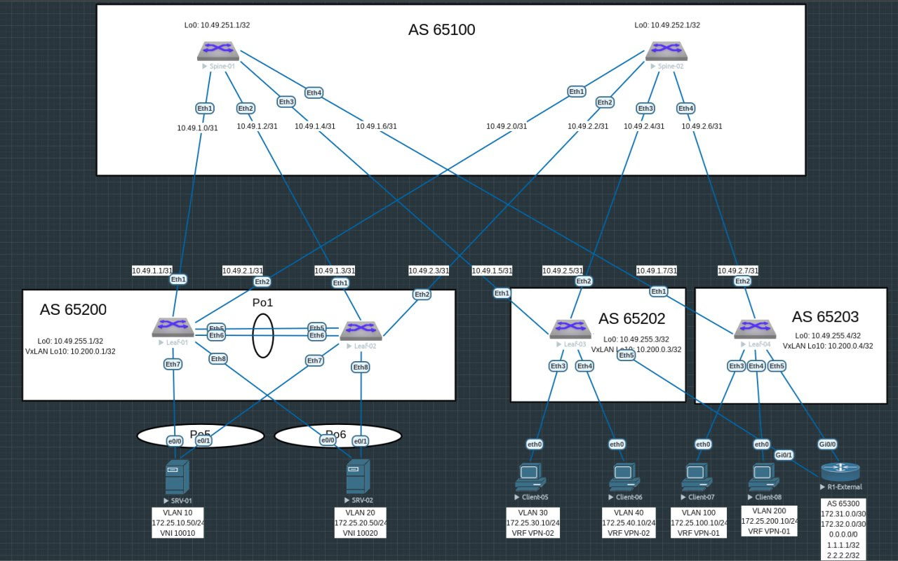

# Домашнее задание №8

## Overlay. VxLAN Оптимизация таблиц маршрутизации 

### Задача:

- Анонсировать суммарные префиксы клиентов в Overlay сети
- Настроить маршрутизацию между клиентами через суммарный префикс
- Проверить связанность между клиентами

## Выполнение:

### Схема сети



### Конфигурация оборудования

- #### [leaf-01](config/leaf-01.ios)

```
spanning-tree mode mstp
no spanning-tree vlan-id 4094
!
vlan 10
   name VLAN-10
!
vlan 20
   name VLAN-20
!
vlan 4094
   trunk group MLAGPEER
!
vrf instance VPN-01
!
interface Port-Channel1
   description Peer-Link
   switchport mode trunk
   switchport trunk group MLAGPEER
!
interface Port-Channel5
   description --- to SRV-01 ---
   switchport mode trunk
   mlag 5
!
interface Port-Channel6
   description --- to SRV-02 ---
   switchport mode trunk
   mlag 6
!
interface Ethernet5
   channel-group 1 mode active
!
interface Ethernet6
   channel-group 1 mode active
!
interface Ethernet7
   channel-group 5 mode active
!
interface Ethernet8
   channel-group 6 mode active
!
interface Loopback0
   ip address 10.49.255.1/32
!
interface Loopback10
   ip address 10.200.0.1/32
!
interface Vlan10
   vrf VPN-01
   ip address virtual 172.25.10.254/24
!
interface Vlan20
   vrf VPN-01
   ip address virtual 172.25.20.254/24
!
interface Vlan4094
   ip address 10.10.10.0/31
!
interface Vxlan1
   vxlan source-interface Loopback10
   vxlan udp-port 4789
   vxlan vlan 10 vni 10010
   vxlan vlan 20 vni 10020
   vxlan vrf VPN-01 vni 155
   vxlan virtual-vtep local-interface Loopback10
   vxlan learn-restrict any
!
ip virtual-router mac-address 00:00:00:00:00:01
!
ip routing
ip routing vrf VPN-01
!
mlag configuration
   domain-id mlag1
   local-interface Vlan4094
   peer-address 10.10.10.1
   peer-link Port-Channel1
!
router bgp 65200
   maximum-paths 4 ecmp 4
   neighbor EVPN peer group
   neighbor EVPN remote-as 65100
   neighbor EVPN update-source Loopback0
   neighbor EVPN ebgp-multihop 3
   neighbor EVPN send-community extended
   neighbor SPINE peer group
   neighbor SPINE remote-as 65100
   neighbor SPINE bfd
   neighbor SPINE send-community extended
   neighbor SPINE maximum-routes 1000
   neighbor 10.49.1.0 peer group SPINE
   neighbor 10.49.2.0 peer group SPINE
   neighbor 10.49.251.1 peer group EVPN
   neighbor 10.49.252.1 peer group EVPN
   redistribute connected route-map RM_CONNECTED
   !
   vlan 10
      rd 65200:10010
      route-target both 10:10010
      redistribute learned
   !
   vlan 20
      rd 65200:10020
      route-target both 20:10020
      redistribute learned
   !
   address-family evpn
      neighbor EVPN activate
   !
   address-family ipv4
      neighbor SPINE activate
   !
   vrf VPN-01
      rd 65200:155
      route-target import evpn 155:155
      route-target export evpn 155:155
      redistribute connected
!
end

```

- #### [leaf-02](config/leaf-02.ios)

```
spanning-tree mode mstp
no spanning-tree vlan-id 4094
!
vlan 10
   name VLAN-10
!
vlan 20
   name VLAN-20
!
vlan 4094
   trunk group MLAGPEER
!
vrf instance VPN-01
!
interface Port-Channel1
   description Peer-Link
   switchport mode trunk
   switchport trunk group MLAGPEER
!
interface Port-Channel5
   description --- to SRV-01 ---
   switchport mode trunk
   mlag 5
!
interface Port-Channel6
   description --- to SRV-02 ---
   switchport mode trunk
   mlag 6
!
interface Ethernet5
   channel-group 1 mode active
!
interface Ethernet6
   channel-group 1 mode active
!
interface Ethernet7
   channel-group 5 mode active
!
interface Ethernet8
   channel-group 6 mode active
!
interface Loopback0
   ip address 10.49.255.2/32
!
interface Loopback10
   ip address 10.200.0.1/32
!
interface Vlan10
   vrf VPN-01
   ip address virtual 172.25.10.254/24
!
interface Vlan20
   vrf VPN-01
   ip address virtual 172.25.20.254/24
!
interface Vlan4094
   ip address 10.10.10.1/31
!
interface Vxlan1
   vxlan source-interface Loopback10
   vxlan udp-port 4789
   vxlan vlan 10 vni 10010
   vxlan vlan 20 vni 10020
   vxlan vrf VPN-01 vni 155
   vxlan virtual-vtep local-interface Loopback10
   vxlan learn-restrict any
!
ip virtual-router mac-address 00:00:00:00:00:01
!
ip routing
ip routing vrf VPN-01
!
mlag configuration
   domain-id mlag1
   local-interface Vlan4094
   peer-address 10.10.10.0
   peer-link Port-Channel1
!
router bgp 65200
   maximum-paths 4 ecmp 4
   neighbor EVPN peer group
   neighbor EVPN remote-as 65100
   neighbor EVPN update-source Loopback0
   neighbor EVPN ebgp-multihop 3
   neighbor EVPN send-community extended
   neighbor SPINE peer group
   neighbor SPINE remote-as 65100
   neighbor SPINE bfd
   neighbor SPINE send-community extended
   neighbor SPINE maximum-routes 1000
   neighbor 10.49.1.2 peer group SPINE
   neighbor 10.49.2.2 peer group SPINE
   neighbor 10.49.251.1 peer group EVPN
   neighbor 10.49.252.1 peer group EVPN
   redistribute connected route-map RM_CONNECTED
   !
   vlan 10
      rd 65200:10010
      route-target both 10:10010
      redistribute learned
   !
   vlan 20
      rd 65200:10020
      route-target both 20:10020
      redistribute learned
   !
   address-family evpn
      neighbor EVPN activate
   !
   address-family ipv4
      neighbor SPINE activate
   !
   vrf VPN-01
      rd 65200:155
      route-target import evpn 155:155
      route-target export evpn 155:155
      redistribute connected
!
end

```

- #### [leaf-03](config/leaf-03.ios)

```
vlan 10
   name VLAN-10
!
vlan 20
   name VLAN-20
!
vrf instance VPN-01
!
interface Ethernet3
   switchport access vlan 10
!
interface Ethernet4
   switchport access vlan 20
!
interface Loopback0
   ip address 10.49.255.3/32
!
interface Loopback10
   ip address 10.200.0.3/32
!
interface Vlan10
   vrf VPN-01
   ip address virtual 172.25.10.254/24
!
interface Vlan20
   vrf VPN-01
   ip address virtual 172.25.20.254/24
!
interface Vxlan1
   vxlan source-interface Loopback10
   vxlan udp-port 4789
   vxlan vlan 10 vni 10010
   vxlan vlan 20 vni 10020
   vxlan vrf VPN-01 vni 155
   vxlan learn-restrict any
!
ip virtual-router mac-address 00:00:00:00:00:03
!
ip routing
ip routing vrf VPN-01
!
router bgp 65202
   maximum-paths 4 ecmp 4
   neighbor EVPN peer group
   neighbor EVPN remote-as 65100
   neighbor EVPN update-source Loopback0
   neighbor EVPN ebgp-multihop 3
   neighbor EVPN send-community extended
   neighbor SPINE peer group
   neighbor SPINE remote-as 65100
   neighbor SPINE bfd
   neighbor SPINE send-community extended
   neighbor SPINE maximum-routes 1000
   neighbor 10.49.1.4 peer group SPINE
   neighbor 10.49.2.4 peer group SPINE
   neighbor 10.49.251.1 peer group EVPN
   neighbor 10.49.252.1 peer group EVPN
   redistribute connected route-map RM_CONNECTED
   !
   vlan 10
      rd 65202:10010
      route-target both 10:10010
      redistribute learned
   !
   vlan 20
      rd 65202:10020
      route-target both 20:10020
      redistribute learned
   !
   address-family evpn
      neighbor EVPN activate
   !
   address-family ipv4
      neighbor SPINE activate
   !
   vrf VPN-01
      rd 65202:155
      route-target import evpn 155:155
      route-target export evpn 155:155
      redistribute connected
!
end
```

- #### [leaf-04](config/leaf-04.ios)
```
vlan 777
!
interface Ethernet5
   switchport trunk allowed vlan 777
   switchport mode trunk
!
interface Vlan777
   vrf VPN-01
   ip address 172.31.0.1/30
!
interface Vxlan1
   vxlan source-interface Loopback10
   vxlan udp-port 4789
   vxlan vlan 100 vni 10100
   vxlan vlan 200 vni 10200
   vxlan vrf VPN-01 vni 155
   vxlan learn-restrict any
!
ip virtual-router mac-address 00:00:00:00:00:04
!
ip routing
ip routing vrf VPN-01
!
ip prefix-list PL_LOOPBACK
   seq 10 permit 10.49.255.4/32
   seq 20 permit 10.200.0.4/32
!
route-map RM_CONNECTED permit 10
   match ip address prefix-list PL_LOOPBACK
!
router bgp 65203
   maximum-paths 4 ecmp 4
   neighbor EVPN peer group
   neighbor EVPN remote-as 65100
   neighbor EVPN update-source Loopback0
   neighbor EVPN ebgp-multihop 3
   neighbor EVPN send-community extended
   neighbor SPINE peer group
   neighbor SPINE remote-as 65100
   neighbor SPINE bfd
   neighbor SPINE send-community
   neighbor SPINE maximum-routes 1000
   neighbor 10.49.1.6 peer group SPINE
   neighbor 10.49.2.6 peer group SPINE
   neighbor 10.49.251.1 peer group EVPN
   neighbor 10.49.252.1 peer group EVPN
   redistribute connected route-map RM_CONNECTED
   !
   vlan 100
      rd 65203:10100
      route-target both 10:10100
      redistribute learned
   !
   vlan 200
      rd 65203:10200
      route-target both 20:10200
      redistribute learned
   !
   address-family evpn
      neighbor EVPN activate
   !
   address-family ipv4
      neighbor SPINE activate
      neighbor 172.31.0.2 activate
   !
   vrf VPN-01
      rd 65203:155
      route-target import evpn 155:155
      route-target export evpn 155:155
      neighbor 172.31.0.2 remote-as 65300
      redistribute connected
!
end

```

- #### [R1-External](config/router.ios)

```
interface Loopback0
 ip address 1.1.1.1 255.255.255.255
!
interface Loopback1
 ip address 2.2.2.2 255.255.255.255
!
interface Loopback3
 ip address 3.3.3.3 255.255.255.255
!
interface GigabitEthernet0/0.777
 encapsulation dot1Q 777
 ip address 172.31.0.2 255.255.255.252
!
router bgp 65300
 bgp log-neighbor-changes
 neighbor 172.31.0.1 remote-as 65203
 !
 address-family ipv4
  redistribute connected route-map RM_CONNECTED
  redistribute static
  neighbor 172.31.0.1 activate
  default-information originate
 exit-address-family
!
ip route 0.0.0.0 0.0.0.0 Null0
!
!
ip prefix-list PL_CONNECTED seq 5 permit 1.1.1.1/32
ip prefix-list PL_CONNECTED seq 10 permit 2.2.2.2/32
ipv6 ioam timestamp
!
route-map RM_CONNECTED permit 10
 match ip address prefix-list PL_CONNECTED
!
end

```
---

### Проверка связанности клиентов по L3

- #### leaf-01

```
leaf-01#sh ip ro vrf VPN-01

VRF: VPN-01

Gateway of last resort:
 B E      0.0.0.0/0 [200/0] via VTEP 10.200.0.4 VNI 155 router-mac 50:01:00:27:03:91 local-interface Vxlan1

 B E      1.1.1.1/32 [200/0] via VTEP 10.200.0.4 VNI 155 router-mac 50:01:00:27:03:91 local-interface Vxlan1
 B E      2.2.2.2/32 [200/0] via VTEP 10.200.0.4 VNI 155 router-mac 50:01:00:27:03:91 local-interface Vxlan1
 C        172.25.10.0/24 is directly connected, Vlan10
 C        172.25.20.0/24 is directly connected, Vlan20
 B E      172.25.100.0/24 [200/0] via VTEP 10.200.0.4 VNI 155 router-mac 50:01:00:27:03:91 local-interface Vxlan1
 B E      172.25.200.0/24 [200/0] via VTEP 10.200.0.4 VNI 155 router-mac 50:01:00:27:03:91 local-interface Vxlan1
 B E      172.31.0.0/30 [200/0] via VTEP 10.200.0.4 VNI 155 router-mac 50:01:00:27:03:91 local-interface Vxlan1

```
```
leaf-01#sh bgp evpn route-type ip-prefix ipv4
BGP routing table information for VRF default
Router identifier 10.200.0.1, local AS number 65200
Route status codes: * - valid, > - active, S - Stale, E - ECMP head, e - ECMP
                    c - Contributing to ECMP, % - Pending BGP convergence
Origin codes: i - IGP, e - EGP, ? - incomplete
AS Path Attributes: Or-ID - Originator ID, C-LST - Cluster List, LL Nexthop - Link Local Nexthop

          Network                Next Hop              Metric  LocPref Weight  Path
 * >Ec    RD: 65203:155 ip-prefix 0.0.0.0/0
                                 10.200.0.4            -       100     0       65100 65203 65300 ?
 *  ec    RD: 65203:155 ip-prefix 0.0.0.0/0
                                 10.200.0.4            -       100     0       65100 65203 65300 ?
 * >Ec    RD: 65203:155 ip-prefix 1.1.1.1/32
                                 10.200.0.4            -       100     0       65100 65203 65300 ?
 *  ec    RD: 65203:155 ip-prefix 1.1.1.1/32
                                 10.200.0.4            -       100     0       65100 65203 65300 ?
 * >Ec    RD: 65203:155 ip-prefix 2.2.2.2/32
                                 10.200.0.4            -       100     0       65100 65203 65300 ?
 *  ec    RD: 65203:155 ip-prefix 2.2.2.2/32
                                 10.200.0.4            -       100     0       65100 65203 65300 ?
 * >      RD: 65200:155 ip-prefix 172.25.10.0/24
                                 -                     -       -       0       i
 * >Ec    RD: 65202:155 ip-prefix 172.25.10.0/24
                                 10.200.0.3            -       100     0       65100 65202 i
 *  ec    RD: 65202:155 ip-prefix 172.25.10.0/24
                                 10.200.0.3            -       100     0       65100 65202 i
 * >      RD: 65200:155 ip-prefix 172.25.20.0/24
                                 -                     -       -       0       i
 * >Ec    RD: 65202:155 ip-prefix 172.25.20.0/24
                                 10.200.0.3            -       100     0       65100 65202 i
 *  ec    RD: 65202:155 ip-prefix 172.25.20.0/24
                                 10.200.0.3            -       100     0       65100 65202 i
 * >Ec    RD: 65203:155 ip-prefix 172.25.100.0/24
                                 10.200.0.4            -       100     0       65100 65203 i
 *  ec    RD: 65203:155 ip-prefix 172.25.100.0/24
                                 10.200.0.4            -       100     0       65100 65203 i
 * >Ec    RD: 65203:155 ip-prefix 172.25.200.0/24
                                 10.200.0.4            -       100     0       65100 65203 i
 *  ec    RD: 65203:155 ip-prefix 172.25.200.0/24
                                 10.200.0.4            -       100     0       65100 65203 i
 * >Ec    RD: 65203:155 ip-prefix 172.31.0.0/30
                                 10.200.0.4            -       100     0       65100 65203 i
 *  ec    RD: 65203:155 ip-prefix 172.31.0.0/30
                                 10.200.0.4            -       100     0       65100 65203 i

```
```
leaf-01#sh interfaces vxlan 1
Vxlan1 is up, line protocol is up (connected)
  Hardware is Vxlan
  Source interface is Loopback10 and is active with 10.200.0.1
  Listening on UDP port 4789
  Virtual VTEP source interface is 'Loopback10'
  Replication/Flood Mode is headend with Flood List Source: EVPN
  Remote MAC learning via EVPN
  VNI mapping to VLANs
  Static VLAN to VNI mapping is
    [10, 10010]       [20, 10020]
  Dynamic VLAN to VNI mapping for 'evpn' is
    [4093, 155]
  Note: All Dynamic VLANs used by VCS are internal VLANs.
        Use 'show vxlan vni' for details.
  Static VRF to VNI mapping is
   [VPN-01, 155]
  Headend replication flood vtep list is:
    10 10.200.0.3
    20 10.200.0.3
  MLAG Shared Router MAC is 0000.0000.0000

```
```  
leaf-01#show vxlan vni
VNI to VLAN Mapping for Vxlan1
VNI         VLAN       Source       Interface           802.1Q Tag
----------- ---------- ------------ ------------------- ----------
10010       10         static       Ethernet3           untagged
                                    Port-Channel5       10
                                    Port-Channel6       10
                                    Vxlan1              10
10020       20         static       Ethernet4           untagged
                                    Port-Channel5       20
                                    Port-Channel6       20
                                    Vxlan1              20

VNI to dynamic VLAN Mapping for Vxlan1
VNI       VLAN       VRF          Source
--------- ---------- ------------ ------------
155       4093       VPN-01       evpn

```

- #### leaf-02

```
leaf-02#sh ip ro vrf VPN-01

VRF: VPN-01

Gateway of last resort:
 B E      0.0.0.0/0 [200/0] via VTEP 10.200.0.4 VNI 155 router-mac 50:01:00:27:03:91 local-interface Vxlan1

 B E      1.1.1.1/32 [200/0] via VTEP 10.200.0.4 VNI 155 router-mac 50:01:00:27:03:91 local-interface Vxlan1
 B E      2.2.2.2/32 [200/0] via VTEP 10.200.0.4 VNI 155 router-mac 50:01:00:27:03:91 local-interface Vxlan1
 C        172.25.10.0/24 is directly connected, Vlan10
 C        172.25.20.0/24 is directly connected, Vlan20
 B E      172.25.100.0/24 [200/0] via VTEP 10.200.0.4 VNI 155 router-mac 50:01:00:27:03:91 local-interface Vxlan1
 B E      172.25.200.0/24 [200/0] via VTEP 10.200.0.4 VNI 155 router-mac 50:01:00:27:03:91 local-interface Vxlan1
 B E      172.31.0.0/30 [200/0] via VTEP 10.200.0.4 VNI 155 router-mac 50:01:00:27:03:91 local-interface Vxlan1

```
```
leaf-02#sh bgp evpn route-type ip-prefix ipv4
BGP routing table information for VRF default
Router identifier 10.200.0.1, local AS number 65200
Route status codes: * - valid, > - active, S - Stale, E - ECMP head, e - ECMP
                    c - Contributing to ECMP, % - Pending BGP convergence
Origin codes: i - IGP, e - EGP, ? - incomplete
AS Path Attributes: Or-ID - Originator ID, C-LST - Cluster List, LL Nexthop - Link Local Nexthop

          Network                Next Hop              Metric  LocPref Weight  Path
 * >Ec    RD: 65203:155 ip-prefix 0.0.0.0/0
                                 10.200.0.4            -       100     0       65100 65203 65300 ?
 *  ec    RD: 65203:155 ip-prefix 0.0.0.0/0
                                 10.200.0.4            -       100     0       65100 65203 65300 ?
 * >Ec    RD: 65203:155 ip-prefix 1.1.1.1/32
                                 10.200.0.4            -       100     0       65100 65203 65300 ?
 *  ec    RD: 65203:155 ip-prefix 1.1.1.1/32
                                 10.200.0.4            -       100     0       65100 65203 65300 ?
 * >Ec    RD: 65203:155 ip-prefix 2.2.2.2/32
                                 10.200.0.4            -       100     0       65100 65203 65300 ?
 *  ec    RD: 65203:155 ip-prefix 2.2.2.2/32
                                 10.200.0.4            -       100     0       65100 65203 65300 ?
 * >      RD: 65200:155 ip-prefix 172.25.10.0/24
                                 -                     -       -       0       i
 * >Ec    RD: 65202:155 ip-prefix 172.25.10.0/24
                                 10.200.0.3            -       100     0       65100 65202 i
 *  ec    RD: 65202:155 ip-prefix 172.25.10.0/24
                                 10.200.0.3            -       100     0       65100 65202 i
 * >      RD: 65200:155 ip-prefix 172.25.20.0/24
                                 -                     -       -       0       i
 * >Ec    RD: 65202:155 ip-prefix 172.25.20.0/24
                                 10.200.0.3            -       100     0       65100 65202 i
 *  ec    RD: 65202:155 ip-prefix 172.25.20.0/24
                                 10.200.0.3            -       100     0       65100 65202 i
 * >Ec    RD: 65203:155 ip-prefix 172.25.100.0/24
                                 10.200.0.4            -       100     0       65100 65203 i
 *  ec    RD: 65203:155 ip-prefix 172.25.100.0/24
                                 10.200.0.4            -       100     0       65100 65203 i
 * >Ec    RD: 65203:155 ip-prefix 172.25.200.0/24
                                 10.200.0.4            -       100     0       65100 65203 i
 *  ec    RD: 65203:155 ip-prefix 172.25.200.0/24
                                 10.200.0.4            -       100     0       65100 65203 i
 * >Ec    RD: 65203:155 ip-prefix 172.31.0.0/30
                                 10.200.0.4            -       100     0       65100 65203 i
 *  ec    RD: 65203:155 ip-prefix 172.31.0.0/30
                                 10.200.0.4            -       100     0       65100 65203 i

```
```
leaf-02#sh interfaces vxlan 1
Vxlan1 is up, line protocol is up (connected)
  Hardware is Vxlan
  Source interface is Loopback10 and is active with 10.200.0.1
  Listening on UDP port 4789
  Virtual VTEP source interface is 'Loopback10'
  Replication/Flood Mode is headend with Flood List Source: EVPN
  Remote MAC learning via EVPN
  VNI mapping to VLANs
  Static VLAN to VNI mapping is
    [10, 10010]       [20, 10020]
  Dynamic VLAN to VNI mapping for 'evpn' is
    [4093, 155]
  Note: All Dynamic VLANs used by VCS are internal VLANs.
        Use 'show vxlan vni' for details.
  Static VRF to VNI mapping is
   [VPN-01, 155]
  Headend replication flood vtep list is:
    10 10.200.0.3
    20 10.200.0.3
  MLAG Shared Router MAC is 0000.0000.0000

```
```  
leaf-02#show vxlan vni
VNI to VLAN Mapping for Vxlan1
VNI         VLAN       Source       Interface           802.1Q Tag
----------- ---------- ------------ ------------------- ----------
10010       10         static       PeerEthernet3       untagged
                                    Port-Channel5       10
                                    Port-Channel6       10
                                    Vxlan1              10
10020       20         static       PeerEthernet4       untagged
                                    Port-Channel5       20
                                    Port-Channel6       20
                                    Vxlan1              20

VNI to dynamic VLAN Mapping for Vxlan1
VNI       VLAN       VRF          Source
--------- ---------- ------------ ------------
155       4093       VPN-01       evpn

```

- #### leaf-03

```
leaf-03#sh ip route vrf VPN-01

VRF: VPN-01

Gateway of last resort:
 B E      0.0.0.0/0 [200/0] via VTEP 10.200.0.4 VNI 155 router-mac 50:01:00:27:03:91 local-interface Vxlan1

 B E      1.1.1.1/32 [200/0] via VTEP 10.200.0.4 VNI 155 router-mac 50:01:00:27:03:91 local-interface Vxlan1
 B E      2.2.2.2/32 [200/0] via VTEP 10.200.0.4 VNI 155 router-mac 50:01:00:27:03:91 local-interface Vxlan1
 C        172.25.10.0/24 is directly connected, Vlan10
 C        172.25.20.0/24 is directly connected, Vlan20
 B E      172.25.100.0/24 [200/0] via VTEP 10.200.0.4 VNI 155 router-mac 50:01:00:27:03:91 local-interface Vxlan1
 B E      172.25.200.0/24 [200/0] via VTEP 10.200.0.4 VNI 155 router-mac 50:01:00:27:03:91 local-interface Vxlan1
 B E      172.31.0.0/30 [200/0] via VTEP 10.200.0.4 VNI 155 router-mac 50:01:00:27:03:91 local-interface Vxlan1


```
```
leaf-03#sh bgp evpn route-type ip-prefix ipv4
BGP routing table information for VRF default
Router identifier 10.200.0.3, local AS number 65202
Route status codes: * - valid, > - active, S - Stale, E - ECMP head, e - ECMP
                    c - Contributing to ECMP, % - Pending BGP convergence
Origin codes: i - IGP, e - EGP, ? - incomplete
AS Path Attributes: Or-ID - Originator ID, C-LST - Cluster List, LL Nexthop - Link Local Nexthop

          Network                Next Hop              Metric  LocPref Weight  Path
 * >Ec    RD: 65203:155 ip-prefix 0.0.0.0/0
                                 10.200.0.4            -       100     0       65100 65203 65300 ?
 *  ec    RD: 65203:155 ip-prefix 0.0.0.0/0
                                 10.200.0.4            -       100     0       65100 65203 65300 ?
 * >Ec    RD: 65203:155 ip-prefix 1.1.1.1/32
                                 10.200.0.4            -       100     0       65100 65203 65300 ?
 *  ec    RD: 65203:155 ip-prefix 1.1.1.1/32
                                 10.200.0.4            -       100     0       65100 65203 65300 ?
 * >Ec    RD: 65203:155 ip-prefix 2.2.2.2/32
                                 10.200.0.4            -       100     0       65100 65203 65300 ?
 *  ec    RD: 65203:155 ip-prefix 2.2.2.2/32
                                 10.200.0.4            -       100     0       65100 65203 65300 ?
 * >Ec    RD: 65200:155 ip-prefix 172.25.10.0/24
                                 10.200.0.1            -       100     0       65100 65200 i
 *  ec    RD: 65200:155 ip-prefix 172.25.10.0/24
                                 10.200.0.1            -       100     0       65100 65200 i
 * >      RD: 65202:155 ip-prefix 172.25.10.0/24
                                 -                     -       -       0       i
 * >Ec    RD: 65200:155 ip-prefix 172.25.20.0/24
                                 10.200.0.1            -       100     0       65100 65200 i
 *  ec    RD: 65200:155 ip-prefix 172.25.20.0/24
                                 10.200.0.1            -       100     0       65100 65200 i
 * >      RD: 65202:155 ip-prefix 172.25.20.0/24
                                 -                     -       -       0       i
 * >Ec    RD: 65203:155 ip-prefix 172.25.100.0/24
                                 10.200.0.4            -       100     0       65100 65203 i
 *  ec    RD: 65203:155 ip-prefix 172.25.100.0/24
                                 10.200.0.4            -       100     0       65100 65203 i
 * >Ec    RD: 65203:155 ip-prefix 172.25.200.0/24
                                 10.200.0.4            -       100     0       65100 65203 i
 *  ec    RD: 65203:155 ip-prefix 172.25.200.0/24
                                 10.200.0.4            -       100     0       65100 65203 i
 * >Ec    RD: 65203:155 ip-prefix 172.31.0.0/30
                                 10.200.0.4            -       100     0       65100 65203 i
 *  ec    RD: 65203:155 ip-prefix 172.31.0.0/30
                                 10.200.0.4            -       100     0       65100 65203 i

```
```
leaf-03#sh interfaces vxlan 1
Vxlan1 is up, line protocol is up (connected)
  Hardware is Vxlan
  Source interface is Loopback10 and is active with 10.200.0.3
  Listening on UDP port 4789
  Replication/Flood Mode is headend with Flood List Source: EVPN
  Remote MAC learning via EVPN
  VNI mapping to VLANs
  Static VLAN to VNI mapping is
    [10, 10010]       [20, 10020]
  Dynamic VLAN to VNI mapping for 'evpn' is
    [4092, 155]
  Note: All Dynamic VLANs used by VCS are internal VLANs.
        Use 'show vxlan vni' for details.
  Static VRF to VNI mapping is
   [VPN-01, 155]
  Headend replication flood vtep list is:
    10 10.200.0.1
    20 10.200.0.1
  Shared Router MAC is 0000.0000.0000

```
```
leaf-03#sh interfaces vxlan 1
Vxlan1 is up, line protocol is up (connected)
  Hardware is Vxlan
  Source interface is Loopback10 and is active with 10.200.0.3
  Listening on UDP port 4789
  Replication/Flood Mode is headend with Flood List Source: EVPN
  Remote MAC learning via EVPN
  VNI mapping to VLANs
  Static VLAN to VNI mapping is
    [10, 10010]       [20, 10020]
  Dynamic VLAN to VNI mapping for 'evpn' is
    [4092, 155]
  Note: All Dynamic VLANs used by VCS are internal VLANs.
        Use 'show vxlan vni' for details.
  Static VRF to VNI mapping is
   [VPN-01, 155]
  Headend replication flood vtep list is:
    10 10.200.0.1
    20 10.200.0.1
  Shared Router MAC is 0000.0000.0000
leaf-03#show vxlan vni
VNI to VLAN Mapping for Vxlan1
VNI         VLAN       Source       Interface       802.1Q Tag
----------- ---------- ------------ --------------- ----------
10010       10         static       Ethernet3       untagged
                                    Vxlan1          10
10020       20         static       Ethernet4       untagged
                                    Vxlan1          20

VNI to dynamic VLAN Mapping for Vxlan1
VNI       VLAN       VRF          Source
--------- ---------- ------------ ------------
155       4092       VPN-01       evpn

```

- #### leaf-04

```
leaf-04#sh ip route vrf VPN-01

VRF: VPN-01

Gateway of last resort:
 B E      0.0.0.0/0 [200/0] via 172.31.0.2, Vlan777

 B E      1.1.1.1/32 [200/0] via 172.31.0.2, Vlan777
 B E      2.2.2.2/32 [200/0] via 172.31.0.2, Vlan777
 B E      172.25.10.0/24 [200/0] via VTEP 10.200.0.3 VNI 155 router-mac 50:01:00:be:ab:97 local-interface Vxlan1
                                 via VTEP 10.200.0.1 VNI 155 router-mac 50:01:00:ca:7a:8d local-interface Vxlan1
 B E      172.25.20.0/24 [200/0] via VTEP 10.200.0.3 VNI 155 router-mac 50:01:00:be:ab:97 local-interface Vxlan1
                                 via VTEP 10.200.0.1 VNI 155 router-mac 50:01:00:ca:7a:8d local-interface Vxlan1
 C        172.25.100.0/24 is directly connected, Vlan100
 C        172.25.200.0/24 is directly connected, Vlan200
 C        172.31.0.0/30 is directly connected, Vlan777

```
```
leaf-04#sh bgp evpn route-type ip-prefix ipv4
BGP routing table information for VRF default
Router identifier 10.200.0.4, local AS number 65203
Route status codes: * - valid, > - active, S - Stale, E - ECMP head, e - ECMP
                    c - Contributing to ECMP, % - Pending BGP convergence
Origin codes: i - IGP, e - EGP, ? - incomplete
AS Path Attributes: Or-ID - Originator ID, C-LST - Cluster List, LL Nexthop - Link Local Nexthop

          Network                Next Hop              Metric  LocPref Weight  Path
 * >      RD: 65203:155 ip-prefix 0.0.0.0/0
                                 -                     0       100     0       65300 ?
 * >      RD: 65203:155 ip-prefix 1.1.1.1/32
                                 -                     0       100     0       65300 ?
 * >      RD: 65203:155 ip-prefix 2.2.2.2/32
                                 -                     0       100     0       65300 ?
 * >Ec    RD: 65200:155 ip-prefix 172.25.10.0/24
                                 10.200.0.1            -       100     0       65100 65200 i
 *  ec    RD: 65200:155 ip-prefix 172.25.10.0/24
                                 10.200.0.1            -       100     0       65100 65200 i
 * >Ec    RD: 65202:155 ip-prefix 172.25.10.0/24
                                 10.200.0.3            -       100     0       65100 65202 i
 *  ec    RD: 65202:155 ip-prefix 172.25.10.0/24
                                 10.200.0.3            -       100     0       65100 65202 i
 * >Ec    RD: 65200:155 ip-prefix 172.25.20.0/24
                                 10.200.0.1            -       100     0       65100 65200 i
 *  ec    RD: 65200:155 ip-prefix 172.25.20.0/24
                                 10.200.0.1            -       100     0       65100 65200 i
 * >Ec    RD: 65202:155 ip-prefix 172.25.20.0/24
                                 10.200.0.3            -       100     0       65100 65202 i
 *  ec    RD: 65202:155 ip-prefix 172.25.20.0/24
                                 10.200.0.3            -       100     0       65100 65202 i
 * >      RD: 65203:155 ip-prefix 172.25.100.0/24
                                 -                     -       -       0       i
 * >      RD: 65203:155 ip-prefix 172.25.200.0/24
                                 -                     -       -       0       i
 * >      RD: 65203:155 ip-prefix 172.31.0.0/30
                                 -                     -       -       0       i

```
```
leaf-04#sh interfaces vxlan 1
Vxlan1 is up, line protocol is up (connected)
  Hardware is Vxlan
  Source interface is Loopback10 and is active with 10.200.0.4
  Listening on UDP port 4789
  Replication/Flood Mode is headend with Flood List Source: EVPN
  Remote MAC learning via EVPN
  VNI mapping to VLANs
  Static VLAN to VNI mapping is
    [100, 10100]      [200, 10200]
  Dynamic VLAN to VNI mapping for 'evpn' is
    [4094, 155]
  Note: All Dynamic VLANs used by VCS are internal VLANs.
        Use 'show vxlan vni' for details.
  Static VRF to VNI mapping is
   [VPN-01, 155]
  Shared Router MAC is 0000.0000.0000

```
```
leaf-04#sh vxlan vni
VNI to VLAN Mapping for Vxlan1
VNI         VLAN       Source       Interface       802.1Q Tag
----------- ---------- ------------ --------------- ----------
10100       100        static       Ethernet3       untagged
                                    Vxlan1          100
10200       200        static       Ethernet4       untagged
                                    Vxlan1          200

VNI to dynamic VLAN Mapping for Vxlan1
VNI       VLAN       VRF          Source
--------- ---------- ------------ ------------
155       4094       VPN-01       evpn

```

- #### srv-01

```
SRV-01#sh ip int b
Interface              IP-Address      OK? Method Status                Protocol
Vlan10                 172.25.10.50    YES NVRAM  up                    up
SRV-01#
SRV-01#ping 172.25.20.50
Type escape sequence to abort.
Sending 5, 100-byte ICMP Echos to 172.25.20.50, timeout is 2 seconds:
!!!!!
Success rate is 100 percent (5/5), round-trip min/avg/max = 5/22/56 ms
SRV-01#ping 172.25.10.10
Type escape sequence to abort.
Sending 5, 100-byte ICMP Echos to 172.25.10.10, timeout is 2 seconds:
!!!!!
Success rate is 100 percent (5/5), round-trip min/avg/max = 63/84/133 ms
SRV-01#ping 172.25.20.10
Type escape sequence to abort.
Sending 5, 100-byte ICMP Echos to 172.25.20.10, timeout is 2 seconds:
!!!!!
Success rate is 100 percent (5/5), round-trip min/avg/max = 24/55/136 ms
SRV-01#ping 172.25.100.10
Type escape sequence to abort.
Sending 5, 100-byte ICMP Echos to 172.25.100.10, timeout is 2 seconds:
!!!!!
Success rate is 100 percent (5/5), round-trip min/avg/max = 32/65/183 ms
SRV-01#ping 172.25.200.10
Type escape sequence to abort.
Sending 5, 100-byte ICMP Echos to 172.25.200.10, timeout is 2 seconds:
!!!!!
Success rate is 100 percent (5/5), round-trip min/avg/max = 17/63/219 ms
SRV-01#ping 1.1.1.1
Type escape sequence to abort.
Sending 5, 100-byte ICMP Echos to 1.1.1.1, timeout is 2 seconds:
!!!!!
Success rate is 100 percent (5/5), round-trip min/avg/max = 18/26/40 ms
SRV-01#ping 2.2.2.2
Type escape sequence to abort.
Sending 5, 100-byte ICMP Echos to 2.2.2.2, timeout is 2 seconds:
!!!!!
Success rate is 100 percent (5/5), round-trip min/avg/max = 15/15/16 ms
SRV-01#ping 3.3.3.3
Type escape sequence to abort.
Sending 5, 100-byte ICMP Echos to 3.3.3.3, timeout is 2 seconds:
!!!!!
Success rate is 100 percent (5/5), round-trip min/avg/max = 36/62/159 ms


```

- #### client-07

```
VPCS> sh ip

NAME        : VPCS[1]
IP/MASK     : 172.25.100.10/24
GATEWAY     : 172.25.100.254
DNS         :
MAC         : 00:50:79:66:68:0d
LPORT       : 20000
RHOST:PORT  : 127.0.0.1:30000
MTU         : 1500

VPCS> ping 172.25.10.50 -c 2

84 bytes from 172.25.10.50 icmp_seq=1 ttl=253 time=34.999 ms
84 bytes from 172.25.10.50 icmp_seq=2 ttl=253 time=31.212 ms

VPCS> ping 172.25.20.50 -c 2

84 bytes from 172.25.20.50 icmp_seq=1 ttl=253 time=32.153 ms
84 bytes from 172.25.20.50 icmp_seq=2 ttl=253 time=25.676 ms

VPCS> ping 172.25.10.10 -c 2

84 bytes from 172.25.10.10 icmp_seq=1 ttl=62 time=28.715 ms
84 bytes from 172.25.10.10 icmp_seq=2 ttl=62 time=24.229 ms

VPCS> ping 172.25.20.10 -c 2

84 bytes from 172.25.20.10 icmp_seq=1 ttl=62 time=43.869 ms
84 bytes from 172.25.20.10 icmp_seq=2 ttl=62 time=24.788 ms

VPCS> ping 172.25.200.10 -c 2

84 bytes from 172.25.200.10 icmp_seq=1 ttl=63 time=26.728 ms
84 bytes from 172.25.200.10 icmp_seq=2 ttl=63 time=12.009 ms

VPCS> ping 1.1.1.1 -c 2

84 bytes from 1.1.1.1 icmp_seq=1 ttl=254 time=16.096 ms
84 bytes from 1.1.1.1 icmp_seq=2 ttl=254 time=12.862 ms

VPCS> ping 2.2.2.2 -c 2

84 bytes from 2.2.2.2 icmp_seq=1 ttl=254 time=14.714 ms
84 bytes from 2.2.2.2 icmp_seq=2 ttl=254 time=5.883 ms

VPCS> ping 3.3.3.3 -c 2

84 bytes from 3.3.3.3 icmp_seq=1 ttl=254 time=17.547 ms
84 bytes from 3.3.3.3 icmp_seq=2 ttl=254 time=16.347 ms
```