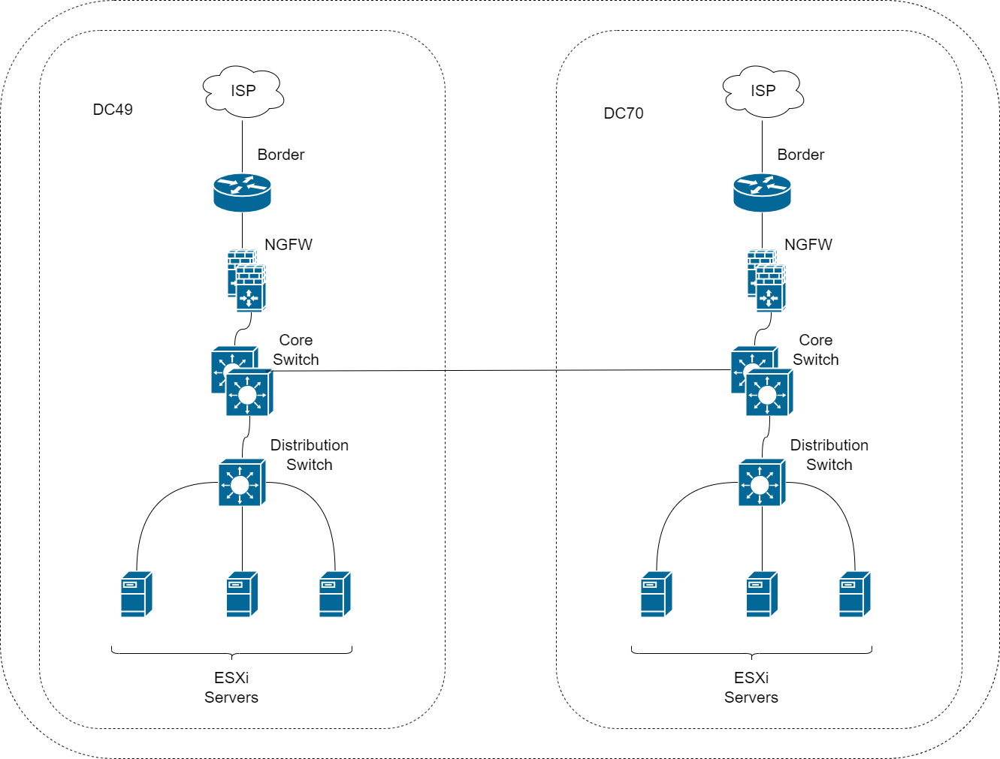
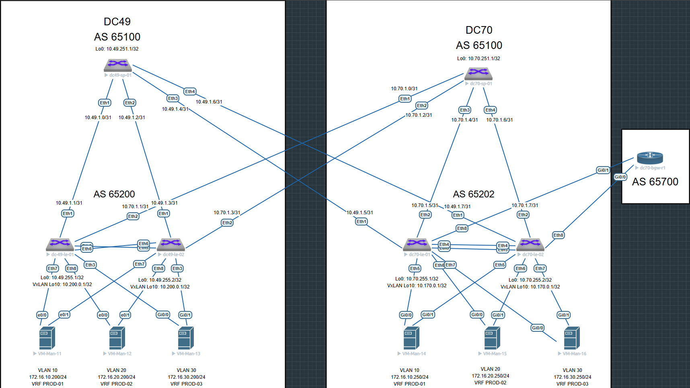

# Проектная работа

## Тема: Построение отказоустойчивых решений сети ЦОД через внедрение архитектуры EVPN/VXLAN

### Цели:

- Модернизация текущей сетевой инфраструктуры с минимальными вложениями и внедрение технологии VXLAN/EVPN
- Отказ от традиционной топологии tier-3 в центре обработки данных
- Подключение резервного ЦОД с использованием технологии “multipod”
- Обеспечение L2/L3 связанности между площадками

## План:

- Разработка отказоустойчивой и масштабируемой топологии CLOS для существующего ЦОД
- Проектирование DCI с помощью технологии “multipod”
- Проектирование адресного пространства
- Проектирование Underlay и Overlay сетей

### [Презинтация проекта](file/presentation.pptx)

### Схема существующей сети



### Схема проектируемой сети



### Конфигурация оборудования

#### POD 1
- [dc49-sp01](config/dc49-sp01.ios)
- [dc49-le01](config/dc49-le01.ios)
- [dc49-le02](config/dc49-le02.ios)

#### POD 2
- [dc70-sp01](config/dc70-sp01.ios)
- [dc70-le01](config/dc70-le01.ios)
- [dc02-le02](config/dc70-le02.ios)
- [dc70-bgw-r01](config/dc70-bgw-r1.ios)


### Таблица адресов

|   hostname  |        interface       |      IP/MASK     |             description            |
|:-----------:|:----------------------:|:----------------:|:----------------------------------:|
| dc49-sp-01  | Ethernet1              | 10.49.1.0/31     | --- to dc49-le-01 10.49.1.1/31 --- |
| dc49-sp-01  | Ethernet2              | 10.49.1.2/31     | --- to dc49-le-02 10.49.1.3/31 --- |
| dc49-sp-01  | Ethernet3              | 10.49.1.4/31     | --- to dc70-le-01 10.49.1.5/31 --- |
| dc49-sp-01  | Ethernet4              | 10.49.1.6/31     | --- to dc70-le-02 10.49.1.7/31 --- |
| dc49-sp-01  | Loopback0              | 10.49.251.1/32   |                                    |
|             |                        |                  |                                    |
| dc49-le-01  | Ethernet1              | 10.49.1.1/31     | --- to dc49-sp-01 10.49.1.0/31 --- |
| dc49-le-01  | Ethernet2              | 10.70.1.1/31     | --- to dc70-sp-01 10.70.1.0/31 --- |
| dc49-le-01  | Loopback0              | 10.49.255.1/32   |                                    |
| dc49-le-01  | Loopback10             | 10.200.0.1/32    |                                    |
| dc49-le-01  | Vlan10                 | 172.16.10.254/24 |                                    |
| dc49-le-01  | Vlan20                 | 172.16.20.254/24 |                                    |
| dc49-le-01  | Vlan30                 | 172.16.30.254/24 |                                    |
| dc49-le-01  | Vlan4094               | 10.10.10.0/31    |                                    |
|             |                        |                  |                                    |
| dc49-le-02  | Ethernet1              | 10.49.1.3/31     | --- to dc49-sp01 10.49.1.2/31 ---  |
| dc49-le-02  | Ethernet2              | 10.70.1.3/31     | --- to dc70-sp-01 10.70.1.2/31 --- |
| dc49-le-02  | Loopback0              | 10.49.255.2/32   |                                    |
| dc49-le-02  | Loopback10             | 10.200.0.1/32    |                                    |
| dc49-le-02  | Vlan10                 | 172.16.10.254/24 |                                    |
| dc49-le-02  | Vlan20                 | 172.16.20.254/24 |                                    |
| dc49-le-02  | Vlan30                 | 172.16.30.254/24 |                                    |
| dc49-le-02  | Vlan4094               | 10.10.10.1/31    |                                    |
|             |                        |                  |                                    |
| dc70-sp-01  | Ethernet1              | 10.70.1.0/31     | --- to dc49-le-01 10.70.1.1/31 --- |
| dc70-sp-01  | Ethernet2              | 10.70.1.2/31     | --- to dc49-le-02 10.70.1.3/31 --- |
| dc70-sp-01  | Ethernet3              | 10.70.1.4/31     | --- to dc70-le-01 10.70.1.5/31 --- |
| dc70-sp-01  | Ethernet4              | 10.70.1.6/31     | --- to dc70-le-02 10.70.1.7/31 --- |
| dc70-sp-01  | Loopback0              | 10.70.251.1/32   |                                    |
|             |                        |                  |                                    |
| dc70-le-01  | Ethernet1              | 10.49.1.5/31     | --- to dc49-sp-01 10.49.1.4/31 --- |
| dc70-le-01  | Ethernet2              | 10.70.1.5/31     | --- to dc70-sp-01 10.70.1.4/31 --- |
| dc70-le-01  | Loopback0              | 10.70.255.1/32   |                                    |
| dc70-le-01  | Loopback10             | 10.170.0.1/32    |                                    |
| dc70-le-01  | Vlan10                 | 172.16.10.254/24 |                                    |
| dc70-le-01  | Vlan20                 | 172.16.20.254/24 |                                    |
| dc70-le-01  | Vlan30                 | 172.16.30.254/24 |                                    |
| dc70-le-01  | Vlan110                | 10.49.250.0/31   |                                    |
| dc70-le-01  | Vlan120                | 10.49.250.2/31   |                                    |
| dc70-le-01  | Vlan130                | 10.49.250.4/31   |                                    |
| dc70-le-01  | Vlan4094               | 10.10.20.0/31    |                                    |
|             |                        |                  |                                    |
| dc70-le-02  | Ethernet1              | 10.49.1.7/31     | --- to dc49-sp-01 10.49.1.6/31 --- |
| dc70-le-02  | Ethernet2              | 10.70.1.7/31     | --- to dc70-sp-01 10.70.1.6/31 --- |
| dc70-le-02  | Loopback0              | 10.70.255.2/32   |                                    |
| dc70-le-02  | Loopback10             | 10.170.0.1/32    |                                    |
| dc70-le-02  | Vlan10                 | 172.16.10.254/24 |                                    |
| dc70-le-02  | Vlan20                 | 172.16.20.254/24 |                                    |
| dc70-le-02  | Vlan30                 | 172.16.30.254/24 |                                    |
| dc70-le-02  | Vlan110                | 10.49.249.0/31   |                                    |
| dc70-le-02  | Vlan120                | 10.49.249.2/31   |                                    |
| dc70-le-02  | Vlan130                | 10.49.249.4/31   |                                    |
| dc70-le-02  | Vlan4094               | 10.10.20.1/31    |                                    |
|             |                        |                  |                                    |
| dc70-bgw-r1 | GigabitEthernet0/0.110 | 10.49.249.1/31   |                                    |
| dc70-bgw-r1 | GigabitEthernet0/0.120 | 10.49.249.3/31   |                                    |
| dc70-bgw-r1 | GigabitEthernet0/0.130 | 10.49.249.5/31   |                                    |
| dc70-bgw-r1 | GigabitEthernet0/1.110 | 10.49.250.1/31   |                                    |
| dc70-bgw-r1 | GigabitEthernet0/1.120 | 10.49.250.3/31   |                                    |
| dc70-bgw-r1 | GigabitEthernet0/1.130 | 10.49.250.5/31   |                                    |
| dc70-bgw-r1 | Loopback0              | 1.1.1.1/32       |                                    |


### Проверка (Underlay. POD 1)
```
dc49-sp-01#sh ip bgp summary
BGP summary information for VRF default
Router identifier 10.49.251.1, local AS number 65100
Neighbor Status Codes: m - Under maintenance
  Neighbor    V AS           MsgRcvd   MsgSent  InQ OutQ  Up/Down State   PfxRcd PfxAcc
  10.49.1.1   4 65200            971       970    0    0 13:42:28 Estab   2      2
  10.49.1.3   4 65200            993      1009    0    0 14:05:22 Estab   1      1
  10.49.1.5   4 65202           1002      1008    0    0 14:07:08 Estab   2      2
  10.49.1.7   4 65202           1001      1009    0    0 14:07:13 Estab   2      2
  10.49.255.1 4 65200           1133      1143    0    0 13:42:27 Estab   2      2
  10.49.255.2 4 65200           1174      1190    0    0 14:05:21 Estab   1      1
  10.70.255.1 4 65202           1191      1197    0    0 14:07:07 Estab   2      2
  10.70.255.2 4 65202           1173      1187    0    0 14:07:11 Estab   2      2

```

```
dc49-le-01#sh ip bgp summary
BGP summary information for VRF default
Router identifier 10.200.0.1, local AS number 65200
Neighbor Status Codes: m - Under maintenance
  Neighbor    V AS           MsgRcvd   MsgSent  InQ OutQ  Up/Down State   PfxRcd PfxAcc
  10.49.1.0   4 65100           1016      1017    0    0 14:21:23 Estab   4      4
  10.49.251.1 4 65100           1208      1195    0    0 14:21:22 Estab   4      4
  10.70.1.0   4 65100           1018      1011    0    0 14:21:23 Estab   4      4
  10.70.251.1 4 65100           1202      1200    0    0 14:21:20 Estab   4      4

```

```
dc49-le-02#sh ip bgp summary
BGP summary information for VRF default
Router identifier 10.200.0.1, local AS number 65200
Neighbor Status Codes: m - Under maintenance
  Neighbor    V AS           MsgRcvd   MsgSent  InQ OutQ  Up/Down State   PfxRcd PfxAcc
  10.49.1.2   4 65100           1055      1041    0    0 14:45:43 Estab   4      4
  10.49.251.1 4 65100           1255      1238    0    0 14:45:42 Estab   4      4
  10.70.1.2   4 65100           1048      1044    0    0 14:45:43 Estab   4      4
  10.70.251.1 4 65100           1245      1255    0    0 14:45:39 Estab   4      4

```
### Проверка (MLAG. POD 1)

```
dc49-le-01#sh mlag
MLAG Configuration:
domain-id                          :               mlag1
local-interface                    :            Vlan4094
peer-address                       :          10.10.10.1
peer-link                          :       Port-Channel1
peer-config                        :          consistent

MLAG Status:
state                              :              Active
negotiation status                 :           Connected
peer-link status                   :                  Up
local-int status                   :                  Up
system-id                          :   52:01:00:c7:fa:a0
dual-primary detection             :            Disabled
dual-primary interface errdisabled :               False

MLAG Ports:
Disabled                           :                   0
Configured                         :                   0
Inactive                           :                   0
Active-partial                     :                   0
Active-full                        :                   3

```
```
dc49-le-01#sh mlag interfaces detail
                                        local/remote
 mlag         state   local   remote    oper    config    last change   changes
------ ------------- ------- -------- ------- --------- --------------- -------
    5   active-full     Po5      Po5   up/up   ena/ena   15:37:12 ago         3
    6   active-full     Po6      Po6   up/up   ena/ena   15:37:12 ago         3
    7   active-full     Po7      Po7   up/up   ena/ena   15:37:12 ago         3

```
```
dc49-le-01#sh port-channel 5 detailed
Port Channel Port-Channel5 (Fallback State: Unconfigured):
Minimum links: unconfigured
Minimum speed: unconfigured
Current weight/Max weight: 1/16
  Active Ports:
      Port               Time Became Active      Protocol      Mode      Weight
    ------------------ ----------------------- ------------- ----------- ------
      Ethernet7          Sat 17:57:30            LACP          Active      1
      PeerEthernet7      Sat 17:34:35            LACP          Active      0

```
```
dc49-le-01#sh port-channel 6 detailed
Port Channel Port-Channel6 (Fallback State: Unconfigured):
Minimum links: unconfigured
Minimum speed: unconfigured
Current weight/Max weight: 1/16
  Active Ports:
      Port               Time Became Active      Protocol      Mode      Weight
    ------------------ ----------------------- ------------- ----------- ------
      Ethernet8          Sat 17:57:30            LACP          Active      1
      PeerEthernet8      Sat 17:34:35            LACP          Active      0

```
```
dc49-le-01#sh port-channel 7 detailed
Port Channel Port-Channel7 (Fallback State: Unconfigured):
Minimum links: unconfigured
Minimum speed: unconfigured
Current weight/Max weight: 1/16
  Active Ports:
      Port               Time Became Active      Protocol      Mode      Weight
    ------------------ ----------------------- ------------- ----------- ------
      Ethernet3          Sat 17:57:30            LACP          Active      1
      PeerEthernet3      Sat 17:34:35            LACP          Active      0

```
```
dc49-le-02#sh mlag
MLAG Configuration:
domain-id                          :               mlag1
local-interface                    :            Vlan4094
peer-address                       :          10.10.10.0
peer-link                          :       Port-Channel1
peer-config                        :          consistent

MLAG Status:
state                              :              Active
negotiation status                 :           Connected
peer-link status                   :                  Up
local-int status                   :                  Up
system-id                          :   52:01:00:c7:fa:a0
dual-primary detection             :            Disabled
dual-primary interface errdisabled :               False

MLAG Ports:
Disabled                           :                   0
Configured                         :                   0
Inactive                           :                   0
Active-partial                     :                   0
Active-full                        :                   3

```

```
dc49-le-02#sh mlag interfaces detail
                                        local/remote
 mlag         state   local   remote    oper    config    last change   changes
------ ------------- ------- -------- ------- --------- --------------- -------
    5   active-full     Po5      Po5   up/up   ena/ena   15:43:27 ago         6
    6   active-full     Po6      Po6   up/up   ena/ena   15:43:27 ago         6
    7   active-full     Po7      Po7   up/up   ena/ena   15:43:27 ago         6

```

```
dc49-le-02#sh port-channel 5 detailed
Port Channel Port-Channel5 (Fallback State: Unconfigured):
Minimum links: unconfigured
Minimum speed: unconfigured
Current weight/Max weight: 1/16
  Active Ports:
      Port               Time Became Active      Protocol      Mode      Weight
    ------------------ ----------------------- ------------- ----------- ------
      Ethernet7          Sat 17:34:35            LACP          Active      1
      PeerEthernet7      Sat 17:57:30            LACP          Active      0

```

```
dc49-le-02#sh port-channel 6 detailed
Port Channel Port-Channel6 (Fallback State: Unconfigured):
Minimum links: unconfigured
Minimum speed: unconfigured
Current weight/Max weight: 1/16
  Active Ports:
      Port               Time Became Active      Protocol      Mode      Weight
    ------------------ ----------------------- ------------- ----------- ------
      Ethernet8          Sat 17:34:35            LACP          Active      1
      PeerEthernet8      Sat 17:57:30            LACP          Active      0

```

```
dc49-le-02#sh port-channel 7 detailed
Port Channel Port-Channel7 (Fallback State: Unconfigured):
Minimum links: unconfigured
Minimum speed: unconfigured
Current weight/Max weight: 1/16
  Active Ports:
      Port               Time Became Active      Protocol      Mode      Weight
    ------------------ ----------------------- ------------- ----------- ------
      Ethernet3          Sat 17:34:35            LACP          Active      1
      PeerEthernet3      Sat 17:57:30            LACP          Active      0

```

### Проверка (Overlay. POD 1)
```
dc49-le-01#sh bgp evpn summary
BGP summary information for VRF default
Router identifier 10.200.0.1, local AS number 65200
Neighbor Status Codes: m - Under maintenance
  Neighbor    V AS           MsgRcvd   MsgSent  InQ OutQ  Up/Down State   PfxRcd PfxAcc
  10.49.251.1 4 65100           1203      1190    0    0 14:16:56 Estab   15     15
  10.70.251.1 4 65100           1197      1194    0    0 14:16:54 Estab   15     15

```
```
dc49-le-02#sh bgp evpn summary
BGP summary information for VRF default
Router identifier 10.200.0.1, local AS number 65200
Neighbor Status Codes: m - Under maintenance
  Neighbor    V AS           MsgRcvd   MsgSent  InQ OutQ  Up/Down State   PfxRcd PfxAcc
  10.49.251.1 4 65100           1258      1242    0    0 14:48:54 Estab   15     15
  10.70.251.1 4 65100           1249      1259    0    0 14:48:51 Estab   15     15

```

```
dc49-le-01#sh bgp evpn
BGP routing table information for VRF default
Router identifier 10.200.0.1, local AS number 65200
Route status codes: * - valid, > - active, S - Stale, E - ECMP head, e - ECMP
                    c - Contributing to ECMP, % - Pending BGP convergence
Origin codes: i - IGP, e - EGP, ? - incomplete
AS Path Attributes: Or-ID - Originator ID, C-LST - Cluster List, LL Nexthop - Link Local Nexthop

          Network                Next Hop              Metric  LocPref Weight  Path
 * >      RD: 65200:10030 mac-ip 5001.001b.801e
                                 -                     -       -       0       i
 * >      RD: 65200:10030 mac-ip 5001.001b.801e 172.16.30.200
                                 -                     -       -       0       i
 * >Ec    RD: 65202:10010 mac-ip 5001.001c.800a
                                 10.170.0.1            -       100     0       65100 65202 i
 *  ec    RD: 65202:10010 mac-ip 5001.001c.800a
                                 10.170.0.1            -       100     0       65100 65202 i
 * >Ec    RD: 65202:10010 mac-ip 5001.001c.800a 172.16.10.250
                                 10.170.0.1            -       100     0       65100 65202 i
 *  ec    RD: 65202:10010 mac-ip 5001.001c.800a 172.16.10.250
                                 10.170.0.1            -       100     0       65100 65202 i
 * >Ec    RD: 65202:10020 mac-ip 5001.001d.8014
                                 10.170.0.1            -       100     0       65100 65202 i
 *  ec    RD: 65202:10020 mac-ip 5001.001d.8014
                                 10.170.0.1            -       100     0       65100 65202 i
 * >Ec    RD: 65202:10020 mac-ip 5001.001d.8014 172.16.20.250
                                 10.170.0.1            -       100     0       65100 65202 i
 *  ec    RD: 65202:10020 mac-ip 5001.001d.8014 172.16.20.250
                                 10.170.0.1            -       100     0       65100 65202 i
 * >Ec    RD: 65202:10030 mac-ip 5001.001e.801e
                                 10.170.0.1            -       100     0       65100 65202 i
 *  ec    RD: 65202:10030 mac-ip 5001.001e.801e
                                 10.170.0.1            -       100     0       65100 65202 i
 * >Ec    RD: 65202:10030 mac-ip 5001.001e.801e 172.16.30.250
                                 10.170.0.1            -       100     0       65100 65202 i
 *  ec    RD: 65202:10030 mac-ip 5001.001e.801e 172.16.30.250
                                 10.170.0.1            -       100     0       65100 65202 i
 * >      RD: 65200:10010 mac-ip aabb.cc80.7100
                                 -                     -       -       0       i
 * >      RD: 65200:10010 mac-ip aabb.cc80.7100 172.16.10.200
                                 -                     -       -       0       i
 * >      RD: 65200:10020 mac-ip aabb.cc80.8100
                                 -                     -       -       0       i
 * >      RD: 65200:10020 mac-ip aabb.cc80.8100 172.16.20.200
                                 -                     -       -       0       i
 * >Ec    RD: 65202:10010 imet 10.170.0.1
                                 10.170.0.1            -       100     0       65100 65202 i
 *  ec    RD: 65202:10010 imet 10.170.0.1
                                 10.170.0.1            -       100     0       65100 65202 i
 * >Ec    RD: 65202:10020 imet 10.170.0.1
                                 10.170.0.1            -       100     0       65100 65202 i
 *  ec    RD: 65202:10020 imet 10.170.0.1
                                 10.170.0.1            -       100     0       65100 65202 i
 * >Ec    RD: 65202:10030 imet 10.170.0.1
                                 10.170.0.1            -       100     0       65100 65202 i
 *  ec    RD: 65202:10030 imet 10.170.0.1
                                 10.170.0.1            -       100     0       65100 65202 i
 * >      RD: 65200:10010 imet 10.200.0.1
                                 -                     -       -       0       i
 * >      RD: 65200:10020 imet 10.200.0.1
                                 -                     -       -       0       i
 * >      RD: 65200:10030 imet 10.200.0.1
                                 -                     -       -       0       i
 * >Ec    RD: 65202:110 ip-prefix 0.0.0.0/0
                                 10.170.0.1            -       100     0       65100 65202 65700 ?
 *  ec    RD: 65202:110 ip-prefix 0.0.0.0/0
                                 10.170.0.1            -       100     0       65100 65202 65700 ?
 * >Ec    RD: 65202:120 ip-prefix 0.0.0.0/0
                                 10.170.0.1            -       100     0       65100 65202 65700 ?
 *  ec    RD: 65202:120 ip-prefix 0.0.0.0/0
                                 10.170.0.1            -       100     0       65100 65202 65700 ?
 * >Ec    RD: 65202:130 ip-prefix 0.0.0.0/0
                                 10.170.0.1            -       100     0       65100 65202 65700 ?
 *  ec    RD: 65202:130 ip-prefix 0.0.0.0/0
                                 10.170.0.1            -       100     0       65100 65202 65700 ?
 * >Ec    RD: 65202:110 ip-prefix 10.49.249.0/31
                                 10.170.0.1            -       100     0       65100 65202 i
 *  ec    RD: 65202:110 ip-prefix 10.49.249.0/31
                                 10.170.0.1            -       100     0       65100 65202 i
 * >Ec    RD: 65202:120 ip-prefix 10.49.249.2/31
                                 10.170.0.1            -       100     0       65100 65202 i
 *  ec    RD: 65202:120 ip-prefix 10.49.249.2/31
                                 10.170.0.1            -       100     0       65100 65202 i
 * >Ec    RD: 65202:130 ip-prefix 10.49.249.4/31
                                 10.170.0.1            -       100     0       65100 65202 i
 *  ec    RD: 65202:130 ip-prefix 10.49.249.4/31
                                 10.170.0.1            -       100     0       65100 65202 i
 * >Ec    RD: 65202:110 ip-prefix 10.49.250.0/31
                                 10.170.0.1            -       100     0       65100 65202 i
 *  ec    RD: 65202:110 ip-prefix 10.49.250.0/31
                                 10.170.0.1            -       100     0       65100 65202 i
 * >Ec    RD: 65202:120 ip-prefix 10.49.250.2/31
                                 10.170.0.1            -       100     0       65100 65202 i
 *  ec    RD: 65202:120 ip-prefix 10.49.250.2/31
                                 10.170.0.1            -       100     0       65100 65202 i
 * >Ec    RD: 65202:130 ip-prefix 10.49.250.4/31
                                 10.170.0.1            -       100     0       65100 65202 i
 *  ec    RD: 65202:130 ip-prefix 10.49.250.4/31
                                 10.170.0.1            -       100     0       65100 65202 i
 * >      RD: 65200:110 ip-prefix 172.16.10.0/24
                                 -                     -       -       0       i
 * >Ec    RD: 65202:110 ip-prefix 172.16.10.0/24
                                 10.170.0.1            -       100     0       65100 65202 i
 *  ec    RD: 65202:110 ip-prefix 172.16.10.0/24
                                 10.170.0.1            -       100     0       65100 65202 i
 * >      RD: 65200:120 ip-prefix 172.16.20.0/24
                                 -                     -       -       0       i
 * >Ec    RD: 65202:120 ip-prefix 172.16.20.0/24
                                 10.170.0.1            -       100     0       65100 65202 i
 *  ec    RD: 65202:120 ip-prefix 172.16.20.0/24
                                 10.170.0.1            -       100     0       65100 65202 i
 * >      RD: 65200:130 ip-prefix 172.16.30.0/24
                                 -                     -       -       0       i
 * >Ec    RD: 65202:130 ip-prefix 172.16.30.0/24
                                 10.170.0.1            -       100     0       65100 65202 i
 *  ec    RD: 65202:130 ip-prefix 172.16.30.0/24
                                 10.170.0.1            -       100     0       65100 65202 i

```
```
dc49-le-02#sh bgp evpn
BGP routing table information for VRF default
Router identifier 10.200.0.1, local AS number 65200
Route status codes: * - valid, > - active, S - Stale, E - ECMP head, e - ECMP
                    c - Contributing to ECMP, % - Pending BGP convergence
Origin codes: i - IGP, e - EGP, ? - incomplete
AS Path Attributes: Or-ID - Originator ID, C-LST - Cluster List, LL Nexthop - Link Local Nexthop

          Network                Next Hop              Metric  LocPref Weight  Path
 * >      RD: 65200:10030 mac-ip 5001.001b.801e
                                 -                     -       -       0       i
 * >      RD: 65200:10030 mac-ip 5001.001b.801e 172.16.30.200
                                 -                     -       -       0       i
 * >Ec    RD: 65202:10010 mac-ip 5001.001c.800a
                                 10.170.0.1            -       100     0       65100 65202 i
 *  ec    RD: 65202:10010 mac-ip 5001.001c.800a
                                 10.170.0.1            -       100     0       65100 65202 i
 * >Ec    RD: 65202:10010 mac-ip 5001.001c.800a 172.16.10.250
                                 10.170.0.1            -       100     0       65100 65202 i
 *  ec    RD: 65202:10010 mac-ip 5001.001c.800a 172.16.10.250
                                 10.170.0.1            -       100     0       65100 65202 i
 * >Ec    RD: 65202:10020 mac-ip 5001.001d.8014
                                 10.170.0.1            -       100     0       65100 65202 i
 *  ec    RD: 65202:10020 mac-ip 5001.001d.8014
                                 10.170.0.1            -       100     0       65100 65202 i
 * >Ec    RD: 65202:10020 mac-ip 5001.001d.8014 172.16.20.250
                                 10.170.0.1            -       100     0       65100 65202 i
 *  ec    RD: 65202:10020 mac-ip 5001.001d.8014 172.16.20.250
                                 10.170.0.1            -       100     0       65100 65202 i
 * >Ec    RD: 65202:10030 mac-ip 5001.001e.801e
                                 10.170.0.1            -       100     0       65100 65202 i
 *  ec    RD: 65202:10030 mac-ip 5001.001e.801e
                                 10.170.0.1            -       100     0       65100 65202 i
 * >Ec    RD: 65202:10030 mac-ip 5001.001e.801e 172.16.30.250
                                 10.170.0.1            -       100     0       65100 65202 i
 *  ec    RD: 65202:10030 mac-ip 5001.001e.801e 172.16.30.250
                                 10.170.0.1            -       100     0       65100 65202 i
 * >      RD: 65200:10010 mac-ip aabb.cc80.7100
                                 -                     -       -       0       i
 * >      RD: 65200:10010 mac-ip aabb.cc80.7100 172.16.10.200
                                 -                     -       -       0       i
 * >      RD: 65200:10020 mac-ip aabb.cc80.8100
                                 -                     -       -       0       i
 * >      RD: 65200:10020 mac-ip aabb.cc80.8100 172.16.20.200
                                 -                     -       -       0       i
 * >Ec    RD: 65202:10010 imet 10.170.0.1
                                 10.170.0.1            -       100     0       65100 65202 i
 *  ec    RD: 65202:10010 imet 10.170.0.1
                                 10.170.0.1            -       100     0       65100 65202 i
 * >Ec    RD: 65202:10020 imet 10.170.0.1
                                 10.170.0.1            -       100     0       65100 65202 i
 *  ec    RD: 65202:10020 imet 10.170.0.1
                                 10.170.0.1            -       100     0       65100 65202 i
 * >Ec    RD: 65202:10030 imet 10.170.0.1
                                 10.170.0.1            -       100     0       65100 65202 i
 *  ec    RD: 65202:10030 imet 10.170.0.1
                                 10.170.0.1            -       100     0       65100 65202 i
 * >      RD: 65200:10010 imet 10.200.0.1
                                 -                     -       -       0       i
 * >      RD: 65200:10020 imet 10.200.0.1
                                 -                     -       -       0       i
 * >      RD: 65200:10030 imet 10.200.0.1
                                 -                     -       -       0       i
 * >Ec    RD: 65202:110 ip-prefix 0.0.0.0/0
                                 10.170.0.1            -       100     0       65100 65202 65700 ?
 *  ec    RD: 65202:110 ip-prefix 0.0.0.0/0
                                 10.170.0.1            -       100     0       65100 65202 65700 ?
 * >Ec    RD: 65202:120 ip-prefix 0.0.0.0/0
                                 10.170.0.1            -       100     0       65100 65202 65700 ?
 *  ec    RD: 65202:120 ip-prefix 0.0.0.0/0
                                 10.170.0.1            -       100     0       65100 65202 65700 ?
 * >Ec    RD: 65202:130 ip-prefix 0.0.0.0/0
                                 10.170.0.1            -       100     0       65100 65202 65700 ?
 *  ec    RD: 65202:130 ip-prefix 0.0.0.0/0
                                 10.170.0.1            -       100     0       65100 65202 65700 ?
 * >Ec    RD: 65202:110 ip-prefix 10.49.249.0/31
                                 10.170.0.1            -       100     0       65100 65202 i
 *  ec    RD: 65202:110 ip-prefix 10.49.249.0/31
                                 10.170.0.1            -       100     0       65100 65202 i
 * >Ec    RD: 65202:120 ip-prefix 10.49.249.2/31
                                 10.170.0.1            -       100     0       65100 65202 i
 *  ec    RD: 65202:120 ip-prefix 10.49.249.2/31
                                 10.170.0.1            -       100     0       65100 65202 i
 * >Ec    RD: 65202:130 ip-prefix 10.49.249.4/31
                                 10.170.0.1            -       100     0       65100 65202 i
 *  ec    RD: 65202:130 ip-prefix 10.49.249.4/31
                                 10.170.0.1            -       100     0       65100 65202 i
 * >Ec    RD: 65202:110 ip-prefix 10.49.250.0/31
                                 10.170.0.1            -       100     0       65100 65202 i
 *  ec    RD: 65202:110 ip-prefix 10.49.250.0/31
                                 10.170.0.1            -       100     0       65100 65202 i
 * >Ec    RD: 65202:120 ip-prefix 10.49.250.2/31
                                 10.170.0.1            -       100     0       65100 65202 i
 *  ec    RD: 65202:120 ip-prefix 10.49.250.2/31
                                 10.170.0.1            -       100     0       65100 65202 i
 * >Ec    RD: 65202:130 ip-prefix 10.49.250.4/31
                                 10.170.0.1            -       100     0       65100 65202 i
 *  ec    RD: 65202:130 ip-prefix 10.49.250.4/31
                                 10.170.0.1            -       100     0       65100 65202 i
 * >      RD: 65200:110 ip-prefix 172.16.10.0/24
                                 -                     -       -       0       i
 * >Ec    RD: 65202:110 ip-prefix 172.16.10.0/24
                                 10.170.0.1            -       100     0       65100 65202 i
 *  ec    RD: 65202:110 ip-prefix 172.16.10.0/24
                                 10.170.0.1            -       100     0       65100 65202 i
 * >      RD: 65200:120 ip-prefix 172.16.20.0/24
                                 -                     -       -       0       i
 * >Ec    RD: 65202:120 ip-prefix 172.16.20.0/24
                                 10.170.0.1            -       100     0       65100 65202 i
 *  ec    RD: 65202:120 ip-prefix 172.16.20.0/24
                                 10.170.0.1            -       100     0       65100 65202 i
 * >      RD: 65200:130 ip-prefix 172.16.30.0/24
                                 -                     -       -       0       i
 * >Ec    RD: 65202:130 ip-prefix 172.16.30.0/24
                                 10.170.0.1            -       100     0       65100 65202 i
 *  ec    RD: 65202:130 ip-prefix 172.16.30.0/24
                                 10.170.0.1            -       100     0       65100 65202 i
```

```
dc49-le-01#sh interfaces vxlan 1
Vxlan1 is up, line protocol is up (connected)
  Hardware is Vxlan
  Source interface is Loopback10 and is active with 10.200.0.1
  Listening on UDP port 4789
  Virtual VTEP source interface is 'Loopback10'
  Replication/Flood Mode is headend with Flood List Source: EVPN
  Remote MAC learning via EVPN
  VNI mapping to VLANs
  Static VLAN to VNI mapping is
    [10, 10010]       [20, 10020]       [30, 10030]
  Dynamic VLAN to VNI mapping for 'evpn' is
    [4091, 110]       [4092, 130]       [4093, 120]
  Note: All Dynamic VLANs used by VCS are internal VLANs.
        Use 'show vxlan vni' for details.
  Static VRF to VNI mapping is
   [PROD-01, 110]
   [PROD-02, 120]
   [PROD-03, 130]
  Headend replication flood vtep list is:
    10 10.170.0.1
    20 10.170.0.1
    30 10.170.0.1
  MLAG Shared Router MAC is 0000.0000.0000

```
```
dc49-le-02#sh interfaces vxlan 1
Vxlan1 is up, line protocol is up (connected)
  Hardware is Vxlan
  Source interface is Loopback10 and is active with 10.200.0.1
  Listening on UDP port 4789
  Virtual VTEP source interface is 'Loopback10'
  Replication/Flood Mode is headend with Flood List Source: EVPN
  Remote MAC learning via EVPN
  VNI mapping to VLANs
  Static VLAN to VNI mapping is
    [10, 10010]       [20, 10020]       [30, 10030]
  Dynamic VLAN to VNI mapping for 'evpn' is
    [4091, 110]       [4092, 130]       [4093, 120]
  Note: All Dynamic VLANs used by VCS are internal VLANs.
        Use 'show vxlan vni' for details.
  Static VRF to VNI mapping is
   [PROD-01, 110]
   [PROD-02, 120]
   [PROD-03, 130]
  Headend replication flood vtep list is:
    10 10.170.0.1
    20 10.170.0.1
    30 10.170.0.1
  MLAG Shared Router MAC is 0000.0000.0000

```

```
dc49-le-01#show vxlan vni
VNI to VLAN Mapping for Vxlan1
VNI         VLAN       Source       Interface           802.1Q Tag
----------- ---------- ------------ ------------------- ----------
10010       10         static       Port-Channel5       10
                                    Port-Channel6       10
                                    Port-Channel7       10
                                    Vxlan1              10
10020       20         static       Port-Channel5       20
                                    Port-Channel6       20
                                    Port-Channel7       20
                                    Vxlan1              20
10030       30         static       Port-Channel5       30
                                    Port-Channel6       30
                                    Port-Channel7       30
                                    Vxlan1              30

VNI to dynamic VLAN Mapping for Vxlan1
VNI       VLAN       VRF           Source
--------- ---------- ------------- ------------
110       4091       PROD-01       evpn
120       4093       PROD-02       evpn
130       4092       PROD-03       evpn

```
```
dc49-le-02#show vxlan vni
VNI to VLAN Mapping for Vxlan1
VNI         VLAN       Source       Interface           802.1Q Tag
----------- ---------- ------------ ------------------- ----------
10010       10         static       Port-Channel5       10
                                    Port-Channel6       10
                                    Port-Channel7       10
                                    Vxlan1              10
10020       20         static       Port-Channel5       20
                                    Port-Channel6       20
                                    Port-Channel7       20
                                    Vxlan1              20
10030       30         static       Port-Channel5       30
                                    Port-Channel6       30
                                    Port-Channel7       30
                                    Vxlan1              30

VNI to dynamic VLAN Mapping for Vxlan1
VNI       VLAN       VRF           Source
--------- ---------- ------------- ------------
110       4091       PROD-01       evpn
120       4093       PROD-02       evpn
130       4092       PROD-03       evpn

```

```
dc49-le-01#sh vxlan address-table
          Vxlan Mac Address Table
----------------------------------------------------------------------

VLAN  Mac Address     Type      Prt  VTEP             Moves   Last Move
----  -----------     ----      ---  ----             -----   ---------
  10  5001.001c.800a  EVPN      Vx1  10.170.0.1       1       0:04:47 ago
  20  5001.001d.8014  EVPN      Vx1  10.170.0.1       1       0:05:00 ago
  30  5001.001e.801e  EVPN      Vx1  10.170.0.1       1       0:04:53 ago
4091  5001.0027.0391  EVPN      Vx1  10.170.0.1       1       14:32:25 ago
4091  5001.00be.ab97  EVPN      Vx1  10.170.0.1       1       14:32:25 ago
4092  5001.0027.0391  EVPN      Vx1  10.170.0.1       1       14:32:25 ago
4092  5001.00be.ab97  EVPN      Vx1  10.170.0.1       1       14:32:25 ago
4093  5001.0027.0391  EVPN      Vx1  10.170.0.1       1       14:32:25 ago
4093  5001.00be.ab97  EVPN      Vx1  10.170.0.1       1       14:32:25 ago
Total Remote Mac Addresses for this criterion: 9

```
```
dc49-le-02#sh vxlan address-table
          Vxlan Mac Address Table
----------------------------------------------------------------------

VLAN  Mac Address     Type      Prt  VTEP             Moves   Last Move
----  -----------     ----      ---  ----             -----   ---------
  10  5001.001c.800a  EVPN      Vx1  10.170.0.1       1       0:03:42 ago
  20  5001.001d.8014  EVPN      Vx1  10.170.0.1       1       0:03:55 ago
  30  5001.001e.801e  EVPN      Vx1  10.170.0.1       1       0:03:48 ago
4091  5001.0027.0391  EVPN      Vx1  10.170.0.1       1       14:54:13 ago
4091  5001.00be.ab97  EVPN      Vx1  10.170.0.1       1       14:54:13 ago
4092  5001.0027.0391  EVPN      Vx1  10.170.0.1       1       14:54:13 ago
4092  5001.00be.ab97  EVPN      Vx1  10.170.0.1       1       14:54:13 ago
4093  5001.0027.0391  EVPN      Vx1  10.170.0.1       1       14:54:13 ago
4093  5001.00be.ab97  EVPN      Vx1  10.170.0.1       1       14:54:13 ago
Total Remote Mac Addresses for this criterion: 9

```

### Проверка (Route. POD 1)

```
dc49-le-01#sh ip ro vrf PROD-01

VRF: PROD-01

Gateway of last resort:
 B E      0.0.0.0/0 [200/0] via VTEP 10.170.0.1 VNI 110 router-mac 50:01:00:be:ab:97 local-interface Vxlan1

 B E      10.49.249.0/31 [200/0] via VTEP 10.170.0.1 VNI 110 router-mac 50:01:00:27:03:91 local-interface Vxlan1
 B E      10.49.250.0/31 [200/0] via VTEP 10.170.0.1 VNI 110 router-mac 50:01:00:be:ab:97 local-interface Vxlan1
 C        172.16.10.0/24 is directly connected, Vlan10

```
```
dc49-le-01#sh ip ro vrf PROD-02

VRF: PROD-02

Gateway of last resort:
 B E      0.0.0.0/0 [200/0] via VTEP 10.170.0.1 VNI 120 router-mac 50:01:00:be:ab:97 local-interface Vxlan1

 B E      10.49.249.2/31 [200/0] via VTEP 10.170.0.1 VNI 120 router-mac 50:01:00:27:03:91 local-interface Vxlan1
 B E      10.49.250.2/31 [200/0] via VTEP 10.170.0.1 VNI 120 router-mac 50:01:00:be:ab:97 local-interface Vxlan1
 C        172.16.20.0/24 is directly connected, Vlan20

```

```
dc49-le-01#sh ip ro vrf PROD-03

VRF: PROD-03

Gateway of last resort:
 B E      0.0.0.0/0 [200/0] via VTEP 10.170.0.1 VNI 130 router-mac 50:01:00:be:ab:97 local-interface Vxlan1

 B E      10.49.249.4/31 [200/0] via VTEP 10.170.0.1 VNI 130 router-mac 50:01:00:27:03:91 local-interface Vxlan1
 B E      10.49.250.4/31 [200/0] via VTEP 10.170.0.1 VNI 130 router-mac 50:01:00:be:ab:97 local-interface Vxlan1
 C        172.16.30.0/24 is directly connected, Vlan30

```
```
dc49-le-02#sh ip ro vrf PROD-01

VRF: PROD-01

Gateway of last resort:
 B E      0.0.0.0/0 [200/0] via VTEP 10.170.0.1 VNI 110 router-mac 50:01:00:be:ab:97 local-interface Vxlan1

 B E      10.49.249.0/31 [200/0] via VTEP 10.170.0.1 VNI 110 router-mac 50:01:00:27:03:91 local-interface Vxlan1
 B E      10.49.250.0/31 [200/0] via VTEP 10.170.0.1 VNI 110 router-mac 50:01:00:be:ab:97 local-interface Vxlan1
 C        172.16.10.0/24 is directly connected, Vlan10

```

```
dc49-le-02#sh ip ro vrf PROD-02

VRF: PROD-02

Gateway of last resort:
 B E      0.0.0.0/0 [200/0] via VTEP 10.170.0.1 VNI 120 router-mac 50:01:00:be:ab:97 local-interface Vxlan1

 B E      10.49.249.2/31 [200/0] via VTEP 10.170.0.1 VNI 120 router-mac 50:01:00:27:03:91 local-interface Vxlan1
 B E      10.49.250.2/31 [200/0] via VTEP 10.170.0.1 VNI 120 router-mac 50:01:00:be:ab:97 local-interface Vxlan1
 C        172.16.20.0/24 is directly connected, Vlan20

```

```
dc49-le-02#sh ip ro vrf PROD-03

VRF: PROD-03

Gateway of last resort:
 B E      0.0.0.0/0 [200/0] via VTEP 10.170.0.1 VNI 130 router-mac 50:01:00:be:ab:97 local-interface Vxlan1

 B E      10.49.249.4/31 [200/0] via VTEP 10.170.0.1 VNI 130 router-mac 50:01:00:27:03:91 local-interface Vxlan1
 B E      10.49.250.4/31 [200/0] via VTEP 10.170.0.1 VNI 130 router-mac 50:01:00:be:ab:97 local-interface Vxlan1
 C        172.16.30.0/24 is directly connected, Vlan30

```
### Проверка связанности
```
VM-Man-11#sh ip int b
Interface              IP-Address      OK? Method Status                Protocol
Vlan10                 172.16.10.200   YES NVRAM  up                    up

VM-Man-11#ping 172.16.20.200
Type escape sequence to abort.
Sending 5, 100-byte ICMP Echos to 172.16.20.200, timeout is 2 seconds:
!!!!!
Success rate is 100 percent (5/5), round-trip min/avg/max = 64/138/380 ms

VM-Man-11#ping 172.16.30.200
Type escape sequence to abort.
Sending 5, 100-byte ICMP Echos to 172.16.30.200, timeout is 2 seconds:
!!!!!
Success rate is 100 percent (5/5), round-trip min/avg/max = 45/97/202 ms

VM-Man-11#ping 172.16.10.250
Type escape sequence to abort.
Sending 5, 100-byte ICMP Echos to 172.16.10.250, timeout is 2 seconds:
!.!!!
Success rate is 80 percent (4/5), round-trip min/avg/max = 47/65/114 ms

VM-Man-11#ping 172.16.20.250
Type escape sequence to abort.
Sending 5, 100-byte ICMP Echos to 172.16.20.250, timeout is 2 seconds:
!!!!!
Success rate is 100 percent (5/5), round-trip min/avg/max = 45/49/59 ms

VM-Man-11#ping 172.16.30.250
Type escape sequence to abort.
Sending 5, 100-byte ICMP Echos to 172.16.30.250, timeout is 2 seconds:
!!!!!
Success rate is 100 percent (5/5), round-trip min/avg/max = 45/51/57 ms

VM-Man-11#ping 1.1.1.1
Type escape sequence to abort.
Sending 5, 100-byte ICMP Echos to 1.1.1.1, timeout is 2 seconds:
!!!!!
Success rate is 100 percent (5/5), round-trip min/avg/max = 35/57/135 ms

```
```
VM-Man-12#sh ip int b
Interface              IP-Address      OK? Method Status                Protocol
Vlan20                 172.16.20.200   YES NVRAM  up                    up

VM-Man-12#ping 172.16.10.200
Type escape sequence to abort.
Sending 5, 100-byte ICMP Echos to 172.16.10.200, timeout is 2 seconds:
!!!!!
Success rate is 100 percent (5/5), round-trip min/avg/max = 71/77/86 ms

VM-Man-12#ping 172.16.30.200
Type escape sequence to abort.
Sending 5, 100-byte ICMP Echos to 172.16.30.200, timeout is 2 seconds:
!!!!!
Success rate is 100 percent (5/5), round-trip min/avg/max = 68/73/87 ms

VM-Man-12#ping 172.16.10.250
Type escape sequence to abort.
Sending 5, 100-byte ICMP Echos to 172.16.10.250, timeout is 2 seconds:
!!!!!
Success rate is 100 percent (5/5), round-trip min/avg/max = 67/81/98 ms

VM-Man-12#ping 172.16.20.250
Type escape sequence to abort.
Sending 5, 100-byte ICMP Echos to 172.16.20.250, timeout is 2 seconds:
!!!!!
Success rate is 100 percent (5/5), round-trip min/avg/max = 42/51/59 ms

VM-Man-12#ping 172.16.30.250
Type escape sequence to abort.
Sending 5, 100-byte ICMP Echos to 172.16.30.250, timeout is 2 seconds:
!!!!!
Success rate is 100 percent (5/5), round-trip min/avg/max = 36/51/65 ms

VM-Man-12#ping 1.1.1.1
Type escape sequence to abort.
Sending 5, 100-byte ICMP Echos to 1.1.1.1, timeout is 2 seconds:
!!!!!
Success rate is 100 percent (5/5), round-trip min/avg/max = 38/58/124 ms

```
```
VM-Man-13#sh ip int b
Interface              IP-Address      OK? Method Status                Protocol
Vlan30                 172.16.30.200   YES NVRAM  up                    up

VM-Man-13#ping 172.16.10.200
Type escape sequence to abort.
Sending 5, 100-byte ICMP Echos to 172.16.10.200, timeout is 2 seconds:
!!!!!
Success rate is 100 percent (5/5), round-trip min/avg/max = 57/74/104 ms

VM-Man-13#ping 172.16.20.200
Type escape sequence to abort.
Sending 5, 100-byte ICMP Echos to 172.16.20.200, timeout is 2 seconds:
!!!!!
Success rate is 100 percent (5/5), round-trip min/avg/max = 69/79/96 ms

VM-Man-13#ping 172.16.10.250
Type escape sequence to abort.
Sending 5, 100-byte ICMP Echos to 172.16.10.250, timeout is 2 seconds:
!!!!!
Success rate is 100 percent (5/5), round-trip min/avg/max = 73/77/83 ms

VM-Man-13#ping 172.16.20.250
Type escape sequence to abort.
Sending 5, 100-byte ICMP Echos to 172.16.20.250, timeout is 2 seconds:
!!!!!
Success rate is 100 percent (5/5), round-trip min/avg/max = 38/51/83 ms

VM-Man-13#ping 172.16.30.250
Type escape sequence to abort.
Sending 5, 100-byte ICMP Echos to 172.16.30.250, timeout is 2 seconds:
!!!!!
Success rate is 100 percent (5/5), round-trip min/avg/max = 36/48/63 ms

VM-Man-13#ping 1.1.1.1
Type escape sequence to abort.
Sending 5, 100-byte ICMP Echos to 1.1.1.1, timeout is 2 seconds:
!!!!!
Success rate is 100 percent (5/5), round-trip min/avg/max = 35/58/134 ms

```


### Проверка (Underlay. POD 2)
```
dc70-sp-01#sh ip bgp summary
BGP summary information for VRF default
Router identifier 10.49.252.1, local AS number 65100
Neighbor Status Codes: m - Under maintenance
  Neighbor    V AS           MsgRcvd   MsgSent  InQ OutQ  Up/Down State   PfxRcd PfxAcc
  10.49.255.1 4 65200           1278      1273    0    0 14:58:57 Estab   2      2
  10.49.255.2 4 65200           1331      1319    0    0 15:21:49 Estab   1      1
  10.70.1.1   4 65200           1054      1062    0    0 14:59:00 Estab   2      2
  10.70.1.3   4 65200           1086      1091    0    0 15:21:53 Estab   1      1
  10.70.1.5   4 65202           1176      1172    0    0 16:33:21 Estab   2      2
  10.70.1.7   4 65202           1173      1175    0    0 16:30:11 Estab   2      2
  10.70.255.1 4 65202           1426      1434    0    0 16:41:52 Estab   2      2
  10.70.255.2 4 65202           1412      1417    0    0 16:30:10 Estab   2      2

```

```
dc70-le-01#sh ip bgp summary
BGP summary information for VRF default
Router identifier 10.200.0.2, local AS number 65202
Neighbor Status Codes: m - Under maintenance
  Neighbor    V AS           MsgRcvd   MsgSent  InQ OutQ  Up/Down State   PfxRcd PfxAcc
  10.49.1.4   4 65100           1269      1265    0    0 15:24:30 Estab   4      4
  10.49.251.1 4 65100           1510      1519    0    0 15:24:28 Estab   4      4
  10.70.1.4   4 65100           1199      1203    0    0 16:34:10 Estab   4      4
  10.70.251.1 4 65100           1452      1453    0    0 16:42:42 Estab   4      4

```
```
dc70-bgw-r1#sh ip bgp summary
BGP router identifier 1.1.1.1, local AS number 65700
BGP table version is 230, main routing table version 230
10 network entries using 1440 bytes of memory
13 path entries using 1092 bytes of memory
2/2 BGP path/bestpath attribute entries using 320 bytes of memory
1 BGP AS-PATH entries using 24 bytes of memory
0 BGP route-map cache entries using 0 bytes of memory
0 BGP filter-list cache entries using 0 bytes of memory
BGP using 2876 total bytes of memory
BGP activity 71/61 prefixes, 145/132 paths, scan interval 60 secs

Neighbor        V           AS MsgRcvd MsgSent   TblVer  InQ OutQ Up/Down  State/PfxRcd
*10.49.249.0    4        65202    1149    1118      230    0    0 16:02:26        2
*10.49.249.2    4        65202    1151    1113      230    0    0 16:04:37        2
*10.49.249.4    4        65202    1149    1122      230    0    0 16:04:32        2
*10.49.250.0    4        65202    1147    1123      230    0    0 16:04:18        2
*10.49.250.2    4        65202    1139    1114      230    0    0 16:04:15        2
*10.49.250.4    4        65202    1148    1116      230    0    0 16:04:23        2
* Dynamically created based on a listen range command
Dynamically created neighbors: 6, Subnet ranges: 1

BGP peergroup EVPN_VRFS listen range group members:
  10.49.0.0/16

Total dynamically created neighbors: 6/(100 max), Subnet ranges: 1

```

```
dc70-le-02#sh ip bgp summary
BGP summary information for VRF default
Router identifier 10.200.0.2, local AS number 65202
Neighbor Status Codes: m - Under maintenance
  Neighbor    V AS           MsgRcvd   MsgSent  InQ OutQ  Up/Down State   PfxRcd PfxAcc
  10.49.1.6   4 65100           1274      1260    0    0 15:26:49 Estab   4      4
  10.49.251.1 4 65100           1535      1521    0    0 15:26:47 Estab   4      4
  10.70.1.6   4 65100           1187      1185    0    0 16:33:14 Estab   4      4
  10.70.251.1 4 65100           1454      1446    0    0 16:33:13 Estab   4      4

```

### Проверка (MLAG. POD 2)

```
dc70-le-01#sh mlag
MLAG Configuration:
domain-id                          :               mlag2
local-interface                    :            Vlan4094
peer-address                       :          10.10.20.1
peer-link                          :       Port-Channel1
peer-config                        :          consistent

MLAG Status:
state                              :              Active
negotiation status                 :           Connected
peer-link status                   :                  Up
local-int status                   :                  Up
system-id                          :   52:01:00:27:03:91
dual-primary detection             :            Disabled
dual-primary interface errdisabled :               False

MLAG Ports:
Disabled                           :                   0
Configured                         :                   0
Inactive                           :                   0
Active-partial                     :                   0
Active-full                        :                   3

```
```
dc70-le-01#sh mlag interfaces detail
                                        local/remote
 mlag         state   local   remote    oper    config    last change   changes
------ ------------- ------- -------- ------- --------- --------------- -------
   10   active-full    Po10     Po10   up/up   ena/ena   18:22:55 ago         4
   20   active-full    Po20     Po20   up/up   ena/ena   18:22:58 ago         4
   30   active-full    Po30     Po30   up/up   ena/ena   18:22:56 ago         4

```
```
dc70-le-01#sh port-channel 10 detailed
Port Channel Port-Channel10 (Fallback State: Unconfigured):
Minimum links: unconfigured
Minimum speed: unconfigured
Current weight/Max weight: 1/16
  Active Ports:
      Port               Time Became Active      Protocol      Mode      Weight
    ------------------ ----------------------- ------------- ----------- ------
      Ethernet5          Sat 15:23:16            LACP          Active      1
      PeerEthernet5      Sat 15:24:38            LACP          Active      0

```
```
dc70-le-01#sh port-channel 20 detailed
Port Channel Port-Channel20 (Fallback State: Unconfigured):
Minimum links: unconfigured
Minimum speed: unconfigured
Current weight/Max weight: 1/16
  Active Ports:
      Port               Time Became Active      Protocol      Mode      Weight
    ------------------ ----------------------- ------------- ----------- ------
      Ethernet6          Sat 15:23:15            LACP          Active      1
      PeerEthernet6      Sat 15:24:34            LACP          Active      0

```
```
dc70-le-01#sh port-channel 30 detailed
Port Channel Port-Channel30 (Fallback State: Unconfigured):
Minimum links: unconfigured
Minimum speed: unconfigured
Current weight/Max weight: 1/16
  Active Ports:
      Port               Time Became Active      Protocol      Mode      Weight
    ------------------ ----------------------- ------------- ----------- ------
      Ethernet7          Sat 15:23:16            LACP          Active      1
      PeerEthernet7      Sat 15:24:37            LACP          Active      0

```

```
dc70-le-02#sh mlag
MLAG Configuration:
domain-id                          :               mlag2
local-interface                    :            Vlan4094
peer-address                       :          10.10.20.0
peer-link                          :       Port-Channel1
peer-config                        :          consistent

MLAG Status:
state                              :              Active
negotiation status                 :           Connected
peer-link status                   :                  Up
local-int status                   :                  Up
system-id                          :   52:01:00:27:03:91
dual-primary detection             :            Disabled
dual-primary interface errdisabled :               False

MLAG Ports:
Disabled                           :                   0
Configured                         :                   0
Inactive                           :                   0
Active-partial                     :                   0
Active-full                        :                   3

```
```
dc70-le-02#sh mlag interfaces detail
                                        local/remote
 mlag         state   local   remote    oper    config    last change   changes
------ ------------- ------- -------- ------- --------- --------------- -------
   10   active-full    Po10     Po10   up/up   ena/ena   18:24:15 ago         4
   20   active-full    Po20     Po20   up/up   ena/ena   18:24:19 ago         4
   30   active-full    Po30     Po30   up/up   ena/ena   18:24:16 ago         4


```
```
dc70-le-02#sh port-channel 10 detailed
Port Channel Port-Channel10 (Fallback State: Unconfigured):
Minimum links: unconfigured
Minimum speed: unconfigured
Current weight/Max weight: 1/16
  Active Ports:
      Port               Time Became Active      Protocol      Mode      Weight
    ------------------ ----------------------- ------------- ----------- ------
      Ethernet5          Sat 15:24:38            LACP          Active      1
      PeerEthernet5      Sat 15:23:16            LACP          Active      0

```
```
dc70-le-02#sh port-channel 20 detailed
Port Channel Port-Channel20 (Fallback State: Unconfigured):
Minimum links: unconfigured
Minimum speed: unconfigured
Current weight/Max weight: 1/16
  Active Ports:
      Port               Time Became Active      Protocol      Mode      Weight
    ------------------ ----------------------- ------------- ----------- ------
      Ethernet6          Sat 15:24:34            LACP          Active      1
      PeerEthernet6      Sat 15:23:15            LACP          Active      0

```
```
dc70-le-02#sh port-channel 30 detailed
Port Channel Port-Channel30 (Fallback State: Unconfigured):
Minimum links: unconfigured
Minimum speed: unconfigured
Current weight/Max weight: 1/16
  Active Ports:
      Port               Time Became Active      Protocol      Mode      Weight
    ------------------ ----------------------- ------------- ----------- ------
      Ethernet7          Sat 15:24:37            LACP          Active      1
      PeerEthernet7      Sat 15:23:16            LACP          Active      0

```


### Проверка (Overlay. POD 2)
```
dc70-le-01#sh bgp evpn summary
BGP summary information for VRF default
Router identifier 10.200.0.2, local AS number 65202
Neighbor Status Codes: m - Under maintenance
  Neighbor    V AS           MsgRcvd   MsgSent  InQ OutQ  Up/Down State   PfxRcd PfxAcc
  10.49.251.1 4 65100           1536      1544    0    0 15:30:14 Estab   12     12
  10.70.251.1 4 65100           1478      1478    0    0 16:48:27 Estab   12     12

```
```
dc70-le-02#sh bgp evpn summary
BGP summary information for VRF default
Router identifier 10.200.0.2, local AS number 65202
Neighbor Status Codes: m - Under maintenance
  Neighbor    V AS           MsgRcvd   MsgSent  InQ OutQ  Up/Down State   PfxRcd PfxAcc
  10.49.251.1 4 65100           1551      1535    0    0 15:31:10 Estab   12     12
  10.70.251.1 4 65100           1470      1458    0    0 16:37:36 Estab   12     12

```

```
dc70-le-01#sh bgp evpn
BGP routing table information for VRF default
Router identifier 10.200.0.2, local AS number 65202
Route status codes: * - valid, > - active, S - Stale, E - ECMP head, e - ECMP
                    c - Contributing to ECMP, % - Pending BGP convergence
Origin codes: i - IGP, e - EGP, ? - incomplete
AS Path Attributes: Or-ID - Originator ID, C-LST - Cluster List, LL Nexthop - Link Local Nexthop

          Network                Next Hop              Metric  LocPref Weight  Path
 * >Ec    RD: 65200:10030 mac-ip 5001.001b.801e
                                 10.200.0.1            -       100     0       65100 65200 i
 *  ec    RD: 65200:10030 mac-ip 5001.001b.801e
                                 10.200.0.1            -       100     0       65100 65200 i
 * >Ec    RD: 65200:10030 mac-ip 5001.001b.801e 172.16.30.200
                                 10.200.0.1            -       100     0       65100 65200 i
 *  ec    RD: 65200:10030 mac-ip 5001.001b.801e 172.16.30.200
                                 10.200.0.1            -       100     0       65100 65200 i
 * >      RD: 65202:10010 mac-ip 5001.001c.800a
                                 -                     -       -       0       i
 * >      RD: 65202:10010 mac-ip 5001.001c.800a 172.16.10.250
                                 -                     -       -       0       i
 * >      RD: 65202:10020 mac-ip 5001.001d.8014
                                 -                     -       -       0       i
 * >      RD: 65202:10020 mac-ip 5001.001d.8014 172.16.20.250
                                 -                     -       -       0       i
 * >      RD: 65202:10030 mac-ip 5001.001e.801e
                                 -                     -       -       0       i
 * >      RD: 65202:10030 mac-ip 5001.001e.801e 172.16.30.250
                                 -                     -       -       0       i
 * >Ec    RD: 65200:10010 mac-ip aabb.cc80.7100
                                 10.200.0.1            -       100     0       65100 65200 i
 *  ec    RD: 65200:10010 mac-ip aabb.cc80.7100
                                 10.200.0.1            -       100     0       65100 65200 i
 * >Ec    RD: 65200:10010 mac-ip aabb.cc80.7100 172.16.10.200
                                 10.200.0.1            -       100     0       65100 65200 i
 *  ec    RD: 65200:10010 mac-ip aabb.cc80.7100 172.16.10.200
                                 10.200.0.1            -       100     0       65100 65200 i
 * >Ec    RD: 65200:10020 mac-ip aabb.cc80.8100
                                 10.200.0.1            -       100     0       65100 65200 i
 *  ec    RD: 65200:10020 mac-ip aabb.cc80.8100
                                 10.200.0.1            -       100     0       65100 65200 i
 * >Ec    RD: 65200:10020 mac-ip aabb.cc80.8100 172.16.20.200
                                 10.200.0.1            -       100     0       65100 65200 i
 *  ec    RD: 65200:10020 mac-ip aabb.cc80.8100 172.16.20.200
                                 10.200.0.1            -       100     0       65100 65200 i
 * >      RD: 65202:10010 imet 10.170.0.1
                                 -                     -       -       0       i
 * >      RD: 65202:10020 imet 10.170.0.1
                                 -                     -       -       0       i
 * >      RD: 65202:10030 imet 10.170.0.1
                                 -                     -       -       0       i
 * >Ec    RD: 65200:10010 imet 10.200.0.1
                                 10.200.0.1            -       100     0       65100 65200 i
 *  ec    RD: 65200:10010 imet 10.200.0.1
                                 10.200.0.1            -       100     0       65100 65200 i
 * >Ec    RD: 65200:10020 imet 10.200.0.1
                                 10.200.0.1            -       100     0       65100 65200 i
 *  ec    RD: 65200:10020 imet 10.200.0.1
                                 10.200.0.1            -       100     0       65100 65200 i
 * >Ec    RD: 65200:10030 imet 10.200.0.1
                                 10.200.0.1            -       100     0       65100 65200 i
 *  ec    RD: 65200:10030 imet 10.200.0.1
                                 10.200.0.1            -       100     0       65100 65200 i
 * >      RD: 65202:110 ip-prefix 0.0.0.0/0
                                 -                     0       100     0       65700 ?
 * >      RD: 65202:120 ip-prefix 0.0.0.0/0
                                 -                     0       100     0       65700 ?
 * >      RD: 65202:130 ip-prefix 0.0.0.0/0
                                 -                     0       100     0       65700 ?
 * >      RD: 65202:110 ip-prefix 10.49.250.0/31
                                 -                     -       -       0       i
 * >      RD: 65202:120 ip-prefix 10.49.250.2/31
                                 -                     -       -       0       i
 * >      RD: 65202:130 ip-prefix 10.49.250.4/31
                                 -                     -       -       0       i
 * >Ec    RD: 65200:110 ip-prefix 172.16.10.0/24
                                 10.200.0.1            -       100     0       65100 65200 i
 *  ec    RD: 65200:110 ip-prefix 172.16.10.0/24
                                 10.200.0.1            -       100     0       65100 65200 i
 * >      RD: 65202:110 ip-prefix 172.16.10.0/24
                                 -                     -       -       0       i
 * >Ec    RD: 65200:120 ip-prefix 172.16.20.0/24
                                 10.200.0.1            -       100     0       65100 65200 i
 *  ec    RD: 65200:120 ip-prefix 172.16.20.0/24
                                 10.200.0.1            -       100     0       65100 65200 i
 * >      RD: 65202:120 ip-prefix 172.16.20.0/24
                                 -                     -       -       0       i
 * >Ec    RD: 65200:130 ip-prefix 172.16.30.0/24
                                 10.200.0.1            -       100     0       65100 65200 i
 *  ec    RD: 65200:130 ip-prefix 172.16.30.0/24
                                 10.200.0.1            -       100     0       65100 65200 i
 * >      RD: 65202:130 ip-prefix 172.16.30.0/24
                                 -                     -       -       0       i

```
```
dc70-le-02#sh bgp evpn summary
BGP summary information for VRF default
Router identifier 10.200.0.2, local AS number 65202
Neighbor Status Codes: m - Under maintenance
  Neighbor    V AS           MsgRcvd   MsgSent  InQ OutQ  Up/Down State   PfxRcd PfxAcc
  10.49.251.1 4 65100           1551      1535    0    0 15:31:10 Estab   12     12
  10.70.251.1 4 65100           1470      1458    0    0 16:37:36 Estab   12     12
dc70-le-02#sh bgp evpn
BGP routing table information for VRF default
Router identifier 10.200.0.2, local AS number 65202
Route status codes: * - valid, > - active, S - Stale, E - ECMP head, e - ECMP
                    c - Contributing to ECMP, % - Pending BGP convergence
Origin codes: i - IGP, e - EGP, ? - incomplete
AS Path Attributes: Or-ID - Originator ID, C-LST - Cluster List, LL Nexthop - Link Local Nexthop

          Network                Next Hop              Metric  LocPref Weight  Path
 * >Ec    RD: 65200:10030 mac-ip 5001.001b.801e
                                 10.200.0.1            -       100     0       65100 65200 i
 *  ec    RD: 65200:10030 mac-ip 5001.001b.801e
                                 10.200.0.1            -       100     0       65100 65200 i
 * >Ec    RD: 65200:10030 mac-ip 5001.001b.801e 172.16.30.200
                                 10.200.0.1            -       100     0       65100 65200 i
 *  ec    RD: 65200:10030 mac-ip 5001.001b.801e 172.16.30.200
                                 10.200.0.1            -       100     0       65100 65200 i
 * >      RD: 65202:10010 mac-ip 5001.001c.800a
                                 -                     -       -       0       i
 * >      RD: 65202:10010 mac-ip 5001.001c.800a 172.16.10.250
                                 -                     -       -       0       i
 * >      RD: 65202:10020 mac-ip 5001.001d.8014
                                 -                     -       -       0       i
 * >      RD: 65202:10020 mac-ip 5001.001d.8014 172.16.20.250
                                 -                     -       -       0       i
 * >      RD: 65202:10030 mac-ip 5001.001e.801e
                                 -                     -       -       0       i
 * >      RD: 65202:10030 mac-ip 5001.001e.801e 172.16.30.250
                                 -                     -       -       0       i
 * >Ec    RD: 65200:10010 mac-ip aabb.cc80.7100
                                 10.200.0.1            -       100     0       65100 65200 i
 *  ec    RD: 65200:10010 mac-ip aabb.cc80.7100
                                 10.200.0.1            -       100     0       65100 65200 i
 * >Ec    RD: 65200:10010 mac-ip aabb.cc80.7100 172.16.10.200
                                 10.200.0.1            -       100     0       65100 65200 i
 *  ec    RD: 65200:10010 mac-ip aabb.cc80.7100 172.16.10.200
                                 10.200.0.1            -       100     0       65100 65200 i
 * >Ec    RD: 65200:10020 mac-ip aabb.cc80.8100
                                 10.200.0.1            -       100     0       65100 65200 i
 *  ec    RD: 65200:10020 mac-ip aabb.cc80.8100
                                 10.200.0.1            -       100     0       65100 65200 i
 * >Ec    RD: 65200:10020 mac-ip aabb.cc80.8100 172.16.20.200
                                 10.200.0.1            -       100     0       65100 65200 i
 *  ec    RD: 65200:10020 mac-ip aabb.cc80.8100 172.16.20.200
                                 10.200.0.1            -       100     0       65100 65200 i
 * >      RD: 65202:10010 imet 10.170.0.1
                                 -                     -       -       0       i
 * >      RD: 65202:10020 imet 10.170.0.1
                                 -                     -       -       0       i
 * >      RD: 65202:10030 imet 10.170.0.1
                                 -                     -       -       0       i
 * >Ec    RD: 65200:10010 imet 10.200.0.1
                                 10.200.0.1            -       100     0       65100 65200 i
 *  ec    RD: 65200:10010 imet 10.200.0.1
                                 10.200.0.1            -       100     0       65100 65200 i
 * >Ec    RD: 65200:10020 imet 10.200.0.1
                                 10.200.0.1            -       100     0       65100 65200 i
 *  ec    RD: 65200:10020 imet 10.200.0.1
                                 10.200.0.1            -       100     0       65100 65200 i
 * >Ec    RD: 65200:10030 imet 10.200.0.1
                                 10.200.0.1            -       100     0       65100 65200 i
 *  ec    RD: 65200:10030 imet 10.200.0.1
                                 10.200.0.1            -       100     0       65100 65200 i
 * >      RD: 65202:110 ip-prefix 0.0.0.0/0
                                 -                     0       100     0       65700 ?
 * >      RD: 65202:120 ip-prefix 0.0.0.0/0
                                 -                     0       100     0       65700 ?
 * >      RD: 65202:130 ip-prefix 0.0.0.0/0
                                 -                     0       100     0       65700 ?
 * >      RD: 65202:110 ip-prefix 10.49.249.0/31
                                 -                     -       -       0       i
 * >      RD: 65202:120 ip-prefix 10.49.249.2/31
                                 -                     -       -       0       i
 * >      RD: 65202:130 ip-prefix 10.49.249.4/31
                                 -                     -       -       0       i
 * >Ec    RD: 65200:110 ip-prefix 172.16.10.0/24
                                 10.200.0.1            -       100     0       65100 65200 i
 *  ec    RD: 65200:110 ip-prefix 172.16.10.0/24
                                 10.200.0.1            -       100     0       65100 65200 i
 * >      RD: 65202:110 ip-prefix 172.16.10.0/24
                                 -                     -       -       0       i
 * >Ec    RD: 65200:120 ip-prefix 172.16.20.0/24
                                 10.200.0.1            -       100     0       65100 65200 i
 *  ec    RD: 65200:120 ip-prefix 172.16.20.0/24
                                 10.200.0.1            -       100     0       65100 65200 i
 * >      RD: 65202:120 ip-prefix 172.16.20.0/24
                                 -                     -       -       0       i
 * >Ec    RD: 65200:130 ip-prefix 172.16.30.0/24
                                 10.200.0.1            -       100     0       65100 65200 i
 *  ec    RD: 65200:130 ip-prefix 172.16.30.0/24
                                 10.200.0.1            -       100     0       65100 65200 i
 * >      RD: 65202:130 ip-prefix 172.16.30.0/24
                                 -                     -       -       0       i

```


```
dc70-le-01#sh interfaces vxlan 1
Vxlan1 is up, line protocol is up (connected)
  Hardware is Vxlan
  Source interface is Loopback10 and is active with 10.170.0.1
  Listening on UDP port 4789
  Virtual VTEP source interface is 'Loopback10'
  Replication/Flood Mode is headend with Flood List Source: EVPN
  Remote MAC learning via EVPN
  VNI mapping to VLANs
  Static VLAN to VNI mapping is
    [10, 10010]       [20, 10020]       [30, 10030]
  Dynamic VLAN to VNI mapping for 'evpn' is
    [4088, 130]       [4089, 120]       [4090, 110]
  Note: All Dynamic VLANs used by VCS are internal VLANs.
        Use 'show vxlan vni' for details.
  Static VRF to VNI mapping is
   [PROD-01, 110]
   [PROD-02, 120]
   [PROD-03, 130]
  Headend replication flood vtep list is:
    10 10.200.0.1
    20 10.200.0.1
    30 10.200.0.1
  MLAG Shared Router MAC is 0000.0000.0000

```

```
dc70-le-02#sh interfaces vxlan 1
Vxlan1 is up, line protocol is up (connected)
  Hardware is Vxlan
  Source interface is Loopback10 and is active with 10.170.0.1
  Listening on UDP port 4789
  Replication/Flood Mode is headend with Flood List Source: EVPN
  Remote MAC learning via EVPN
  VNI mapping to VLANs
  Static VLAN to VNI mapping is
    [10, 10010]       [20, 10020]       [30, 10030]
  Dynamic VLAN to VNI mapping for 'evpn' is
    [4088, 130]       [4089, 120]       [4090, 110]
  Note: All Dynamic VLANs used by VCS are internal VLANs.
        Use 'show vxlan vni' for details.
  Static VRF to VNI mapping is
   [PROD-01, 110]
   [PROD-02, 120]
   [PROD-03, 130]
  Headend replication flood vtep list is:
    10 10.200.0.1
    20 10.200.0.1
    30 10.200.0.1
  MLAG Shared Router MAC is 0000.0000.0000

```

```
dc70-le-01#show vxlan vni
VNI to VLAN Mapping for Vxlan1
VNI         VLAN       Source       Interface            802.1Q Tag
----------- ---------- ------------ -------------------- ----------
10010       10         static       PeerEthernet9        10
                                    Port-Channel10       10
                                    Port-Channel20       10
                                    Port-Channel30       10
                                    Vxlan1               10
10020       20         static       PeerEthernet9        20
                                    Port-Channel10       20
                                    Port-Channel20       20
                                    Port-Channel30       20
                                    Vxlan1               20
10030       30         static       PeerEthernet9        30
                                    Port-Channel10       30
                                    Port-Channel20       30
                                    Port-Channel30       30
                                    Vxlan1               30

VNI to dynamic VLAN Mapping for Vxlan1
VNI       VLAN       VRF           Source
--------- ---------- ------------- ------------
110       4090       PROD-01       evpn
120       4089       PROD-02       evpn
130       4088       PROD-03       evpn

```
```
dc70-le-02#show vxlan vni
VNI to VLAN Mapping for Vxlan1
VNI         VLAN       Source       Interface            802.1Q Tag
----------- ---------- ------------ -------------------- ----------
10010       10         static       Ethernet9            10
                                    Port-Channel10       10
                                    Port-Channel20       10
                                    Port-Channel30       10
                                    Vxlan1               10
10020       20         static       Ethernet9            20
                                    Port-Channel10       20
                                    Port-Channel20       20
                                    Port-Channel30       20
                                    Vxlan1               20
10030       30         static       Ethernet9            30
                                    Port-Channel10       30
                                    Port-Channel20       30
                                    Port-Channel30       30
                                    Vxlan1               30

VNI to dynamic VLAN Mapping for Vxlan1
VNI       VLAN       VRF           Source
--------- ---------- ------------- ------------
110       4090       PROD-01       evpn
120       4089       PROD-02       evpn
130       4088       PROD-03       evpn

```

```
dc70-le-01#sh vxlan address-table
          Vxlan Mac Address Table
----------------------------------------------------------------------

VLAN  Mac Address     Type      Prt  VTEP             Moves   Last Move
----  -----------     ----      ---  ----             -----   ---------
  10  aabb.cc80.7100  EVPN      Vx1  10.200.0.1       1       0:00:26 ago
  20  aabb.cc80.8100  EVPN      Vx1  10.200.0.1       1       0:00:24 ago
  30  5001.001b.801e  EVPN      Vx1  10.200.0.1       1       0:00:17 ago
4088  5001.00c7.faa0  EVPN      Vx1  10.200.0.1       1       0:00:17 ago
4088  5001.00ca.7a8d  EVPN      Vx1  10.200.0.1       1       15:12:32 ago
4089  5001.00c7.faa0  EVPN      Vx1  10.200.0.1       1       4:19:06 ago
4089  5001.00ca.7a8d  EVPN      Vx1  10.200.0.1       1       15:12:32 ago
4090  5001.00c7.faa0  EVPN      Vx1  10.200.0.1       1       11:52:46 ago
4090  5001.00ca.7a8d  EVPN      Vx1  10.200.0.1       1       15:12:32 ago


```
```
dc70-le-02#sh vxlan address-table
          Vxlan Mac Address Table
----------------------------------------------------------------------

VLAN  Mac Address     Type      Prt  VTEP             Moves   Last Move
----  -----------     ----      ---  ----             -----   ---------
  10  aabb.cc80.7100  EVPN      Vx1  10.200.0.1       1       0:00:36 ago
  20  aabb.cc80.8100  EVPN      Vx1  10.200.0.1       1       0:00:34 ago
  30  5001.001b.801e  EVPN      Vx1  10.200.0.1       1       0:00:28 ago
4088  5001.00c7.faa0  EVPN      Vx1  10.200.0.1       1       12:19:17 ago
4088  5001.00ca.7a8d  EVPN      Vx1  10.200.0.1       1       15:12:43 ago
4089  5001.00c7.faa0  EVPN      Vx1  10.200.0.1       1       0:00:34 ago
4089  5001.00ca.7a8d  EVPN      Vx1  10.200.0.1       1       15:12:43 ago
4090  5001.00c7.faa0  EVPN      Vx1  10.200.0.1       1       0:00:36 ago
4090  5001.00ca.7a8d  EVPN      Vx1  10.200.0.1       1       15:12:43 ago
Total Remote Mac Addresses for this criterion: 9

```

### Проверка (Route. POD 2)

```
dc70-le-01#sh ip ro vrf PROD-01

VRF: PROD-01

Gateway of last resort:
 B E      0.0.0.0/0 [200/0] via 10.49.250.1, Vlan110

 C        10.49.250.0/31 is directly connected, Vlan110
 C        172.16.10.0/24 is directly connected, Vlan10

```
```
dc70-le-01#sh ip ro vrf PROD-02

VRF: PROD-02

Gateway of last resort:
 B E      0.0.0.0/0 [200/0] via 10.49.250.3, Vlan120

 C        10.49.250.2/31 is directly connected, Vlan120
 C        172.16.20.0/24 is directly connected, Vlan20

```

```
dc70-le-01#sh ip ro vrf PROD-03

VRF: PROD-03

Gateway of last resort:
 B E      0.0.0.0/0 [200/0] via 10.49.250.5, Vlan130

 C        10.49.250.4/31 is directly connected, Vlan130
 C        172.16.30.0/24 is directly connected, Vlan30

```


```
dc70-le-02#sh ip ro vrf PROD-01

VRF: PROD-01

Gateway of last resort:
 B E      0.0.0.0/0 [200/0] via 10.49.249.1, Vlan110

 C        10.49.249.0/31 is directly connected, Vlan110
 C        172.16.10.0/24 is directly connected, Vlan10

```

```
dc70-le-02#sh ip ro vrf PROD-02

VRF: PROD-02

Gateway of last resort:
 B E      0.0.0.0/0 [200/0] via 10.49.249.3, Vlan120

 C        10.49.249.2/31 is directly connected, Vlan120
 C        172.16.20.0/24 is directly connected, Vlan20


```

```
dc70-le-02#sh ip ro vrf PROD-03

VRF: PROD-03

Gateway of last resort:
 B E      0.0.0.0/0 [200/0] via 10.49.249.5, Vlan130

 C        10.49.249.4/31 is directly connected, Vlan130
 C        172.16.30.0/24 is directly connected, Vlan30

```
### Проверка связанности
```
VM-Man-16#sh ip int b
Interface              IP-Address      OK? Method Status                Protocol
Vlan30                 172.16.30.250   YES NVRAM  up                    up

VM-Man-16#ping 172.16.20.250
Type escape sequence to abort.
Sending 5, 100-byte ICMP Echos to 172.16.20.250, timeout is 2 seconds:
!!!!!
Success rate is 100 percent (5/5), round-trip min/avg/max = 23/39/100 ms

VM-Man-16#ping 172.16.10.250
Type escape sequence to abort.
Sending 5, 100-byte ICMP Echos to 172.16.10.250, timeout is 2 seconds:
!!!!!
Success rate is 100 percent (5/5), round-trip min/avg/max = 14/47/133 ms

VM-Man-16#ping 172.16.30.200
Type escape sequence to abort.
Sending 5, 100-byte ICMP Echos to 172.16.30.200, timeout is 2 seconds:
!!!!!
Success rate is 100 percent (5/5), round-trip min/avg/max = 39/73/111 ms

VM-Man-16#ping 172.16.20.200
Type escape sequence to abort.
Sending 5, 100-byte ICMP Echos to 172.16.20.200, timeout is 2 seconds:
!!!!!
Success rate is 100 percent (5/5), round-trip min/avg/max = 42/48/51 ms

VM-Man-16#ping 172.16.10.200
Type escape sequence to abort.
Sending 5, 100-byte ICMP Echos to 172.16.10.200, timeout is 2 seconds:
!!!!!
Success rate is 100 percent (5/5), round-trip min/avg/max = 54/69/90 ms

VM-Man-16#ping 1.1.1.1
Type escape sequence to abort.
Sending 5, 100-byte ICMP Echos to 1.1.1.1, timeout is 2 seconds:
!!!!!
Success rate is 100 percent (5/5), round-trip min/avg/max = 11/24/63 ms

```
```
VM-Man-15#sh ip int b
Interface              IP-Address      OK? Method Status                Protocol
Vlan20                 172.16.20.250   YES NVRAM  up                    up

VM-Man-15#ping 172.16.30.250
Type escape sequence to abort.
Sending 5, 100-byte ICMP Echos to 172.16.30.250, timeout is 2 seconds:
!!!!!
Success rate is 100 percent (5/5), round-trip min/avg/max = 31/32/34 ms

VM-Man-15#ping 172.16.10.250
Type escape sequence to abort.
Sending 5, 100-byte ICMP Echos to 172.16.10.250, timeout is 2 seconds:
!!!!!
Success rate is 100 percent (5/5), round-trip min/avg/max = 23/39/72 ms

VM-Man-15#ping 172.16.30.200
Type escape sequence to abort.
Sending 5, 100-byte ICMP Echos to 172.16.30.200, timeout is 2 seconds:
!!!!!
Success rate is 100 percent (5/5), round-trip min/avg/max = 51/63/76 ms

VM-Man-15#ping 172.16.20.200
Type escape sequence to abort.
Sending 5, 100-byte ICMP Echos to 172.16.20.200, timeout is 2 seconds:
!!!!!
Success rate is 100 percent (5/5), round-trip min/avg/max = 48/51/60 ms

VM-Man-15#ping 172.16.10.200
Type escape sequence to abort.
Sending 5, 100-byte ICMP Echos to 172.16.10.200, timeout is 2 seconds:
!!!!!
Success rate is 100 percent (5/5), round-trip min/avg/max = 38/40/44 ms

VM-Man-15#ping 1.1.1.1
Type escape sequence to abort.
Sending 5, 100-byte ICMP Echos to 1.1.1.1, timeout is 2 seconds:
!!!!!
Success rate is 100 percent (5/5), round-trip min/avg/max = 9/25/72 ms

```
```
VM-Man-14#sh ip int b
Interface              IP-Address      OK? Method Status                Protocol
Vlan10                 172.16.10.250   YES NVRAM  up                    up

VM-Man-14#ping 172.16.30.250
Type escape sequence to abort.
Sending 5, 100-byte ICMP Echos to 172.16.30.250, timeout is 2 seconds:
!!!!!
Success rate is 100 percent (5/5), round-trip min/avg/max = 25/32/40 ms

VM-Man-14#ping 172.16.20.250
Type escape sequence to abort.
Sending 5, 100-byte ICMP Echos to 172.16.20.250, timeout is 2 seconds:
!!!!!
Success rate is 100 percent (5/5), round-trip min/avg/max = 29/29/30 ms

VM-Man-14#ping 172.16.30.200
Type escape sequence to abort.
Sending 5, 100-byte ICMP Echos to 172.16.30.200, timeout is 2 seconds:
!!!!!
Success rate is 100 percent (5/5), round-trip min/avg/max = 36/55/74 ms

VM-Man-14#ping 172.16.20.200
Type escape sequence to abort.
Sending 5, 100-byte ICMP Echos to 172.16.20.200, timeout is 2 seconds:
!!!!!
Success rate is 100 percent (5/5), round-trip min/avg/max = 53/58/61 ms

VM-Man-14#ping 172.16.10.200
Type escape sequence to abort.
Sending 5, 100-byte ICMP Echos to 172.16.10.200, timeout is 2 seconds:
!!!!!
Success rate is 100 percent (5/5), round-trip min/avg/max = 34/37/40 ms

VM-Man-14#ping 1.1.1.1
Type escape sequence to abort.
Sending 5, 100-byte ICMP Echos to 1.1.1.1, timeout is 2 seconds:
!!!!!
Success rate is 100 percent (5/5), round-trip min/avg/max = 11/18/33 ms

```